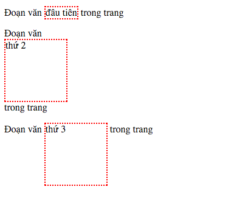
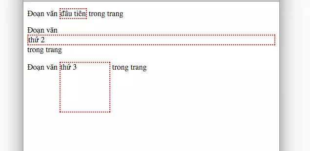

# Tìm hiểu về Block, Inline và Inline-block trong CSS

## Giới thiệu

Trong CSS, thuộc tính `display` là một trong những thuộc tính quan trọng nhất để kiểm soát bố cục trang web. Ba giá trị cơ bản nhất là **Block**, **Inline** và **Inline-block**. Hiểu rõ sự khác biệt giữa chúng là nền tảng để xây dựng layout chính xác và hiệu quả.

## Ví dụ minh họa

### HTML Structure
```html
<!DOCTYPE html>
<html>
<head>
    <meta charset="UTF-8">
    <meta name="viewport" content="width=device-width, initial-scale=1.0">
    <link rel="stylesheet" href="main.css">
</head>
<body>
    <p>Đoạn văn <span class="inline">đầu tiên</span> trong trang</p>
    <p>Đoạn văn <span class="block">thứ 2</span> trong trang</p>
    <p>Đoạn văn <span class="inline-block">thứ 3</span> trong trang</p>
</body>
</html>
```

### CSS Styles
```css
span {
    border: 2px dotted red;
    background-color: #f0f0f0;
}

.inline {
    display: inline;
}

.block {
    display: block;
    width: 100px;
    height: 100px;
}

.inline-block {
    display: inline-block;
    width: 100px;
    height: 100px;
}
```

Khi đó trên giao diện ta sẽ thấy mọi thứ hiển thị thế này:


## 1. Inline

### Đặc điểm
- Phần tử có thuộc tính display thuộc kiểu Inline sẽ nằm cùng dòng với các phần tử cạnh nó.
- Ta có thể coi phần tử Inline như là các từ thuộc một đoạn văn, khi còn chỗ trống thì nó nằm bên cạnh phần tử trước nó, khi hết chỗ trống thì nó "xuống dòng".
- Khoảng cách giữa phần tử Inline và các phần tử cạnh nó được để mặc định là khoảng cách giữa các từ của font-size.
- Ta **không thể** định nghĩa các thuộc tính `width`, `height`, `padding` và `margin` theo chiều dọc (`top`, `bottom`) dành cho các phần tử `Inline`.
- **Chỉ áp dụng được** `margin` và `padding` theo chiều ngang (`left`, `right`).
- **Không thể** chứa các phần tử **block-level** khác.

### Ví dụ minh họa
```css
.inline {
    display: inline;
    /* Các thuộc tính sau sẽ KHÔNG có tác dụng */
    width: 100px;       /* Bị bỏ qua */
    height: 100px;      /* Bị bỏ qua */
    margin-top: 20px;   /* Bị bỏ qua */
    margin-bottom: 20px; /* Bị bỏ qua */
}
```

### Phần tử Inline mặc định
- `<span>`, `<a>`, `<strong>`, `<em>`, ``, `<input>`, `<label>`

### Kết quả hiển thị



Mọi thứ vẫn giữ nguyên như vậy.

## 2. Block

### Đặc điểm
- **Chiếm toàn bộ chiều rộng** có sẵn (mặc định 100%)
- **Luôn bắt đầu trên một dòng mới**
- **Có thể** thiết lập `width`, `height`, `margin`, `padding` đầy đủ
- **Có thể** chứa cả phần tử inline và block khác

### Ví dụ minh họa
```css
.block {
    display: block;
    width: 100px;      /* Có tác dụng */
    height: 100px;     /* Có tác dụng */
    margin: 10px;      /* Có tác dụng cả 4 hướng */
    padding: 15px;     /* Có tác dụng cả 4 hướng */
}
```

### Phần tử Block mặc định
- `<div>`, `<p>`, `<h1>`-`<h6>`, `<section>`, `<article>`, `<header>`, `<footer>`, `<ul>`, `<ol>`, `<li>`

### Kết quả khi không set width/height


### Kết quả khi set width/height



Rõ ràng là width và height có ảnh hưởng đến thuộc tính Block.

## 3. Inline-block

Nếu như bạn muốn hiển thị Element của mình theo kiểu Inline, nhưng lại muốn căn chỉnh được width, height, padding và margin theo chiều dọc thì đây là thứ bạn cần.

Inline-block là kiểu kết hợp giữa Inline và Block, nó vừa có thể hiển thị trên cùng dòng như Inline, lại có thể căn chỉnh được các giá trị như đã nêu ở trên giống như Block.

### Đặc điểm
- **Kết hợp ưu điểm** của cả inline và block
- **Nằm cùng dòng** giống inline elements
- **Có thể** thiết lập `width`, `height`, `margin`, `padding` đầy đủ giống block elements
- **Không tự động xuống dòng** trừ khi hết chỗ

### Ví dụ minh họa
```css
.inline-block {
    display: inline-block;
    width: 100px;      /* Có tác dụng */
    height: 100px;     /* Có tác dụng */
    margin: 10px;      /* Có tác dụng cả 4 hướng */
    padding: 15px;     /* Có tác dụng cả 4 hướng */
    vertical-align: middle; /* Quan trọng để căn chỉnh */
}
```

### Ứng dụng thực tế
- Tạo các button xếp hàng ngang
- Xây dựng navigation menu
- Thiết kế grid system đơn giản
- Tạo các icon với kích thước cố định

### Kết quả hiển thị


## So sánh chi tiết

| Thuộc tính | Inline | Block | Inline-block |
|------------|--------|-------|--------------|
| **Xuống dòng** | Không | Luôn luôn | Chỉ khi hết chỗ |
| **Width/Height** | Không thể | Có thể | Có thể |
| **Margin Top/Bottom** | Không có tác dụng | Có tác dụng | Có tác dụng |
| **Vertical Alignment** | Áp dụng được | Không áp dụng | Áp dụng được |
| **Có thể chứa block elements** | Không | Có | Có |

## Vấn đề thường gặp với Inline-block

### Khoảng trắng không mong muốn
```html
<!-- Sẽ có khoảng trắng giữa các div -->
<div class="inline-block">Item 1</div>
<div class="inline-block">Item 2</div>
<div class="inline-block">Item 3</div>
```

### Giải pháp
```css
.container {
    font-size: 0; /* 1. Set font-size về 0 cho container */
}
.inline-block {
    display: inline-block;
    font-size: 16px; /* 2. Reset font-size cho phần tử con */
    vertical-align: top; /* 3. Căn chỉnh vertical alignment */
}

/* Hoặc sử dụng comment */
<div class="inline-block">Item 1</div><!--
--><div class="inline-block">Item 2</div><!--
--><div class="inline-block">Item 3</div>
```

## Xu hướng hiện đại

Mặc dù `inline-block` vẫn được sử dụng, nhưng hiện nay có những phương pháp hiện đại hơn:

### Flexbox
```css
.container {
    display: flex;
    gap: 10px; /* Khoảng cách giữa các item */
}
.item {
    /* Không cần set display */
    width: 100px;
    height: 100px;
}
```

### CSS Grid
```css
.container {
    display: grid;
    grid-template-columns: repeat(3, 1fr);
    gap: 10px;
}
```

## Kết luận

- **Inline**: Phù hợp cho văn bản và các phần tử nhỏ trong dòng
- **Block**: Lý tưởng cho các phần tử lớn, container, sections
- **Inline-block**: Hoàn hảo cho các component nhỏ cần xếp hàng ngang như button, icon

Hiểu rõ sự khác biệt giữa ba kiểu display này giúp bạn:
- Chọn đúng kiểu hiển thị cho từng trường hợp cụ thể
- Tránh được các lỗi layout phổ biến
- Xây dựng giao diện chính xác và hiệu quả hơn

Dù đã có Flexbox và Grid, nhưng kiến thức về Block, Inline và Inline-block vẫn là nền tảng quan trọng mà mọi front-end developer cần nắm vững.

**Lưu ý quan trọng**: Bài viết đã được cập nhật để phản ánh các best practices hiện tại và sửa các lỗi trong ví dụ gốc.