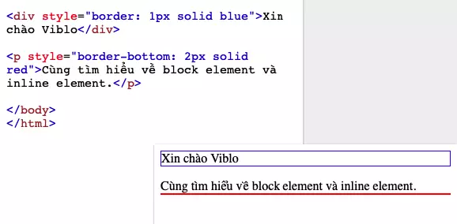
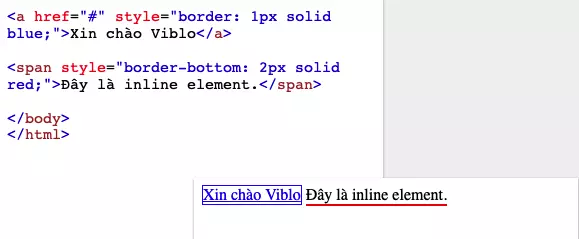

# Bạn đã thực sự hiểu về **Block Elements** và **Inline Elements** chưa?

## Mở đầu

Ngay khi đọc tiêu đề, mục đích của bài viết hôm nay đã rõ: làm sáng tỏ khái niệm **Block Elements** và **Inline Elements**. Với nhiều bạn, hai khái niệm này còn khá lạ, tuy nhiên thực tế bạn **vẫn dùng hằng ngày** — chỉ là không để ý tên gọi mà thôi.

Rất nhiều bạn **nhầm Block/Inline Elements** (thuộc **HTML**) với `display: block` / `display: inline` (thuộc **CSS**). Về **kết quả hiển thị mặc định**, hai cặp này thường trông **giống nhau**, nhưng **bản chất khác nhau hoàn toàn**. Đừng nhầm lẫn nhé!

* **Block Elements, Inline Elements**: chỉ **loại phần tử trong HTML** (mặc định UA stylesheet gán kiểu hiển thị).
* **`display: block`, `display: inline`**: là **thuộc tính CSS** điều khiển cách phần tử **hiển thị**.

Trong thực tế, các phần tử HTML được phân chia thành hai loại chính:

* **Block elements** (*phần tử khối*)
* **Inline elements** (*phần tử nội tuyến*)

**Vì sao cần phân chia?** Để bạn **tiết kiệm thời gian viết CSS** và **tài nguyên**, bằng cách nắm đúng mặc định của trình duyệt rồi chỉ sửa chỗ cần thiết.

---

## Block Elements

**Đặc điểm:** Khi hiển thị trên trình duyệt, Block element **tự động thêm ngắt dòng** (line break) ở **trước** và **sau** nó. Nói đơn giản: gọi 2 block liên tiếp → **mỗi cái chiếm 1 dòng**, và **`width` mặc định là 100%** chiều ngang chứa nó (nếu không bị ràng buộc khác).



**Ví dụ:**

```html
<div style="border: 1px solid blue">Xin chào Viblo</div>

<p style="border-bottom: 2px solid red">
  Cùng tìm hiểu về block element và inline element.
</p>
```

### Danh sách các **Block element** (mặc định) của HTML5

> (Giữ nguyên như liệt kê trong nội dung bạn cung cấp)

| Col 1        | Col 2        | Col 3    |
| ------------ | ------------ | -------- |
| `address`    | `figcaption` | `hgroup` |
| `article`    | `figure`     | `hr`     |
| `aside`      | `footer`     | `li`     |
| `blockquote` | `form`       | `main`   |
| `details`    | `h1` – `h6`  | `nav`    |
| `dialog`     | `ol`         | `p`      |
| `dd`         | `div`        | `pre`    |
| `dl`         | `section`    | `table`  |
| `dt`         | `fieldset`   | `header` |
| `ul`         |              |          |

> ℹ️ *Ghi chú nhỏ (bổ sung cho đầy đủ):* Một vài thẻ như `hgroup` đã **không còn khuyến nghị** trong HTML Living Standard.

### Làm sao để đặt **các Block element** nằm **song song** trên cùng một hàng?

Bạn có thể sử dụng các thuộc tính/giá trị `display` sau:

* `display: inline`
* `display: inline-block`  <!-- đã sửa chính tả từ “inine-block” -->
* `display: flex`
* `display: grid`
* `display: table`
* `display: table-cell`

Hoặc dùng **`float: left|right`** cũng được.

---

## Inline Elements

**Đặc điểm:** Trái ngược Block, Inline element **không** tự chèn ngắt dòng (line break) ở trước/sau. Chúng **nằm trong dòng văn bản**, hiển thị cùng text.



**Ví dụ:**

```html
<a href="#" style="border: 1px solid blue;">Xin chào Viblo</a>

<span style="border-bottom: 2px solid red;">Đây là inline element.</span>
```

### Danh sách **Inline element** (theo nội dung bạn cung cấp)

| Col 1      | Col 2    | Col 3     | Col 4    | Col 5    | Col 6 | Col 7    |
| ---------- | -------- | --------- | -------- | -------- | ----- | -------- |
| `a`        | `abbr`   | `acronym` | `b`      | `bdo`    | `big` | `button` |
| `cite`     | `code`   | `dfn`     | `em`     | `i`      | `img` | `input`  |
| `kbd`      | `label`  | `map`     | `object` | `output` | `q`   | `samp`   |
| `script`   | `select` | `small`   | `span`   | `strong` | `sub` | `sup`    |
| `textarea` | `time`   | `tt`      | `var`    |          |       |          |

> ℹ️ *Ghi chú nhỏ (bổ sung cho đầy đủ):* Một số thẻ như `acronym`, `big`, `tt` đã **lỗi thời/không còn khuyến nghị** trong chuẩn hiện hành.

### Muốn **Inline** cư xử như **Block**?

Chỉ cần thêm một dòng CSS:

```css
display: block;
```

---

## Kết luận

Bài viết này giúp bạn **hiểu đúng bản chất** của phần tử mình đang dùng. Khi nắm được **block vs inline** ở cấp **HTML** và cách **`display` của CSS** tác động, bạn sẽ:

* Sử dụng đúng mục đích,
* Tiết kiệm thời gian viết CSS,
* Cải thiện hiệu năng (performance) cho web/app của bạn.

**Chúc các bạn thành công!**
