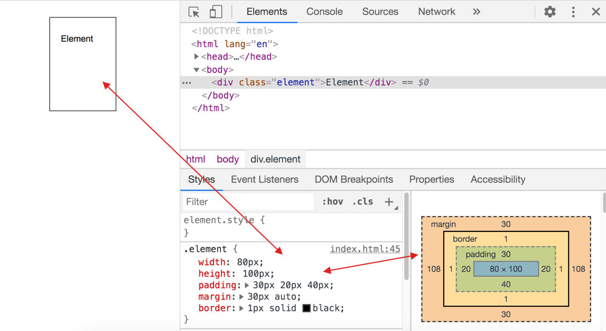
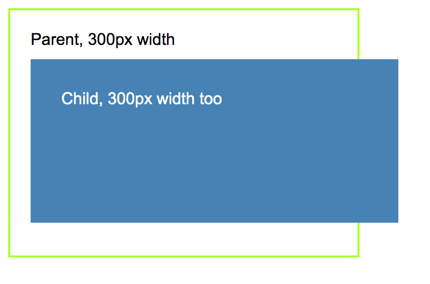
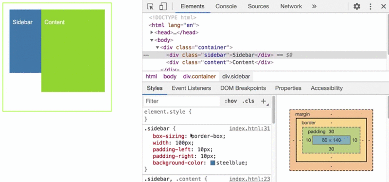

# CSS Box Model và `box-sizing: border-box` là gì?

Trong thế giới phát triển web, một nguyên tắc cơ bản mà mọi lập trình viên frontend cần nắm vững là: **bất kỳ element nào trên trang web đều được trình duyệt render như một khối hình chữ nhật**. Dù đó là hình tròn, hình oval, hay các đoạn text dài ngắn khác nhau, chúng đều được "đóng gói" vào một hộp hình chữ nhật. Để browser có thể tính toán chính xác kích thước của các element này theo ý đồ của developer, **CSS Box Model** ra đời. Nói một cách lý thuyết, Box Model là tập hợp các quy tắc và công thức cộng/trừ giúp browser xác định chiều rộng (width), chiều cao (height), và các thuộc tính liên quan khác của một element.

Bài viết này sẽ giúp bạn hiểu rõ Box Model, các thành phần của nó, những vấn đề phổ biến khi sử dụng mặc định, và cách `box-sizing: border-box` giải quyết chúng một cách hoàn hảo. Chúng ta sẽ đi từ cơ bản đến nâng cao, kèm ví dụ code và hình minh họa (mô tả textual vì đây là bài viết Markdown).

## Các thành phần của Box Model

Mỗi element là một "hộp" hình chữ nhật, bao gồm **4 thành phần chính** (tốt nhất không nên Việt hóa để tránh nhầm lẫn):

- **Content**: Vùng trung tâm chứa nội dung thực tế của element, như text, hình ảnh, video. Kích thước của vùng này được định nghĩa bởi thuộc tính `width` và `height`.
- **Padding**: Vùng đệm bao quanh content, tạo khoảng trống bên trong border. Nó giúp nội dung không sát mép.
- **Border**: Vùng viền bao quanh padding, có thể tùy chỉnh độ dày, kiểu (solid, dashed), và màu sắc.
- **Margin**: Vùng khoảng cách bên ngoài border, dùng để tách element khỏi các element lân cận.

Mỗi thành phần có một **đường biên tương ứng**:
- Content edge: Biên của content.
- Padding edge: Biên ngoài của padding.
- Border edge: Biên ngoài của border.
- Margin edge: Biên ngoài của margin.

Bạn có thể dễ dàng quan sát các thành phần này qua **DevTools của browser** (nhấn F12, chọn element và xem tab "Computed" hoặc "Box Model").

 

*(Hình minh họa: Một hộp với content ở giữa, bao quanh bởi padding, border, và margin.)*

## Công thức tính kích thước mặc định (content-box)

Theo mặc định, Box Model sử dụng `box-sizing: content-box`. Lúc này, `width` và `height` chỉ áp dụng cho **content**, không bao gồm padding và border. Margin **không được tính vào kích thước tổng của element**, mà chỉ ảnh hưởng đến vị trí.

**Công thức đơn giản:**
- Chiều rộng tổng = `width` (content) + padding-left + padding-right + border-left + border-right
- Chiều cao tổng = `height` (content) + padding-top + padding-bottom + border-top + border-bottom

### Các thuộc tính CSS liên quan
| Thành phần | Thuộc tính chính | Ví dụ |
|------------|------------------|--------|
| **Content** | `width`, `height` | `width: 200px;` |
| **Padding** | `padding` (tất cả), `padding-top/bottom/left/right` | `padding: 10px 20px;` (top/bottom: 10px, left/right: 20px) |
| **Border** | `border`, `border-top/bottom/left/right` | `border: 1px solid black;` |
| **Margin** | `margin` (tất cả), `margin-top/bottom/left/right` | `margin: 10px auto;` (auto để căn giữa ngang) |

### Ví dụ code minh họa (content-box mặc định)
```css
.element {
  width: 200px;      /* Content width */
  height: 100px;     /* Content height */
  padding: 20px 30px 40px 10px;  /* top:20px, right:30px, bottom:40px, left:10px */
  margin: 15px auto; /* Căn giữa ngang */
  border: 2px solid black;
}
```
- Chiều rộng tổng: 200px + 10px (left) + 30px (right) + 2px (left border) + 2px (right border) = **244px**
- Chiều cao tổng: 100px + 20px (top) + 40px (bottom) + 2px (top border) + 2px (bottom border) = **164px**
- Margin không ảnh hưởng đến kích thước tổng, chỉ đẩy element ra xa các phần tử khác.

## Sự khác biệt giữa Margin và Padding (tóm tắt ngắn gọn)

- **Padding**: Khoảng cách **bên trong** border, giữa content và border. Nó ảnh hưởng đến kích thước tổng của element và thường dùng để tạo không gian cho nội dung (ví dụ: làm text không sát mép).
- **Margin**: Khoảng cách **bên ngoài** border, giữa element này và element khác. Nó không ảnh hưởng đến kích thước tổng, mà chỉ dùng để định vị (ví dụ: tạo khoảng cách giữa các div).

Quy tắc nhớ: "Padding là 'nội thất' bên trong hộp, margin là 'khoảng trống' bên ngoài hộp." Để tìm hiểu sâu hơn, bạn có thể tham khảo [MDN: Margin vs Padding](https://developer.mozilla.org/en-US/docs/Learn/CSS/Building_blocks/The_box_model#the_different_parts_of_the_box_model).

## Vấn đề phổ biến với content-box

### Vấn đề 1: Thay đổi padding/border làm lệch layout
Khi bạn chỉnh sửa padding hoặc thêm border, kích thước tổng thay đổi, dẫn đến layout bị "xê dịch". Ví dụ:
- Ban đầu: Content 200px + Padding 40px = **240px**.
- Tăng padding lên 60px: Tổng thành **260px** → Phải giảm content xuống 180px để bù đắp.


Tương tự, thêm border 2px sẽ tăng thêm 4px chiều rộng, gây lệch layout.

### Vấn đề 2: Element con tràn ra ngoài cha
Element con có thể vượt quá giới hạn của parent do padding/border của chính nó.

```css
.parent {
  width: 300px;
  height: 300px;
  padding: 20px;
  border: 2px solid green;
  background: lightgray;
}

.child {
  width: 300px;      /* Content width = 300px */
  height: 200px;
  padding: 30px;     /* Thêm 60px width tổng */
  background: steelblue;
  color: white;
}
```
- Kích thước child tổng: 300px + 60px (padding) = **360px** → Tràn ra ngoài parent (300px).



## Giải pháp: Thuộc tính `box-sizing`

Box Model được "nâng cấp" với `box-sizing`, có 2 giá trị chính:

- **`content-box`** (mặc định): `width/height` chỉ cho content. Padding và border thêm vào kích thước tổng.
- **`border-box`**: `width/height` bao gồm **content + padding + border**. Content sẽ tự co giãn để giữ tổng kích thước không đổi. Margin vẫn ngoài tính toán.

### Công thức với border-box
- Chiều rộng tổng = `width` (đã bao gồm content + padding-left/right + border-left/right)
- Content width = `width` - (padding-left/right + border-left/right)

Ví dụ với code trên (child dùng border-box):
```css
.child {
  box-sizing: border-box;
  width: 300px;  /* Tổng width = 300px, content tự co = 300 - 60px = 240px */
}
```
→ Không còn tràn ra!



Hầu hết developer hiện nay ưu tiên `border-box` vì nó trực quan và dễ kiểm soát layout. Chỉ dùng `content-box` trong trường hợp đặc biệt (ví dụ: icon SVG cần kích thước content chính xác).

## Áp dụng cho toàn bộ trang web

Thay vì thêm `box-sizing: border-box` cho từng element (trang web có hàng nghìn element!), dùng **Universal Selector**:

```css
* {
  box-sizing: border-box;
}

/* Phiên bản an toàn hơn, bao gồm pseudo-elements */
*, *::before, *::after {
  box-sizing: border-box;
}
```

Bạn vẫn có thể override cho element cụ thể:
```css
.special-icon {
  box-sizing: content-box;  /* Quay về mặc định nếu cần */
}
```

## Lưu ý quan trọng
- Box Model còn bị ảnh hưởng bởi `min-width/max-width`, `min-height/max-height`, flexbox/grid, và các hiệu ứng khác (như box-shadow không tính vào kích thước).
- Luôn kiểm tra trên nhiều browser (Chrome DevTools là công cụ tuyệt vời).
- Để debug, dùng `outline: 1px solid red;` tạm thời cho element để visualize box.

## Kết luận

CSS Box Model là nền tảng của layout web, giúp browser "hiểu" cách render element như những hộp hình chữ nhật. Việc chuyển sang `box-sizing: border-box` không chỉ giải quyết các vấn đề layout phiền toái mà còn làm code của bạn sạch sẽ và dễ maintain hơn. Nếu bạn là frontend developer, hãy áp dụng ngay universal selector này vào project tiếp theo!

Cảm ơn bạn đã đọc. Nếu có câu hỏi hoặc ví dụ thực tế cần dùng `content-box`, hãy comment bên dưới. Để học sâu hơn, tham khảo:
- [MDN: CSS Box Model](https://developer.mozilla.org/en-US/docs/Learn/CSS/Building_blocks/The_box_model)
- [CSS Tricks: Box Sizing](https://css-tricks.com/box-sizing/)

Hy vọng bài viết này đã làm rõ khái niệm cho bạn! 🚀