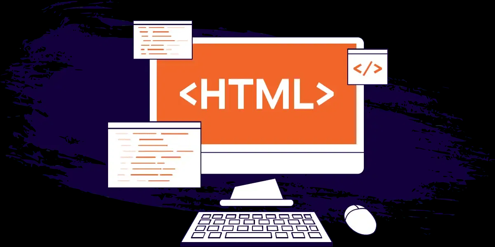
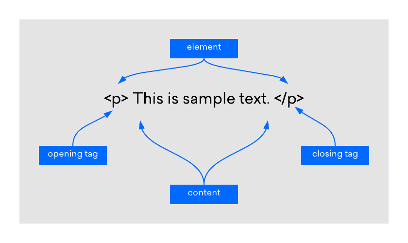

# HTML là gì? Tất tần tật về Ngôn ngữ Đánh dấu Siêu văn bản


## 1. Giới thiệu về HTML



**HTML** (HyperText Markup Language - Ngôn ngữ Đánh dấu Siêu văn bản) là ngôn ngữ cốt lõi được sử dụng để xây dựng và thiết kế cấu trúc các trang web. Nó là tiêu chuẩn của World Wide Web Consortium (W3C) và được sử dụng để tạo ra các tài liệu siêu văn bản có thể được hiển thị trên trình duyệt web.

### Lịch sử và phát triển
- **Ra đời**: HTML được phát triển bởi Tim Berners-Lee vào năm 1989 tại CERN (Tổ chức Nghiên cứu Hạt nhân Châu Âu) như một phần của dự án World Wide Web.
- **Phiên bản đầu tiên**: HTML 1.0 được phát hành năm 1991.
- **Các phiên bản chính**:
  - HTML 2.0 (1995): Thêm các thẻ cơ bản như forms và tables.
  - HTML 3.2 (1997): Hỗ trợ CSS và JavaScript.
  - HTML 4.01 (1999): Tập trung vào khả năng truy cập và tách biệt cấu trúc với trình bày.
  - XHTML (2000): Kết hợp HTML với XML để cú pháp nghiêm ngặt hơn.
  - HTML5 (2014): Phiên bản hiện đại nhất, hỗ trợ multimedia, ngữ nghĩa, và API mới cho web động.
- **Hiện tại**: HTML5 là tiêu chuẩn đang được sử dụng rộng rãi, với các cập nhật liên tục từ W3C và WHATWG.

### Cách hoạt động
HTML hoạt động bằng cách sử dụng các **thẻ (tags)** để đánh dấu cấu trúc và nội dung của trang web. Các thẻ này được trình duyệt web phân tích cú pháp (parse) và hiển thị dưới dạng trang web trực quan. HTML không phải là ngôn ngữ lập trình mà là ngôn ngữ đánh dấu, nghĩa là nó mô tả cấu trúc của nội dung chứ không thực hiện logic tính toán.

- **HyperText (Siêu văn bản)**: Cho phép bạn liên kết các trang web lại với nhau thông qua các siêu liên kết (hyperlinks), tạo thành một "web" (mạng lưới) thông tin kết nối toàn cầu.
- **Markup Language (Ngôn ngữ đánh dấu)**: Sử dụng các "thẻ" (tags) để đánh dấu và định nghĩa các phần tử, nội dung trên trang, chẳng hạn như tiêu đề, đoạn văn, hình ảnh, hoặc liên kết.

**Tóm lại**: HTML là **bộ khung xương** của mọi website. Nó xác định đâu là tiêu đề, đoạn văn, hình ảnh, liên kết, v.v., và cung cấp nền tảng để CSS (định kiểu) và JavaScript (tương tác) hoạt động. Không có HTML, không thể có trang web nào tồn tại trên internet.

### Vai trò trong phát triển web
- **Cấu trúc nội dung**: HTML xác định cấu trúc ngữ nghĩa của trang, giúp trình duyệt và công cụ tìm kiếm hiểu nội dung.
- **Khả năng truy cập**: Hỗ trợ người dùng khuyết tật thông qua screen readers và các công nghệ hỗ trợ.
- **Tích hợp với công nghệ khác**: Là nền tảng cho CSS (styling), JavaScript (interactivity), và các framework như React hoặc Vue.js.
- **SEO và hiệu suất**: Cấu trúc HTML chuẩn giúp tối ưu hóa cho công cụ tìm kiếm và cải thiện tốc độ tải trang.

**Tóm lại**: HTML là **bộ khung xương** của mọi website. Nó xác định đâu là tiêu đề, đoạn văn, hình ảnh, liên kết, v.v.

## 2. Cấu trúc cơ bản của một tài liệu HTML

```html
<!DOCTYPE html>
<html lang="vi">
<head>
    <meta charset="UTF-8">
    <meta name="viewport" content="width=device-width, initial-scale=1.0">
    <title>Tiêu đề trang web</title>
</head>
<body>
    <h1>Đây là một tiêu đề lớn</h1>
    <p>Đây là một đoạn văn bản.</p>
    <a href="https://200lab.io">Đây là một liên kết</a>
</body>
</html>
```

## 3. Các khái niệm quan trọng trong HTML

### a. Thẻ (Tags)
Thẻ được dùng để đánh dấu các phần tử trong HTML. Thường có thẻ mở và thẻ đóng.

**Ví dụ**: `<p>Nội dung đoạn văn</p>`

### b. Phần tử (Elements)



Một phần tử bao gồm thẻ mở, nội dung và thẻ đóng.

**Ví dụ**: `<h1>Chào mừng bạn!</h1>` là một phần tử tiêu đề.

### c. Thuộc tính (Attributes)
Thuộc tính cung cấp thông tin bổ sung cho một phần tử, luôn được khai báo trong thẻ mở.

**Ví dụ**:
```html
<a href="https://200lab.io">Học cùng 200Lab</a>

```

## 4. Chi tiết về Thẻ HEAD, META và TITLE

### Thẻ `<head>`
Thẻ `<head>` là nơi chứa các **siêu dữ liệu** về tài liệu HTML - những thông tin không hiển thị trực tiếp lên trang nhưng cực kỳ quan trọng.

**Vai trò chính:**
- Khai báo thông tin mã hóa ký tự
- Định nghĩa tiêu đề trang
- Cung cấp mô tả trang cho công cụ tìm kiếm
- Liên kết đến các file CSS, JavaScript
- Thiết lập viewport cho thiết bị di động

### Thẻ `<title>`
Định nghĩa **tiêu đề của tài liệu HTML**, là thẻ **bắt buộc** trong mọi tài liệu HTML.

**Tác dụng:**
- Hiển thị trên thanh tiêu đề hoặc tab của trình duyệt
- Được sử dụng làm tiêu đề khi bookmark trang
- Yếu tố quan trọng hàng đầu cho SEO

### Thẻ `<meta>`
Thẻ `<meta>` cung cấp siêu dữ liệu về trang web cho các trình duyệt và công cụ tìm kiếm, giúp chúng hiểu nội dung và xử lý nó đúng cách. Các chức năng chính bao gồm: cung cấp thông tin mô tả và từ khóa, tối ưu hóa hiển thị trên thiết bị di động, hỗ trợ các nền tảng mạng xã hội khi chia sẻ, chỉ định mã hóa ký tự và điều khiển hoạt động của công cụ tìm kiếm như lập chỉ mục. 

**Các loại thẻ `<meta>` quan trọng:**

| Loại | Ví dụ | Mục đích |
|------|-------|----------|
| **Mã hóa ký tự** | `<meta charset="UTF-8">` | hướng dẫn trình duyệt cách giải mã và hiển thị các ký tự trong trang web, tránh lỗi font và đảm bảo hiển thị đúng các ký tự đặc biệt, đặc biệt là với các ngôn ngữ như tiếng Việt |
| **Viewport** | `<meta name="viewport" content="width=device-width, initial-scale=1.0">` | giúp định cấu hình trang web để hiển thị phù hợp trên các kích thước màn hình khác nhau, đảm bảo trải nghiệm người dùng tốt trên mọi thiết bị |
| **Mô tả trang** | `<meta name="description" content="Mô tả trang">` | cung cấp mô tả tóm tắt cho kết quả tìm kiếm |
| **Từ khóa** | `<meta name="keywords" content="html, web">` | cung cấp các từ khóa liên quan đến nội dung trang web |
| **Tác giả** | `<meta name="author" content="Tên tác giả">` | Khai báo tác giả |
| **Chỉ mục và theo dõi**| `<meta name="robots" content="noindex" />` | cho phép bạn chỉ định cho công cụ tìm kiếm có nên lập chỉ mục trang và theo dõi các liên kết trên trang hay không |


## 5. Ví dụ đầy đủ một thẻ `<head>`

```html
<!DOCTYPE html>
<html lang="vi">
<head>
    <!-- Khai báo mã hóa ký tự -->
    <meta charset="UTF-8">
    
    <!-- Thiết lập viewport cho responsive -->
    <meta name="viewport" content="width=device-width, initial-scale=1.0">
    
    <!-- Mô tả trang cho SEO -->
    <meta name="description" content="Học HTML cơ bản đến nâng cao cùng 200Lab">
    
    <!-- Từ khóa -->
    <meta name="keywords" content="HTML, CSS, JavaScript, học lập trình">
    
    <!-- Tác giả -->
    <meta name="author" content="200Lab">

    <!-- Cho phép bạn chỉ định cho công cụ tìm kiếm có nên lập chỉ mục trang và theo dõi các liên kết trên trang hay không -->
    <meta name="robots" content="noindex" />
    
    <!-- Tiêu đề trang -->
    <title>Học HTML - Khóa Học Lập Trình Web | 200Lab</title>
    
    <!-- Liên kết đến file CSS -->
    <link rel="stylesheet" href="styles.css">
    
    <!-- Liên kết đến favicon -->
    <link rel="icon" type="image/x-icon" href="/images/favicon.ico">
</head>
<body>
    <!-- Nội dung trang web -->
</body>
</html>
```

## 6. Một số thẻ HTML phổ biến khác


| Thẻ | Mục đích | Ví dụ |
| :--- | :--- | :--- |
| `<h1>` đến `<h6>` | Định nghĩa các cấp độ tiêu đề | `<h1>Tiêu đề chính</h1>` |
| `<p>` | Định nghĩa một đoạn văn | `<p>Đây là một đoạn văn.</p>` |
| `<a>` | Tạo một siêu liên kết | `<a href="...">Liên kết</a>` |
| `` | Chèn hình ảnh | `` |
| `<ul>`, `<ol>`, `<li>` | Tạo danh sách | `<ul><li>Mục 1</li></ul>` |
| `<div>` | Vùng chứa khối | `<div>Nội dung khối</div>` |
| `<span>` | Vùng chứa nội tuyến | `<span>Nội dung nội tuyến</span>` |
| `<header>`, `<footer>` | Đầu trang và chân trang | `<header>Logo, menu</header>` |
| `<section>`, `<article>` | Phân chia nội dung | `<section>Phần nội dung</section>` |

## 7. Tại sao HTML lại quan trọng?

- **Nền tảng của Web**: Mọi trình duyệt đều hiểu và hiển thị HTML
- **Hỗ trợ đa phương tiện**: Cho phép nhúng hình ảnh, video, audio
- **Tích hợp với CSS & JavaScript**: Kết hợp với CSS (tạo kiểu) và JavaScript (thêm chức năng) tạo nên trải nghiệm web hoàn chỉnh
- **SEO thân thiện**: Cấu trúc HTML chuẩn giúp công cụ tìm kiếm dễ dàng thu thập thông tin
- **Khả năng truy cập**: Giúp người dùng khuyết tật có thể truy cập nội dung qua screen reader

## 8. Tóm tắt tầm quan trọng của các thẻ chính

| Thẻ | Vai trò | Ảnh hưởng đến |
|-----|---------|---------------|
| **`<head>`** | Chứa siêu dữ liệu | Trình duyệt, SEO, hiệu suất |
| **`<title>`** | Định nghĩa tiêu đề trang | Tab trình duyệt, SEO, Bookmark |
| **`<meta charset>`** | Khai báo mã hóa ký tự | Hiển thị văn bản chính xác |
| **`<meta viewport>`** | Thiết lập hiển thị mobile | Trải nghiệm người dùng trên mobile |
| **`<meta description>`** | Mô tả nội dung trang | Tỷ lệ click từ kết quả tìm kiếm |

## 9. Kết luận

HTML là **bước đầu tiên và bắt buộc** trên hành trình học phát triển web. Điều quan trọng cần nhớ:

- HTML không phải là ngôn ngữ lập trình, mà là **ngôn ngữ đánh dấu**
- HTML tạo ra **cấu trúc và nội dung** cho trang web
- Thẻ `<head>` chứa thông tin **quan trọng không kém** thẻ `<body>`
- Viết HTML chuẩn giúp website **thân thiện với SEO** và **dễ bảo trì**

Sau khi nắm vững HTML, bạn có thể chuyển sang học **CSS** để làm đẹp trang web và **JavaScript** để tạo ra các tương tác động.

---
*Nội dung được tham khảo và phát triển từ bài viết [HTML là gì?](https://200lab.io/blog/html-la-gi) trên 200Lab.io.*