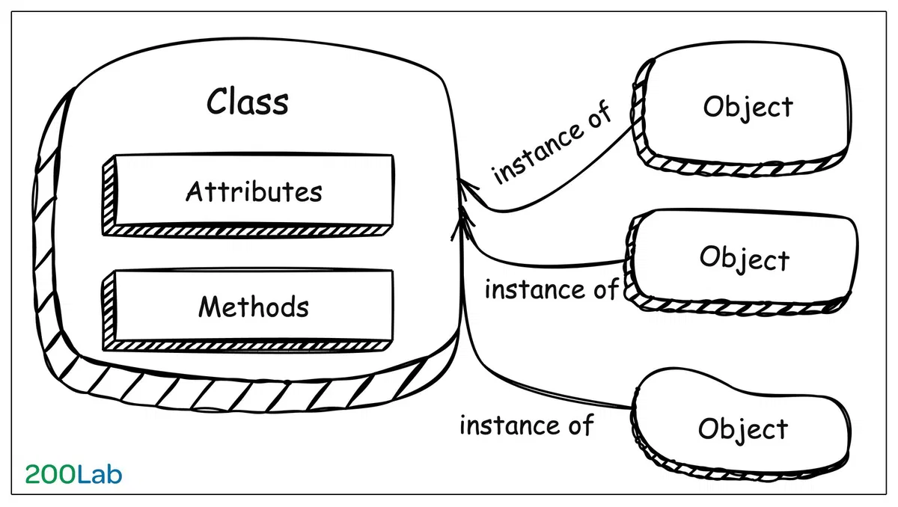
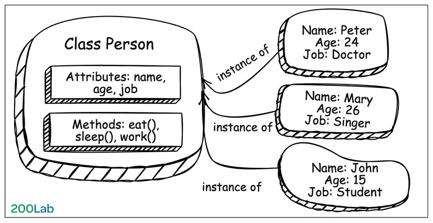
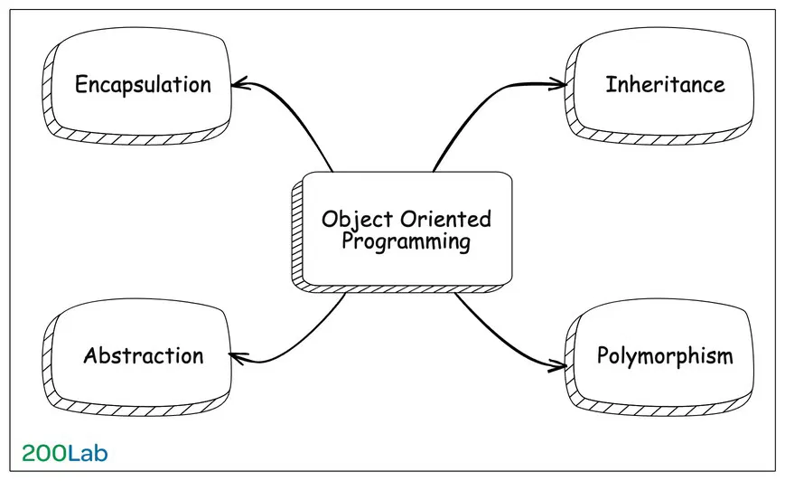

# OOP là gì? Chi tiết về lập trình hướng đối tượng

## Mục lục

1. [OOP là gì?](#1-oop-là-gì)
2. [Các thành phần chính trong OOP](#2-các-thành-phần-chính-trong-oop)
3. [4 tính chất cơ bản trong OOP](#3-4-tính-chất-cơ-bản-trong-oop)
   - 3.1 [Encapsulation (Tính đóng gói)](#31-encapsulation-tính-đóng-gói)
   - 3.2 [Abstraction (Tính trừu tượng)](#32-abstraction-tính-trừu-tượng)
   - 3.3 [Inheritance (Tính kế thừa)](#33-inheritance-tính-kế-thừa)
   - 3.4 [Polymorphism (Tính đa hình)](#34-polymorphism-tính-đa-hình)
   - 3.5 [Ví dụ 4 tính chất bằng C++ và JavaScript](#35-ví-dụ-4-tính-chất-oop-bằng-c-và-javascript)
4. [Vì sao nên học OOP](#4-vì-sao-nên-học-oop)
5. [Các hạn chế của OOP](#5-các-hạn-chế-của-lập-trình-hướng-đối-tượng-oop)
6. [Kết luận](#6-kết-luận)
7. [SOLID Principles](#7-solid-principles)
8. [Design Patterns phổ biến](#8-design-patterns-phổ-biến-trong-oop)

---

## Giới thiệu

Chúng ta đang sử dụng các ngôn ngữ lập trình để giải quyết các vấn đề trong cuộc sống hàng ngày. Vì thế sẽ không lý gì chúng ta lại không thể mô hình các vấn đề này sang các ngôn ngữ lập trình hướng đối tượng. Đây chính là nơi mà lập trình hướng đối tượng (**Object-oriented programming**) phát huy vai trò của nó.

---

## 1. OOP là gì?

**OOP** là viết tắt của **Object-oriented programming** (lập trình hướng đối tượng).

### Định nghĩa

OOP là viết tắt của Object-oriented programming (lập trình hướng đối tượng). OOP là một mô hình lập trình dựa trên khái niệm về **Class** và **Object**. Mô hình này tập trung vào các đối tượng tương tác với nhau
thay vì tập trung vào logic để thao tác chúng.

### Mục tiêu chính

- ✅ Giúp việc **quản lý mã nguồn** dễ dàng hơn
- ✅ Tăng khả năng **tái sử dụng code**
- ✅ **Bảo trì** và **mở rộng** code đơn giản hơn

### Thành phần của Object

Trong OOP, một Object thường chứa 2 thành phần:

1. **Data** (Dữ liệu)

   - Dưới dạng các **fields** (trường)
   - Còn gọi là **attributes** (thuộc tính) hoặc **properties** (đặc tính)

2. **Code** (Mã)
   - Dưới dạng các **procedures** (thủ tục)
   - Còn gọi là **methods** (phương thức)

---

## 2. Các thành phần chính trong OOP



Trong OOP có 2 thành phần chính: **Class** và **Object**

### 2.1 Class (Lớp) trong OOP

**Class** là một **template** (khuôn mẫu) hay **blueprint** (bản thiết kế) để tạo ra các Object.

#### Class bao gồm:

- **Attributes**: Định nghĩa các thông tin, đặc điểm, thuộc tính của Object
- **Methods**: Định nghĩa các hành vi, phương thức, hành động của Object

#### Ví dụ Class Person

```java
class Person {
    // Attributes (Thuộc tính)
    String name;
    int age;
    String occupation;

    // Methods (Phương thức)
    void eat() {
        System.out.println(name + " is eating");
    }

    void sleep() {
        System.out.println(name + " is sleeping");
    }

    void work() {
        System.out.println(name + " is working");
    }
}
```

### 2.2 Object (Đối tượng) trong OOP

**Object** là một **instance** (thể hiện) của Class - một ví dụ cụ thể, hiện thực của một Class.

#### Ví dụ Objects từ Class Person



```java
// Tạo Objects từ Class Person
Person person1 = new Person();
person1.name = "Nguyễn Văn A";
person1.age = 25;
person1.occupation = "Developer";

Person person2 = new Person();
person2.name = "Trần Thị B";
person2.age = 30;
person2.occupation = "Designer";

// Sử dụng methods
person1.eat();    // Output: Nguyễn Văn A is eating
person2.work();   // Output: Trần Thị B is working
```

**So sánh Class vs Object:**

```
Class Person = Bản thiết kế con người
  ↓
Object person1 = Nguyễn Văn A (người cụ thể)
Object person2 = Trần Thị B (người cụ thể)
```

---

## 3. 4 tính chất cơ bản trong OOP



OOP có 4 tính chất cơ bản (4 trụ cột) - thường được gọi là **4 Pillars of OOP**:

| #   | Tính chất         | Tiếng Việt      | Ý nghĩa cốt lõi                                   |
| --- | ----------------- | --------------- | ------------------------------------------------- |
| 1   | **Encapsulation** | Tính đóng gói   | Gói gọn data và methods, kiểm soát truy cập       |
| 2   | **Abstraction**   | Tính trừu tượng | Ẩn chi tiết phức tạp, chỉ hiện interface đơn giản |
| 3   | **Inheritance**   | Tính kế thừa    | Class con thừa hưởng từ class cha                 |
| 4   | **Polymorphism**  | Tính đa hình    | Một hành động, nhiều cách thực hiện               |

### Tổng quan 4 tính chất

```
┌─────────────────────────────────────────────────────────────────────────┐
│                         4 PILLARS OF OOP                                │
├─────────────────────────────────────────────────────────────────────────┤
│                                                                         │
│  ┌─────────────────┐    ┌─────────────────┐                            │
│  │  ENCAPSULATION  │    │   ABSTRACTION   │                            │
│  │  ═══════════════│    │  ═══════════════│                            │
│  │                 │    │                 │                            │
│  │  "Đóng hộp"     │    │  "Giấu phức tạp"│                            │
│  │                 │    │                 │                            │
│  │  • private data │    │  • abstract     │                            │
│  │  • getter/setter│    │  • interface    │                            │
│  │  • validation   │    │  • hide details │                            │
│  │                 │    │                 │                            │
│  │  Bảo vệ dữ liệu │    │  Đơn giản hóa   │                            │
│  └─────────────────┘    └─────────────────┘                            │
│                                                                         │
│  ┌─────────────────┐    ┌─────────────────┐                            │
│  │   INHERITANCE   │    │  POLYMORPHISM   │                            │
│  │  ═══════════════│    │  ═══════════════│                            │
│  │                 │    │                 │                            │
│  │  "Con giống cha"│    │  "Nhiều hình"   │                            │
│  │                 │    │                 │                            │
│  │  • extends      │    │  • overloading  │                            │
│  │  • super class  │    │  • overriding   │                            │
│  │  • reuse code   │    │  • flexibility  │                            │
│  │                 │    │                 │                            │
│  │  Tái sử dụng    │    │  Linh hoạt      │                            │
│  └─────────────────┘    └─────────────────┘                            │
│                                                                         │
└─────────────────────────────────────────────────────────────────────────┘
```

### Mối quan hệ giữa 4 tính chất

```
                    ┌─────────────────┐
                    │   ABSTRACTION   │
                    │ (Thiết kế tổng  │
                    │   quan, ẩn      │
                    │   complexity)   │
                    └────────┬────────┘
                             │
              ┌──────────────┼──────────────┐
              │              │              │
              ▼              ▼              ▼
     ┌────────────┐  ┌────────────┐  ┌────────────┐
     │ENCAPSULATION│  │INHERITANCE │  │POLYMORPHISM│
     │(Bảo vệ data)│  │(Tái sử dụng)│  │(Linh hoạt) │
     └────────────┘  └────────────┘  └────────────┘
              │              │              │
              └──────────────┼──────────────┘
                             │
                             ▼
                    ┌─────────────────┐
                    │   CODE CHẤT    │
                    │   LƯỢNG CAO    │
                    │ • Maintainable │
                    │ • Scalable     │
                    │ • Reusable     │
                    └─────────────────┘
```

### Ví dụ tổng hợp: Hệ thống quản lý nhân viên

```java
// ABSTRACTION: Định nghĩa interface chung
interface Workable {
    void work();
    double calculateSalary();
}

// ENCAPSULATION: Đóng gói data, kiểm soát truy cập
abstract class Employee implements Workable {
    private String id;           // private - ẩn giấu
    private String name;
    private double baseSalary;

    // Constructor
    public Employee(String id, String name, double baseSalary) {
        this.id = id;
        this.name = name;
        this.baseSalary = baseSalary;
    }

    // Getter - kiểm soát đọc
    public String getName() { return name; }
    public double getBaseSalary() { return baseSalary; }

    // Setter với validation - kiểm soát ghi
    public void setBaseSalary(double salary) {
        if (salary > 0) {
            this.baseSalary = salary;
        }
    }

    // ABSTRACTION: Method chung, implementation ở subclass
    public abstract void work();
    public abstract double calculateSalary();
}

// INHERITANCE: Developer kế thừa từ Employee
class Developer extends Employee {
    private String programmingLanguage;
    private int projectBonus;

    public Developer(String id, String name, double baseSalary, String lang) {
        super(id, name, baseSalary);  // Gọi constructor cha
        this.programmingLanguage = lang;
    }

    // POLYMORPHISM (Override): Cùng method, behavior khác
    @Override
    public void work() {
        System.out.println(getName() + " is coding in " + programmingLanguage);
    }

    @Override
    public double calculateSalary() {
        return getBaseSalary() + projectBonus;
    }
}

// INHERITANCE: Manager kế thừa từ Employee
class Manager extends Employee {
    private int teamSize;
    private double managementBonus;

    public Manager(String id, String name, double baseSalary, int teamSize) {
        super(id, name, baseSalary);
        this.teamSize = teamSize;
        this.managementBonus = teamSize * 100; // $100 per team member
    }

    // POLYMORPHISM (Override): Cùng method, behavior khác
    @Override
    public void work() {
        System.out.println(getName() + " is managing a team of " + teamSize);
    }

    @Override
    public double calculateSalary() {
        return getBaseSalary() + managementBonus;
    }
}

// Sử dụng POLYMORPHISM
class PayrollSystem {
    // Nhận bất kỳ Employee nào (Developer, Manager, ...)
    public void processPayroll(List<Employee> employees) {
        for (Employee emp : employees) {
            emp.work();                    // Polymorphism - mỗi loại work khác nhau
            double salary = emp.calculateSalary(); // Polymorphism
            System.out.println("Salary: $" + salary);
        }
    }
}

// Main
public class Main {
    public static void main(String[] args) {
        List<Employee> employees = new ArrayList<>();
        employees.add(new Developer("D001", "John", 5000, "Java"));
        employees.add(new Manager("M001", "Alice", 7000, 5));

        PayrollSystem payroll = new PayrollSystem();
        payroll.processPayroll(employees);

        // Output:
        // John is coding in Java
        // Salary: $5000.0
        // Alice is managing a team of 5
        // Salary: $7500.0
    }
}
```

**Phân tích ví dụ trên:**

| Tính chất         | Áp dụng trong ví dụ                                      |
| ----------------- | -------------------------------------------------------- |
| **Encapsulation** | `private` fields, getter/setter với validation           |
| **Abstraction**   | `interface Workable`, `abstract class Employee`          |
| **Inheritance**   | `Developer extends Employee`, `Manager extends Employee` |
| **Polymorphism**  | `work()` và `calculateSalary()` được override khác nhau  |

---

### 3.1 Encapsulation (Tính đóng gói)

#### Định nghĩa đầy đủ

**Encapsulation** (Tính đóng gói) là một trong những nguyên tắc cơ bản nhất của OOP. Nó bao gồm 2 khía cạnh chính:

1. **Bundling** (Gói gọn): Gom nhóm các **data** (attributes) và **methods** liên quan vào trong một đơn vị duy nhất gọi là **class/object**.

2. **Information Hiding** (Ẩn giấu thông tin): Hạn chế quyền truy cập trực tiếp vào một số thành phần của object, chỉ cho phép truy cập thông qua các **public methods** (getter/setter).

#### Tại sao gọi là "Đóng gói"?

```
Hình dung như một viên thuốc con nhộng (capsule):
┌─────────────────────────────────────┐
│           CAPSULE (Class)           │
│  ┌─────────────────────────────┐   │
│  │     Bên trong (private)     │   │
│  │  • Thành phần hoạt chất     │   │
│  │  • Cấu trúc phức tạp        │   │
│  │  • Chi tiết implementation  │   │
│  └─────────────────────────────┘   │
│                                     │
│  Bên ngoài (public interface):      │
│  • Uống thuốc → Khỏi bệnh           │
│  • Không cần biết bên trong có gì   │
└─────────────────────────────────────┘
```

#### Các thành phần của Encapsulation

```java
class EncapsulatedClass {
    // 1. PRIVATE DATA - Ẩn giấu bên trong
    private String sensitiveData;
    private int internalState;

    // 2. PUBLIC INTERFACE - Cửa ngõ truy cập
    public String getData() {           // Getter
        return sensitiveData;
    }

    public void setData(String data) {  // Setter với validation
        if (isValid(data)) {
            this.sensitiveData = data;
        }
    }

    // 3. PRIVATE METHODS - Logic nội bộ
    private boolean isValid(String data) {
        return data != null && !data.isEmpty();
    }

    // 4. PUBLIC METHODS - Hành vi công khai
    public void performAction() {
        // Sử dụng private data và methods
        internalState++;
        processInternal();
    }

    private void processInternal() {
        // Logic phức tạp ẩn bên trong
    }
}
```

#### Nguyên tắc của Encapsulation

| Nguyên tắc                 | Mô tả                         | Ví dụ                          |
| -------------------------- | ----------------------------- | ------------------------------ |
| **Data Hiding**            | Đặt fields là `private`       | `private double balance;`      |
| **Controlled Access**      | Dùng getter/setter            | `getBalance()`, `setBalance()` |
| **Validation**             | Kiểm tra trước khi thay đổi   | `if (amount > 0)`              |
| **Single Point of Access** | Một cách duy nhất để truy cập | Chỉ qua methods                |

#### Mục đích

- ✅ **Bảo vệ dữ liệu** bên trong Object
- ✅ **Kiểm soát** việc truy cập và thay đổi dữ liệu
- ✅ Tăng tính **bảo mật** và **an toàn** cho chương trình

#### Access Modifiers

```java
public    // Truy cập từ mọi nơi
private   // Chỉ truy cập trong class
protected // Truy cập trong class và class con
```


#### Ví dụ: Class Account

```java
class Account {
    // ❌ Private - Không thể truy cập trực tiếp từ bên ngoài
    private String name;
    private double balance;

    // ✅ Public - Có thể truy cập từ bên ngoài
    public Account(String name, double initialBalance) {
        this.name = name;
        this.balance = initialBalance;
    }

    // Getter - Lấy thông tin
    public String getName() {
        return this.name;
    }

    public double getBalance() {
        return this.balance;
    }

    // Methods - Thao tác với dữ liệu
    public void deposit(double amount) {
        if (amount > 0) {
            this.balance += amount;
            System.out.println("Deposited: " + amount);
        }
    }

    public void withdraw(double amount) {
        if (amount > 0 && amount <= this.balance) {
            this.balance -= amount;
            System.out.println("Withdrawn: " + amount);
        } else {
            System.out.println("Insufficient balance!");
        }
    }
}
```

#### Sử dụng

```java
Account myAccount = new Account("John", 1000);

// ❌ KHÔNG thể làm điều này (vì balance là private)
// myAccount.balance = 999999;

// ✅ Phải sử dụng methods public
myAccount.deposit(500);      // Deposited: 500
System.out.println(myAccount.getBalance()); // 1500

myAccount.withdraw(200);     // Withdrawn: 200
System.out.println(myAccount.getBalance()); // 1300
```

#### Lợi ích của Encapsulation

| Lợi ích             | Giải thích                                                |
| ------------------- | --------------------------------------------------------- |
| **Data Hiding**     | Ẩn giấu dữ liệu nhạy cảm                                  |
| **Validation**      | Kiểm tra dữ liệu trước khi thay đổi                       |
| **Flexibility**     | Thay đổi implementation mà không ảnh hưởng code bên ngoài |
| **Maintainability** | Dễ bảo trì và debug                                       |

#### Ví dụ thực tế

```java
class BankAccount {
    private String accountNumber;
    private String pin;
    private double balance;

    // Validate PIN trước khi withdraw
    public boolean withdraw(String inputPin, double amount) {
        // Bảo mật: Kiểm tra PIN
        if (!this.pin.equals(inputPin)) {
            System.out.println("Incorrect PIN!");
            return false;
        }

        // Validation: Kiểm tra số dư
        if (amount > this.balance) {
            System.out.println("Insufficient balance!");
            return false;
        }

        // Thực hiện giao dịch
        this.balance -= amount;
        // Log transaction (có thể thêm logic phức tạp)
        logTransaction("WITHDRAW", amount);
        return true;
    }

    private void logTransaction(String type, double amount) {
        // Logic ghi log phức tạp ở đây
        System.out.println(type + ": " + amount);
    }
}
```

**Tại sao cần Encapsulation?**

Nếu không có Encapsulation:

```java
// ❌ Không có Encapsulation
class BadAccount {
    public double balance; // Ai cũng có thể thay đổi
}

BadAccount acc = new BadAccount();
acc.balance = 1000;
// Ai đó có thể làm điều này:
acc.balance = -999999; // Số dư âm?! Không hợp lý!
```

Với Encapsulation:

```java
// ✅ Có Encapsulation
class GoodAccount {
    private double balance;

    public void setBalance(double balance) {
        if (balance >= 0) { // Validation
            this.balance = balance;
        } else {
            System.out.println("Balance cannot be negative!");
        }
    }
}
```

---

### 3.2 Abstraction (Tính trừu tượng)

#### Định nghĩa đầy đủ

**Abstraction** (Tính trừu tượng) là quá trình **ẩn giấu các chi tiết triển khai phức tạp** và chỉ **hiển thị những tính năng cần thiết** cho người dùng. Nó tập trung vào **"CÁI GÌ"** (what) thay vì **"NHƯ THẾ NÀO"** (how).

#### Tại sao gọi là "Trừu tượng"?

```
Trừu tượng = Lấy ra những đặc điểm CHUNG, BỎ QUA chi tiết CỤ THỂ

Ví dụ: Khái niệm "Xe" là trừu tượng
┌─────────────────────────────────────────────────────┐
│                    "XE" (Abstract)                  │
│                                                     │
│  Đặc điểm chung (abstract):                        │
│  • Có bánh xe                                       │
│  • Có thể di chuyển                                 │
│  • Có người điều khiển                              │
│                                                     │
│  Chi tiết cụ thể (concrete) - KHÔNG quan tâm:      │
│  • Xe máy: 2 bánh, động cơ xăng                    │
│  • Ô tô: 4 bánh, động cơ điện/xăng                 │
│  • Xe đạp: 2 bánh, sức người                       │
└─────────────────────────────────────────────────────┘
```

#### Hai khía cạnh của Abstraction

| Khía cạnh               | Mô tả                            | Cách thực hiện              |
| ----------------------- | -------------------------------- | --------------------------- |
| **Data Abstraction**    | Ẩn giấu cách data được lưu trữ   | Sử dụng abstract data types |
| **Process Abstraction** | Ẩn giấu cách hoạt động bên trong | Sử dụng abstract methods    |

#### Abstraction trong thực tế

```
┌─────────────────────────────────────────────────────┐
│                    ATM MACHINE                      │
├─────────────────────────────────────────────────────┤
│                                                     │
│  Người dùng THẤY (Abstract Interface):             │
│  ┌─────────────────────────────────────┐           │
│  │  [Rút tiền]  [Gửi tiền]  [Số dư]   │           │
│  └─────────────────────────────────────┘           │
│                                                     │
│  Người dùng KHÔNG THẤY (Hidden Implementation):    │
│  ┌─────────────────────────────────────┐           │
│  │  • Kết nối database                 │           │
│  │  • Mã hóa giao dịch                 │           │
│  │  • Xác thực thẻ                     │           │
│  │  • Giao tiếp với ngân hàng          │           │
│  │  • Cơ chế đếm tiền                  │           │
│  │  • Bảo mật, logging                 │           │
│  └─────────────────────────────────────┘           │
│                                                     │
└─────────────────────────────────────────────────────┘
```

#### Levels of Abstraction

```
High Level (Trừu tượng cao)
    │
    │   interface Vehicle { void move(); }
    │           ↓
    │   abstract class Car implements Vehicle { }
    │           ↓
    │   class Tesla extends Car { void move() {...} }
    │           ↓
    ▼   Actual implementation code
Low Level (Chi tiết cụ thể)
```

#### Mục đích

- ✅ Tập trung vào **"cái gì"** thay vì **"như thế nào"**
- ✅ Giảm độ phức tạp
- ✅ Tăng khả năng tái sử dụng

#### Cách thực hiện Abstraction

1. **Abstract Class** - Class trừu tượng
2. **Interface** - Giao diện

#### Ví dụ 1: Remote Control (Điều khiển từ xa)

```java
// Abstract class
abstract class RemoteControl {
    // Abstract method - Không có implementation
    abstract void powerOn();
    abstract void powerOff();
    abstract void volumeUp();
    abstract void volumeDown();

    // Concrete method - Có implementation
    public void showInfo() {
        System.out.println("This is a remote control");
    }
}

// TV Remote
class TVRemote extends RemoteControl {
    void powerOn() {
        System.out.println("TV is turning ON");
        // Logic phức tạp để bật TV (user không cần biết)
    }

    void powerOff() {
        System.out.println("TV is turning OFF");
    }

    void volumeUp() {
        System.out.println("TV volume UP");
    }

    void volumeDown() {
        System.out.println("TV volume DOWN");
    }
}

// AC Remote
class ACRemote extends RemoteControl {
    void powerOn() {
        System.out.println("AC is turning ON");
        // Logic khác để bật điều hòa
    }

    void powerOff() {
        System.out.println("AC is turning OFF");
    }

    void volumeUp() {
        System.out.println("AC temperature UP");
    }

    void volumeDown() {
        System.out.println("AC temperature DOWN");
    }
}
```

**Sử dụng:**

```java
RemoteControl tvRemote = new TVRemote();
tvRemote.powerOn();  // TV is turning ON
tvRemote.volumeUp(); // TV volume UP

RemoteControl acRemote = new ACRemote();
acRemote.powerOn();  // AC is turning ON
acRemote.volumeUp(); // AC temperature UP
```

**User chỉ cần biết**:

- Nhấn nút ON → Thiết bị bật
- Nhấn nút Volume UP → Tăng âm lượng/nhiệt độ

**User không cần biết**:

- Tín hiệu hồng ngoại hoạt động thế nào
- Mã hóa tín hiệu như thế nào
- Hardware xử lý tín hiệu ra sao

#### Ví dụ 2: UIElement

```java
// Abstract class cho UI Elements
abstract class UIElement {
    protected int x, y;
    protected int width, height;

    // Abstract method - Mỗi element render khác nhau
    abstract void render();

    // Concrete method - Chung cho tất cả elements
    public void move(int newX, int newY) {
        this.x = newX;
        this.y = newY;
    }
}

// Button element
class Button extends UIElement {
    private String label;

    void render() {
        System.out.println("Rendering Button: " + label);
        // Logic vẽ button phức tạp
        // - Vẽ hình chữ nhật
        // - Thêm shadow
        // - Vẽ text
        // - Thêm hover effect
    }
}

// Image element
class Image extends UIElement {
    private String imageUrl;

    void render() {
        System.out.println("Rendering Image: " + imageUrl);
        // Logic load và hiển thị ảnh phức tạp
        // - Tải ảnh từ URL
        // - Resize ảnh
        // - Apply filters
        // - Render lên canvas
    }
}

// TextInput element
class TextInput extends UIElement {
    private String placeholder;

    void render() {
        System.out.println("Rendering TextInput: " + placeholder);
        // Logic vẽ input phức tạp
        // - Vẽ border
        // - Vẽ placeholder text
        // - Handle focus state
        // - Cursor animation
    }
}
```

**Sử dụng:**

```java
List<UIElement> elements = new ArrayList<>();
elements.add(new Button());
elements.add(new Image());
elements.add(new TextInput());

// Render tất cả elements
for (UIElement element : elements) {
    element.render(); // Gọi method chung, nhưng mỗi element tự xử lý
}
```

#### Interface - Một dạng Abstraction khác

```java
interface Vehicle {
    void start();
    void stop();
    void accelerate();
}

class Car implements Vehicle {
    public void start() {
        System.out.println("Car: Turn key, engine starts");
    }

    public void stop() {
        System.out.println("Car: Press brake, engine stops");
    }

    public void accelerate() {
        System.out.println("Car: Press gas pedal");
    }
}

class Bicycle implements Vehicle {
    public void start() {
        System.out.println("Bicycle: Start pedaling");
    }

    public void stop() {
        System.out.println("Bicycle: Use hand brake");
    }

    public void accelerate() {
        System.out.println("Bicycle: Pedal faster");
    }
}
```

#### Abstraction vs Encapsulation

| Khía cạnh          | Abstraction               | Encapsulation                      |
| ------------------ | ------------------------- | ---------------------------------- |
| **Mục đích**       | Ẩn giấu **complexity**    | Ẩn giấu **data**                   |
| **Focus**          | **What** it does          | **How** it does                    |
| **Implementation** | Abstract class, Interface | Access modifiers (private, public) |
| **Level**          | Design level              | Implementation level               |

#### Ví dụ thực tế: ATM Machine

```java
abstract class ATM {
    // User chỉ biết các operations này
    abstract void checkBalance();
    abstract void withdraw(double amount);
    abstract void deposit(double amount);

    // User KHÔNG cần biết:
    // - Kết nối database như thế nào
    // - Mã hóa dữ liệu ra sao
    // - Xác thực thẻ như thế nào
    // - In biên lai thế nào
}
```

---

### 3.3 Inheritance (Tính kế thừa)

#### Định nghĩa đầy đủ

**Inheritance** (Tính kế thừa) là cơ chế cho phép một class (class con) **thừa hưởng** các attributes và methods từ một class khác (class cha). Class con có thể:

1. **Sử dụng** các thuộc tính và phương thức của class cha
2. **Mở rộng** bằng cách thêm thuộc tính/phương thức mới
3. **Ghi đè** (override) các phương thức của class cha

#### Tại sao gọi là "Kế thừa"?

```
Giống như kế thừa trong gia đình:
┌─────────────────────────────────────────────────────┐
│                                                     │
│  👴 Ông bà (Grandparent Class)                     │
│  • Họ: Nguyễn                                       │
│  • Truyền thống gia đình                           │
│           │                                         │
│           ▼ (kế thừa)                              │
│  👨 Cha mẹ (Parent Class)                          │
│  • Họ: Nguyễn (kế thừa)                            │
│  • Truyền thống (kế thừa)                          │
│  • Nghề nghiệp (mới)                               │
│           │                                         │
│           ▼ (kế thừa)                              │
│  👶 Con cái (Child Class)                          │
│  • Họ: Nguyễn (kế thừa)                            │
│  • Truyền thống (kế thừa)                          │
│  • Nghề nghiệp (có thể khác - override)            │
│  • Sở thích riêng (mới)                            │
│                                                     │
└─────────────────────────────────────────────────────┘
```

#### Thuật ngữ quan trọng

| Thuật ngữ        | Tên khác                 | Ý nghĩa                           |
| ---------------- | ------------------------ | --------------------------------- |
| **Parent Class** | Base Class, Super Class  | Class cha - class được kế thừa    |
| **Child Class**  | Derived Class, Sub Class | Class con - class kế thừa         |
| **extends**      | -                        | Keyword để kế thừa (Java)         |
| **super**        | -                        | Tham chiếu đến class cha          |
| **@Override**    | -                        | Annotation đánh dấu method ghi đè |

#### Cơ chế kế thừa

```java
class Parent {
    // Những gì CON được kế thừa:
    public String publicField;      // ✅ Kế thừa
    protected String protectedField; // ✅ Kế thừa
    String defaultField;            // ✅ Kế thừa (cùng package)
    private String privateField;    // ❌ KHÔNG kế thừa

    public void publicMethod() {}   // ✅ Kế thừa
    protected void protectedMethod() {} // ✅ Kế thừa
    private void privateMethod() {} // ❌ KHÔNG kế thừa
}

class Child extends Parent {
    // Tự động có: publicField, protectedField, defaultField
    // Tự động có: publicMethod(), protectedMethod()

    // Có thể thêm mới
    private String childField;

    // Có thể override
    @Override
    public void publicMethod() {
        super.publicMethod(); // Gọi method của cha
        // Thêm logic mới
    }
}
```

#### Bảng tổng hợp Access Modifiers và Inheritance

| Modifier    | Cùng Class | Cùng Package | Subclass | Khác Package |
| ----------- | ---------- | ------------ | -------- | ------------ |
| `public`    | ✅         | ✅           | ✅       | ✅           |
| `protected` | ✅         | ✅           | ✅       | ❌           |
| `default`   | ✅         | ✅           | ❌       | ❌           |
| `private`   | ✅         | ❌           | ❌       | ❌           |

#### Mục đích

- ✅ **Tái sử dụng code** (Code reusability)
- ✅ Giảm **duplication** (trùng lặp)
- ✅ Tạo **hierarchy** (phân cấp) rõ ràng

#### Ví dụ 1: Animal Hierarchy

```java
// Parent class
class Animal {
    String name;
    int age;

    void eat() {
        System.out.println(name + " is eating");
    }

    void sleep() {
        System.out.println(name + " is sleeping");
    }

    void makeSound() {
        System.out.println(name + " makes a sound");
    }
}

// Child class 1
class Dog extends Animal {
    String breed;

    // Override method từ parent
    @Override
    void makeSound() {
        System.out.println(name + " barks: Woof! Woof!");
    }

    // Method riêng của Dog
    void fetch() {
        System.out.println(name + " is fetching the ball");
    }
}

// Child class 2
class Cat extends Animal {
    boolean isIndoor;

    @Override
    void makeSound() {
        System.out.println(name + " meows: Meow! Meow!");
    }

    // Method riêng của Cat
    void scratch() {
        System.out.println(name + " is scratching");
    }
}

// Child class 3
class Bird extends Animal {
    boolean canFly;

    @Override
    void makeSound() {
        System.out.println(name + " chirps: Tweet! Tweet!");
    }

    void fly() {
        if (canFly) {
            System.out.println(name + " is flying");
        }
    }
}
```

**Sử dụng:**

```java
Dog dog = new Dog();
dog.name = "Buddy";
dog.age = 3;
dog.breed = "Golden Retriever";

// Methods từ Animal (kế thừa)
dog.eat();       // Buddy is eating
dog.sleep();     // Buddy is sleeping

// Method override
dog.makeSound(); // Buddy barks: Woof! Woof!

// Method riêng của Dog
dog.fetch();     // Buddy is fetching the ball

Cat cat = new Cat();
cat.name = "Whiskers";
cat.age = 2;
cat.makeSound(); // Whiskers meows: Meow! Meow!
cat.scratch();   // Whiskers is scratching
```

#### Visualization

```
        Animal (Parent)
        ├─ name
        ├─ age
        ├─ eat()
        ├─ sleep()
        └─ makeSound()
           ↓ (kế thừa)
    ┌──────┼──────┐
    │      │      │
   Dog    Cat   Bird
(+ breed) (+ isIndoor) (+ canFly)
(+ fetch()) (+ scratch()) (+ fly())
```

#### Loại Inheritance

##### 1. Single Inheritance (Đơn kế thừa)

Một class chỉ kế thừa từ **một** parent class duy nhất.

```java
class Vehicle {
    void start() { }
}

class Car extends Vehicle {
    // Car chỉ kế thừa từ Vehicle
}
```

##### 2. Multiple Inheritance (Đa kế thừa)

Một class kế thừa từ **nhiều** parent classes.

> ⚠️ **Lưu ý**: Java **KHÔNG** hỗ trợ multiple inheritance với classes (để tránh Diamond Problem)

```java
// ❌ KHÔNG thể làm điều này trong Java
class FlyingCar extends Car, Aircraft {
    // ERROR: Multiple inheritance not supported
}
```

**Giải pháp**: Sử dụng **Interface**

```java
interface Flyable {
    void fly();
}

interface Drivable {
    void drive();
}

// ✅ Có thể implement nhiều interfaces
class FlyingCar implements Flyable, Drivable {
    public void fly() {
        System.out.println("Flying in the sky");
    }

    public void drive() {
        System.out.println("Driving on the road");
    }
}
```

#### "Is-a" Relationship

"Is-a" giúp xác định khi nào nên dùng kế thừa.

```
Dog IS-A Animal          ✅ Đúng → Dog extends Animal
Car IS-A Vehicle         ✅ Đúng → Car extends Vehicle
Button IS-A UIElement    ✅ Đúng → Button extends UIElement

Dog IS-A Car             ❌ Sai → Không nên kế thừa
```

**Ví dụ thực tế:**

```java
// Shape hierarchy
class Shape {
    String color;
    void draw() { }
}

class Circle extends Shape {
    // Circle IS-A Shape ✅
    double radius;
}

class Rectangle extends Shape {
    // Rectangle IS-A Shape ✅
    double width;
    double height;
}

class Triangle extends Shape {
    // Triangle IS-A Shape ✅
    double base;
    double height;
}
```

#### "Has-a" Relationship (Composition)

"Has-a" là **thay thế** cho kế thừa, sử dụng **composition** (phối hợp).

```java
// ❌ Không nên: Car extends Engine (Car IS-A Engine? Sai!)

// ✅ Nên: Car HAS-A Engine
class Engine {
    int horsepower;
    void start() {
        System.out.println("Engine started");
    }
}

class Car {
    Engine engine; // Car HAS-A Engine

    Car() {
        this.engine = new Engine();
    }

    void start() {
        engine.start();
        System.out.println("Car started");
    }
}
```

**Thêm ví dụ Has-a:**

```java
class Customer {
    String name;
    String email;
}

class Product {
    String name;
    double price;
}

class Order {
    Customer customer;    // Order HAS-A Customer
    List<Product> products; // Order HAS-A List of Products
    double totalAmount;
}
```

#### Khi nào dùng Inheritance vs Composition?

```
Inheritance (Is-a):
✅ Có mối quan hệ rõ ràng "is-a"
✅ Child class là một dạng đặc biệt của Parent class
✅ Cần override methods từ parent

Composition (Has-a):
✅ Cần tính linh hoạt cao
✅ Muốn tránh tight coupling
✅ Cần kết hợp nhiều functionalities
```

---

### 3.4 Polymorphism (Tính đa hình)

#### Định nghĩa đầy đủ

**Polymorphism** = "Poly" (nhiều) + "Morph" (hình dạng) = **Nhiều hình dạng**

Polymorphism là khả năng của một đối tượng có thể **thể hiện nhiều hình thái khác nhau**. Cùng một hành động (method) nhưng có thể có **nhiều cách thực hiện khác nhau** tùy thuộc vào đối tượng thực thi.

#### Tại sao gọi là "Đa hình"?

```
Ví dụ: Hành động "Nói" (speak)
┌─────────────────────────────────────────────────────┐
│                                                     │
│  Cùng một hành động: speak()                       │
│                                                     │
│  ┌─────────┐  ┌─────────┐  ┌─────────┐            │
│  │  Người  │  │   Chó   │  │   Mèo   │            │
│  │ speak() │  │ speak() │  │ speak() │            │
│  └────┬────┘  └────┬────┘  └────┬────┘            │
│       │            │            │                  │
│       ▼            ▼            ▼                  │
│   "Xin chào"   "Gâu gâu"   "Meo meo"              │
│                                                     │
│  → Cùng method name, KHÁC behavior                 │
│  → Đây chính là POLYMORPHISM                       │
│                                                     │
└─────────────────────────────────────────────────────┘
```

#### Hai loại Polymorphism

```
                    POLYMORPHISM
                         │
          ┌──────────────┴──────────────┐
          │                             │
          ▼                             ▼
┌─────────────────────┐    ┌─────────────────────┐
│ STATIC POLYMORPHISM │    │DYNAMIC POLYMORPHISM │
│   (Compile-time)    │    │    (Runtime)        │
├─────────────────────┤    ├─────────────────────┤
│                     │    │                     │
│ • Method Overloading│    │ • Method Overriding │
│ • Operator Overload │    │ • Virtual methods   │
│                     │    │                     │
│ Quyết định lúc      │    │ Quyết định lúc      │
│ COMPILE             │    │ RUNTIME             │
│                     │    │                     │
│ Cùng class          │    │ Parent-Child class  │
│ Khác parameters     │    │ Cùng signature      │
│                     │    │                     │
└─────────────────────┘    └─────────────────────┘
```

#### Bảng so sánh 2 loại Polymorphism

| Tiêu chí        | Static (Overloading) | Dynamic (Overriding)        |
| --------------- | -------------------- | --------------------------- |
| **Thời điểm**   | Compile-time         | Runtime                     |
| **Vị trí**      | Cùng một class       | Parent và Child class       |
| **Method name** | Giống nhau           | Giống nhau                  |
| **Parameters**  | KHÁC nhau            | GIỐNG nhau                  |
| **Return type** | Có thể khác          | Phải giống (hoặc covariant) |
| **Keyword**     | Không cần            | `@Override`                 |
| **Binding**     | Early binding        | Late binding                |

#### Ví dụ minh họa sự khác biệt

```java
class Example {
    // ═══════════════════════════════════════════════
    // OVERLOADING (Static Polymorphism)
    // Cùng class, cùng tên, KHÁC tham số
    // ═══════════════════════════════════════════════

    void print(String s) {
        System.out.println("String: " + s);
    }

    void print(int i) {           // Khác kiểu tham số
        System.out.println("Int: " + i);
    }

    void print(String s, int n) { // Khác số lượng tham số
        for (int i = 0; i < n; i++) {
            System.out.println(s);
        }
    }
}

// ═══════════════════════════════════════════════
// OVERRIDING (Dynamic Polymorphism)
// Parent-Child, cùng tên, CÙNG tham số
// ═══════════════════════════════════════════════

class Animal {
    void speak() {
        System.out.println("Animal speaks");
    }
}

class Dog extends Animal {
    @Override
    void speak() {              // Cùng signature với parent
        System.out.println("Woof!");
    }
}

class Cat extends Animal {
    @Override
    void speak() {              // Cùng signature với parent
        System.out.println("Meow!");
    }
}
```


---

#### Static Polymorphism (Method Overloading)

**Định nghĩa**: Nhiều methods **cùng tên** nhưng **khác tham số** trong cùng một class.

**Điều kiện để Overloading:**

- Cùng tên method
- Khác số lượng tham số, HOẶC
- Khác kiểu dữ liệu tham số

```java
class Calculator {
    // Method 1: Cộng 2 số int
    int add(int a, int b) {
        return a + b;
    }

    // Method 2: Cộng 3 số int (khác số lượng tham số)
    int add(int a, int b, int c) {
        return a + b + c;
    }

    // Method 3: Cộng 2 số double (khác kiểu tham số)
    double add(double a, double b) {
        return a + b;
    }

    // Method 4: Cộng array
    int add(int[] numbers) {
        int sum = 0;
        for (int num : numbers) {
            sum += num;
        }
        return sum;
    }
}
```

**Sử dụng:**

```java
Calculator calc = new Calculator();

System.out.println(calc.add(5, 3));           // 8 (Method 1)
System.out.println(calc.add(5, 3, 2));        // 10 (Method 2)
System.out.println(calc.add(5.5, 3.2));       // 8.7 (Method 3)
System.out.println(calc.add(new int[]{1,2,3})); // 6 (Method 4)
```

**Ví dụ thực tế: Print method**

```java
class Printer {
    void print(String text) {
        System.out.println("Text: " + text);
    }

    void print(int number) {
        System.out.println("Number: " + number);
    }

    void print(String text, int copies) {
        for (int i = 0; i < copies; i++) {
            System.out.println("Text: " + text);
        }
    }

    void print(String[] texts) {
        for (String text : texts) {
            System.out.println("Text: " + text);
        }
    }
}
```

**Lợi ích của Method Overloading:**

- ✅ Code dễ đọc, dễ nhớ (cùng tên method)
- ✅ Tăng tính linh hoạt
- ✅ Giảm sự phức tạp

---

#### Dynamic Polymorphism (Method Overriding)

**Định nghĩa**: Child class **định nghĩa lại** (ghi đè) method từ Parent class với **cùng signature** (tên, tham số, return type).

```java
class Animal {
    void makeSound() {
        System.out.println("Animal makes a sound");
    }

    void move() {
        System.out.println("Animal moves");
    }
}

class Dog extends Animal {
    // Override method makeSound()
    @Override
    void makeSound() {
        System.out.println("Dog barks: Woof! Woof!");
    }

    @Override
    void move() {
        System.out.println("Dog runs on 4 legs");
    }
}

class Bird extends Animal {
    @Override
    void makeSound() {
        System.out.println("Bird chirps: Tweet! Tweet!");
    }

    @Override
    void move() {
        System.out.println("Bird flies in the sky");
    }
}

class Fish extends Animal {
    @Override
    void makeSound() {
        System.out.println("Fish makes bubbles: Blub! Blub!");
    }

    @Override
    void move() {
        System.out.println("Fish swims in water");
    }
}
```

**Sử dụng - Runtime Polymorphism:**

````java
// Parent reference, Child object
Animal animal1 = new Dog();
Animal animal2 = new Bird();
Animal animal3 = new Fish();

// Cùng method call, nhưng behavior khác nhau
animal1.makeSound(); // Dog barks: Woof! Woof!
animal2.makeSound(); // Bird chirps: Tweet! Tweet!
animal3.makeSound(); // Fish makes bubbles: Blub! Blub!

animal1.move();      // Dog runs on 4 legs
animal2.move();      // Bird flies in the sky
animal3.move();      // Fish swims in water

**
Ví dụ thực tế: Payment System**

```java
abstract class Payment {
    protected double amount;

    abstract void processPayment();
    abstract void refund();
}

class CreditCardPayment extends Payment {
    private String cardNumber;

    @Override
    void processPayment() {
        System.out.println("Processing credit card payment: $" + amount);
        // Logic xử lý thẻ tín dụng
        // - Validate card
        // - Connect to payment gateway
        // - Charge card
    }

    @Override
    void refund() {
        System.out.println("Refunding to credit card: $" + amount);
    }
}

class PayPalPayment extends Payment {
    private String email;

    @Override
    void processPayment() {
        System.out.println("Processing PayPal payment: $" + amount);
        // Logic xử lý PayPal
        // - Redirect to PayPal
        // - Authenticate user
        // - Complete transaction
    }

    @Override
    void refund() {
        System.out.println("Refunding to PayPal account: $" + amount);
    }
}

class CryptoPayment extends Payment {
    private String walletAddress;

    @Override
    void processPayment() {
        System.out.println("Processing crypto payment: $" + amount);
        // Logic xử lý crypto
        // - Generate wallet address
        // - Wait for blockchain confirmation
    }

    @Override
    void refund() {
        System.out.println("Refunding to crypto wallet: $" + amount);
    }
}
````

**Sử dụng Polymorphism trong thực tế:**

```java
class PaymentProcessor {
    // Nhận bất kỳ loại Payment nào
    void process(Payment payment) {
        payment.processPayment();
    }

    void processMultiple(List<Payment> payments) {
        for (Payment payment : payments) {
            payment.processPayment(); // Polymorphism!
        }
    }
}

// Usage
PaymentProcessor processor = new PaymentProcessor();

Payment creditCard = new CreditCardPayment();
Payment paypal = new PayPalPayment();
Payment crypto = new CryptoPayment();

processor.process(creditCard); // Processing credit card payment
processor.process(paypal);     // Processing PayPal payment
processor.process(crypto);     // Processing crypto payment
```

#### So sánh Overloading vs Overriding

| Tiêu chí             | Overloading           | Overriding                  |
| -------------------- | --------------------- | --------------------------- |
| **Loại**             | Static (Compile-time) | Dynamic (Runtime)           |
| **Vị trí**           | Cùng class            | Parent-Child classes        |
| **Method signature** | Khác tham số          | Giống hoàn toàn             |
| **Return type**      | Có thể khác           | Phải giống (hoặc covariant) |
| **Access modifier**  | Có thể khác           | Không được restrictive hơn  |
| **Annotation**       | Không cần             | `@Override` (recommended)   |

#### Lợi ích của Polymorphism

| Lợi ích              | Giải thích                                        |
| -------------------- | ------------------------------------------------- |
| **Flexibility**      | Code linh hoạt, dễ mở rộng                        |
| **Maintainability**  | Dễ bảo trì, thêm loại mới không ảnh hưởng code cũ |
| **Loose Coupling**   | Giảm sự phụ thuộc giữa các components             |
| **Code Reusability** | Tái sử dụng code hiệu quả                         |

---

## 3.5 Ví dụ 4 tính chất OOP bằng C++ và JavaScript

### 🔷 C++ Examples

#### Encapsulation trong C++

```cpp
#include <iostream>
#include <string>
using namespace std;

class BankAccount {
private:
    // Private data - ẩn giấu bên trong
    string accountNumber;
    string ownerName;
    double balance;

public:
    // Constructor
    BankAccount(string accNum, string name, double initialBalance) {
        accountNumber = accNum;
        ownerName = name;
        balance = (initialBalance >= 0) ? initialBalance : 0;
    }

    // Getter methods - kiểm soát đọc
    string getAccountNumber() const {
        return accountNumber;
    }

    string getOwnerName() const {
        return ownerName;
    }

    double getBalance() const {
        return balance;
    }

    // Public methods với validation - kiểm soát ghi
    bool deposit(double amount) {
        if (amount > 0) {
            balance += amount;
            cout << "Deposited: $" << amount << endl;
            return true;
        }
        cout << "Invalid deposit amount!" << endl;
        return false;
    }

    bool withdraw(double amount) {
        if (amount > 0 && amount <= balance) {
            balance -= amount;
            cout << "Withdrawn: $" << amount << endl;
            return true;
        }
        cout << "Insufficient balance or invalid amount!" << endl;
        return false;
    }
};

int main() {
    BankAccount account("ACC001", "John Doe", 1000);

    // ❌ Không thể truy cập trực tiếp
    // account.balance = 999999; // Error: 'balance' is private

    // ✅ Phải dùng public methods
    account.deposit(500);                    // Deposited: $500
    cout << "Balance: $" << account.getBalance() << endl; // Balance: $1500
    account.withdraw(200);                   // Withdrawn: $200

    return 0;
}
```

#### Abstraction trong C++

```cpp
#include <iostream>
#include <cmath>
using namespace std;

// Abstract class (có ít nhất 1 pure virtual function)
class Shape {
protected:
    string color;

public:
    Shape(string c) : color(c) {}

    // Pure virtual functions - abstract methods
    virtual double calculateArea() = 0;
    virtual double calculatePerimeter() = 0;
    virtual void draw() = 0;

    // Concrete method
    void displayColor() {
        cout << "Color: " << color << endl;
    }

    // Virtual destructor
    virtual ~Shape() {}
};

// Concrete class - Circle
class Circle : public Shape {
private:
    double radius;

public:
    Circle(string c, double r) : Shape(c), radius(r) {}

    double calculateArea() override {
        return M_PI * radius * radius;
    }

    double calculatePerimeter() override {
        return 2 * M_PI * radius;
    }

    void draw() override {
        cout << "Drawing a " << color << " circle with radius " << radius << endl;
    }
};

// Concrete class - Rectangle
class Rectangle : public Shape {
private:
    double width, height;

public:
    Rectangle(string c, double w, double h) : Shape(c), width(w), height(h) {}

    double calculateArea() override {
        return width * height;
    }

    double calculatePerimeter() override {
        return 2 * (width + height);
    }

    void draw() override {
        cout << "Drawing a " << color << " rectangle " << width << "x" << height << endl;
    }
};

int main() {
    // ❌ Không thể tạo instance của abstract class
    // Shape shape("red"); // Error!

    // ✅ Tạo instance của concrete classes
    Shape* circle = new Circle("red", 5);
    Shape* rectangle = new Rectangle("blue", 4, 6);

    // User chỉ cần biết interface, không cần biết implementation
    circle->draw();                    // Drawing a red circle with radius 5
    cout << "Area: " << circle->calculateArea() << endl;

    rectangle->draw();                 // Drawing a blue rectangle 4x6
    cout << "Area: " << rectangle->calculateArea() << endl;

    delete circle;
    delete rectangle;
    return 0;
}
```

#### Inheritance trong C++

```cpp
#include <iostream>
#include <string>
using namespace std;

// Base class (Parent)
class Vehicle {
protected:
    string brand;
    int year;
    double price;

public:
    Vehicle(string b, int y, double p) : brand(b), year(y), price(p) {}

    void displayInfo() {
        cout << "Brand: " << brand << ", Year: " << year << ", Price: $" << price << endl;
    }

    virtual void start() {
        cout << "Vehicle is starting..." << endl;
    }

    virtual void stop() {
        cout << "Vehicle is stopping..." << endl;
    }
};

// Derived class (Child) - Car
class Car : public Vehicle {
private:
    int numDoors;
    string fuelType;

public:
    // Gọi constructor của parent class
    Car(string b, int y, double p, int doors, string fuel)
        : Vehicle(b, y, p), numDoors(doors), fuelType(fuel) {}

    // Override method
    void start() override {
        cout << brand << " car: Turn key, engine starts. Vroom!" << endl;
    }

    void stop() override {
        cout << brand << " car: Press brake, engine stops." << endl;
    }

    // Method riêng của Car
    void honk() {
        cout << brand << " car: Beep beep!" << endl;
    }

    void displayCarInfo() {
        displayInfo(); // Gọi method từ parent
        cout << "Doors: " << numDoors << ", Fuel: " << fuelType << endl;
    }
};

// Derived class - Motorcycle
class Motorcycle : public Vehicle {
private:
    string type; // sport, cruiser, touring

public:
    Motorcycle(string b, int y, double p, string t)
        : Vehicle(b, y, p), type(t) {}

    void start() override {
        cout << brand << " motorcycle: Kick start. Vroom vroom!" << endl;
    }

    void stop() override {
        cout << brand << " motorcycle: Apply brakes." << endl;
    }

    void wheelie() {
        cout << brand << " motorcycle: Doing a wheelie!" << endl;
    }
};

int main() {
    Car myCar("Toyota", 2023, 25000, 4, "Gasoline");
    Motorcycle myBike("Harley", 2022, 15000, "Cruiser");

    // Sử dụng methods kế thừa
    myCar.displayCarInfo();
    myCar.start();      // Toyota car: Turn key, engine starts. Vroom!
    myCar.honk();       // Toyota car: Beep beep!

    cout << endl;

    myBike.displayInfo();
    myBike.start();     // Harley motorcycle: Kick start. Vroom vroom!
    myBike.wheelie();   // Harley motorcycle: Doing a wheelie!

    return 0;
}
```

#### Polymorphism trong C++

```cpp
#include <iostream>
#include <vector>
#include <string>
using namespace std;

// ═══════════════════════════════════════════════════════════
// COMPILE-TIME POLYMORPHISM (Method Overloading)
// ═══════════════════════════════════════════════════════════

class Calculator {
public:
    // Overloading: cùng tên, khác tham số
    int add(int a, int b) {
        return a + b;
    }

    double add(double a, double b) {
        return a + b;
    }

    int add(int a, int b, int c) {
        return a + b + c;
    }

    string add(string a, string b) {
        return a + b;
    }
};

// ═══════════════════════════════════════════════════════════
// RUNTIME POLYMORPHISM (Method Overriding)
// ═══════════════════════════════════════════════════════════

class Animal {
public:
    virtual void speak() {
        cout << "Animal makes a sound" << endl;
    }

    virtual void move() {
        cout << "Animal moves" << endl;
    }

    virtual ~Animal() {}
};

class Dog : public Animal {
public:
    void speak() override {
        cout << "Dog: Woof! Woof!" << endl;
    }

    void move() override {
        cout << "Dog runs on 4 legs" << endl;
    }
};

class Cat : public Animal {
public:
    void speak() override {
        cout << "Cat: Meow! Meow!" << endl;
    }

    void move() override {
        cout << "Cat walks gracefully" << endl;
    }
};

class Bird : public Animal {
public:
    void speak() override {
        cout << "Bird: Tweet! Tweet!" << endl;
    }

    void move() override {
        cout << "Bird flies in the sky" << endl;
    }
};

// Function nhận base class pointer - Polymorphism!
void makeAnimalSpeak(Animal* animal) {
    animal->speak(); // Gọi đúng method của derived class
}

int main() {
    // Compile-time Polymorphism
    Calculator calc;
    cout << "=== Method Overloading ===" << endl;
    cout << "add(5, 3) = " << calc.add(5, 3) << endl;           // 8
    cout << "add(5.5, 3.2) = " << calc.add(5.5, 3.2) << endl;   // 8.7
    cout << "add(1, 2, 3) = " << calc.add(1, 2, 3) << endl;     // 6
    cout << "add(\"Hello\", \" World\") = " << calc.add("Hello", " World") << endl;

    cout << "\n=== Method Overriding ===" << endl;

    // Runtime Polymorphism
    // Parent pointer, Child object
    Animal* animals[3];
    animals[0] = new Dog();
    animals[1] = new Cat();
    animals[2] = new Bird();

    // Cùng method call, khác behavior
    for (int i = 0; i < 3; i++) {
        makeAnimalSpeak(animals[i]);
        animals[i]->move();
        cout << "---" << endl;
    }

    // Cleanup
    for (int i = 0; i < 3; i++) {
        delete animals[i];
    }

    return 0;
}
```

---

### 🟨 JavaScript Examples

#### Encapsulation trong JavaScript (ES6+)

```javascript
// Sử dụng private fields (#) - ES2022+
class BankAccount {
  // Private fields
  #accountNumber;
  #ownerName;
  #balance;

  constructor(accountNumber, ownerName, initialBalance) {
    this.#accountNumber = accountNumber;
    this.#ownerName = ownerName;
    this.#balance = initialBalance >= 0 ? initialBalance : 0;
  }

  // Getter methods
  get accountNumber() {
    return this.#accountNumber;
  }

  get ownerName() {
    return this.#ownerName;
  }

  get balance() {
    return this.#balance;
  }

  // Public methods với validation
  deposit(amount) {
    if (amount > 0) {
      this.#balance += amount;
      console.log(`Deposited: $${amount}`);
      return true;
    }
    console.log("Invalid deposit amount!");
    return false;
  }

  withdraw(amount) {
    if (amount > 0 && amount <= this.#balance) {
      this.#balance -= amount;
      console.log(`Withdrawn: $${amount}`);
      return true;
    }
    console.log("Insufficient balance or invalid amount!");
    return false;
  }

  // Private method
  #logTransaction(type, amount) {
    console.log(`[LOG] ${type}: $${amount} at ${new Date().toISOString()}`);
  }
}

// Sử dụng
const account = new BankAccount("ACC001", "John Doe", 1000);

// ❌ Không thể truy cập private fields
// console.log(account.#balance); // SyntaxError

// ✅ Phải dùng public methods/getters
account.deposit(500); // Deposited: $500
console.log(`Balance: $${account.balance}`); // Balance: $1500
account.withdraw(200); // Withdrawn: $200
```

```javascript
// Cách khác: Sử dụng Closure (ES5 compatible)
function createBankAccount(accountNumber, ownerName, initialBalance) {
  // Private variables (closure)
  let _balance = initialBalance >= 0 ? initialBalance : 0;

  return {
    // Public getters
    getAccountNumber: () => accountNumber,
    getOwnerName: () => ownerName,
    getBalance: () => _balance,

    // Public methods
    deposit(amount) {
      if (amount > 0) {
        _balance += amount;
        console.log(`Deposited: $${amount}`);
        return true;
      }
      return false;
    },

    withdraw(amount) {
      if (amount > 0 && amount <= _balance) {
        _balance -= amount;
        console.log(`Withdrawn: $${amount}`);
        return true;
      }
      return false;
    },
  };
}

const account2 = createBankAccount("ACC002", "Jane", 500);
account2.deposit(100);
console.log(account2.getBalance()); // 600
```

#### Abstraction trong JavaScript

```javascript
// Abstract class simulation trong JavaScript
class Shape {
  constructor(color) {
    if (new.target === Shape) {
      throw new Error("Cannot instantiate abstract class Shape directly!");
    }
    this.color = color;
  }

  // Abstract methods - phải được override
  calculateArea() {
    throw new Error("Method calculateArea() must be implemented!");
  }

  calculatePerimeter() {
    throw new Error("Method calculatePerimeter() must be implemented!");
  }

  draw() {
    throw new Error("Method draw() must be implemented!");
  }

  // Concrete method
  displayColor() {
    console.log(`Color: ${this.color}`);
  }
}

// Concrete class - Circle
class Circle extends Shape {
  constructor(color, radius) {
    super(color);
    this.radius = radius;
  }

  calculateArea() {
    return Math.PI * this.radius ** 2;
  }

  calculatePerimeter() {
    return 2 * Math.PI * this.radius;
  }

  draw() {
    console.log(`Drawing a ${this.color} circle with radius ${this.radius}`);
  }
}

// Concrete class - Rectangle
class Rectangle extends Shape {
  constructor(color, width, height) {
    super(color);
    this.width = width;
    this.height = height;
  }

  calculateArea() {
    return this.width * this.height;
  }

  calculatePerimeter() {
    return 2 * (this.width + this.height);
  }

  draw() {
    console.log(`Drawing a ${this.color} rectangle ${this.width}x${this.height}`);
  }
}

// Sử dụng
// const shape = new Shape('red'); // ❌ Error: Cannot instantiate abstract class

const circle = new Circle("red", 5);
const rectangle = new Rectangle("blue", 4, 6);

// User chỉ cần biết interface
circle.draw(); // Drawing a red circle with radius 5
console.log(`Area: ${circle.calculateArea().toFixed(2)}`); // Area: 78.54

rectangle.draw(); // Drawing a blue rectangle 4x6
console.log(`Area: ${rectangle.calculateArea()}`); // Area: 24
```

```javascript
// Abstraction với Interface pattern
// JavaScript không có interface, nhưng có thể simulate

const VehicleInterface = {
  start: function () {
    throw new Error("start() must be implemented");
  },
  stop: function () {
    throw new Error("stop() must be implemented");
  },
  accelerate: function () {
    throw new Error("accelerate() must be implemented");
  },
};

class Car {
  constructor(brand) {
    this.brand = brand;
    // Verify interface implementation
    Object.keys(VehicleInterface).forEach((method) => {
      if (typeof this[method] !== "function") {
        throw new Error(`${this.constructor.name} must implement ${method}()`);
      }
    });
  }

  start() {
    console.log(`${this.brand}: Engine starts. Vroom!`);
  }

  stop() {
    console.log(`${this.brand}: Engine stops.`);
  }

  accelerate() {
    console.log(`${this.brand}: Speeding up!`);
  }
}

const myCar = new Car("Toyota");
myCar.start(); // Toyota: Engine starts. Vroom!
```

#### Inheritance trong JavaScript

```javascript
// Parent class
class Vehicle {
  constructor(brand, year, price) {
    this.brand = brand;
    this.year = year;
    this.price = price;
  }

  displayInfo() {
    console.log(`Brand: ${this.brand}, Year: ${this.year}, Price: $${this.price}`);
  }

  start() {
    console.log("Vehicle is starting...");
  }

  stop() {
    console.log("Vehicle is stopping...");
  }
}

// Child class - Car
class Car extends Vehicle {
  constructor(brand, year, price, numDoors, fuelType) {
    super(brand, year, price); // Gọi constructor của parent
    this.numDoors = numDoors;
    this.fuelType = fuelType;
  }

  // Override methods
  start() {
    console.log(`${this.brand} car: Turn key, engine starts. Vroom!`);
  }

  stop() {
    console.log(`${this.brand} car: Press brake, engine stops.`);
  }

  // Method riêng của Car
  honk() {
    console.log(`${this.brand} car: Beep beep!`);
  }

  displayCarInfo() {
    super.displayInfo(); // Gọi method từ parent
    console.log(`Doors: ${this.numDoors}, Fuel: ${this.fuelType}`);
  }
}

// Child class - Motorcycle
class Motorcycle extends Vehicle {
  constructor(brand, year, price, type) {
    super(brand, year, price);
    this.type = type;
  }

  start() {
    console.log(`${this.brand} motorcycle: Kick start. Vroom vroom!`);
  }

  stop() {
    console.log(`${this.brand} motorcycle: Apply brakes.`);
  }

  wheelie() {
    console.log(`${this.brand} motorcycle: Doing a wheelie!`);
  }
}

// Sử dụng
const myCar = new Car("Toyota", 2023, 25000, 4, "Gasoline");
const myBike = new Motorcycle("Harley", 2022, 15000, "Cruiser");

myCar.displayCarInfo();
// Brand: Toyota, Year: 2023, Price: $25000
// Doors: 4, Fuel: Gasoline

myCar.start(); // Toyota car: Turn key, engine starts. Vroom!
myCar.honk(); // Toyota car: Beep beep!

console.log("---");

myBike.displayInfo(); // Brand: Harley, Year: 2022, Price: $15000
myBike.start(); // Harley motorcycle: Kick start. Vroom vroom!
myBike.wheelie(); // Harley motorcycle: Doing a wheelie!
```

#### Polymorphism trong JavaScript

```javascript
// ═══════════════════════════════════════════════════════════
// METHOD OVERLOADING (Simulated - JS không hỗ trợ native)
// ═══════════════════════════════════════════════════════════

class Calculator {
  // JavaScript không có method overloading thực sự
  // Nhưng có thể simulate bằng cách kiểm tra arguments

  add(...args) {
    // Kiểm tra số lượng và kiểu tham số
    if (args.length === 0) {
      return 0;
    }

    if (args.every((arg) => typeof arg === "number")) {
      return args.reduce((sum, num) => sum + num, 0);
    }

    if (args.every((arg) => typeof arg === "string")) {
      return args.join("");
    }

    if (Array.isArray(args[0])) {
      return args[0].reduce((sum, num) => sum + num, 0);
    }

    throw new Error("Invalid arguments");
  }
}

const calc = new Calculator();
console.log("=== Method Overloading (Simulated) ===");
console.log("add(5, 3) =", calc.add(5, 3)); // 8
console.log("add(1, 2, 3, 4) =", calc.add(1, 2, 3, 4)); // 10
console.log('add("Hello", " ", "World") =', calc.add("Hello", " ", "World")); // Hello World
console.log("add([1, 2, 3]) =", calc.add([1, 2, 3])); // 6

// ═══════════════════════════════════════════════════════════
// METHOD OVERRIDING (Runtime Polymorphism)
// ═══════════════════════════════════════════════════════════

class Animal {
  constructor(name) {
    this.name = name;
  }

  speak() {
    console.log(`${this.name} makes a sound`);
  }

  move() {
    console.log(`${this.name} moves`);
  }
}

class Dog extends Animal {
  speak() {
    console.log(`${this.name}: Woof! Woof!`);
  }

  move() {
    console.log(`${this.name} runs on 4 legs`);
  }
}

class Cat extends Animal {
  speak() {
    console.log(`${this.name}: Meow! Meow!`);
  }

  move() {
    console.log(`${this.name} walks gracefully`);
  }
}

class Bird extends Animal {
  speak() {
    console.log(`${this.name}: Tweet! Tweet!`);
  }

  move() {
    console.log(`${this.name} flies in the sky`);
  }
}

// Function nhận base class - Polymorphism!
function makeAnimalSpeak(animal) {
  animal.speak(); // Gọi đúng method của derived class
  animal.move();
}

console.log("\n=== Method Overriding ===");

// Tạo array các animals khác nhau
const animals = [new Dog("Buddy"), new Cat("Whiskers"), new Bird("Tweety")];

// Cùng method call, khác behavior - POLYMORPHISM!
animals.forEach((animal) => {
  makeAnimalSpeak(animal);
  console.log("---");
});

// Output:
// Buddy: Woof! Woof!
// Buddy runs on 4 legs
// ---
// Whiskers: Meow! Meow!
// Whiskers walks gracefully
// ---
// Tweety: Tweet! Tweet!
// Tweety flies in the sky
// ---
```

```javascript
// Ví dụ thực tế: Payment System với Polymorphism
class Payment {
  constructor(amount) {
    this.amount = amount;
  }

  process() {
    throw new Error("process() must be implemented");
  }

  refund() {
    throw new Error("refund() must be implemented");
  }
}

class CreditCardPayment extends Payment {
  constructor(amount, cardNumber) {
    super(amount);
    this.cardNumber = cardNumber;
  }

  process() {
    console.log(`Processing credit card payment: $${this.amount}`);
    console.log(`Card: ****${this.cardNumber.slice(-4)}`);
  }

  refund() {
    console.log(`Refunding $${this.amount} to credit card`);
  }
}

class PayPalPayment extends Payment {
  constructor(amount, email) {
    super(amount);
    this.email = email;
  }

  process() {
    console.log(`Processing PayPal payment: $${this.amount}`);
    console.log(`PayPal account: ${this.email}`);
  }

  refund() {
    console.log(`Refunding $${this.amount} to PayPal account`);
  }
}

class CryptoPayment extends Payment {
  constructor(amount, walletAddress) {
    super(amount);
    this.walletAddress = walletAddress;
  }

  process() {
    console.log(`Processing crypto payment: $${this.amount}`);
    console.log(`Wallet: ${this.walletAddress.slice(0, 10)}...`);
  }

  refund() {
    console.log(`Refunding $${this.amount} to crypto wallet`);
  }
}

// Payment Processor - sử dụng Polymorphism
class PaymentProcessor {
  processPayment(payment) {
    // Nhận bất kỳ loại Payment nào
    payment.process();
  }

  processMultiple(payments) {
    payments.forEach((payment) => {
      payment.process();
      console.log("---");
    });
  }
}

// Sử dụng
const processor = new PaymentProcessor();

const payments = [
  new CreditCardPayment(100, "1234567890123456"),
  new PayPalPayment(50, "john@example.com"),
  new CryptoPayment(200, "0x1234567890abcdef"),
];

console.log("=== Payment Processing ===");
processor.processMultiple(payments);
```

---

### So sánh OOP trong Java, C++, JavaScript

| Tính năng            | Java                             | C++                              | JavaScript                         |
| -------------------- | -------------------------------- | -------------------------------- | ---------------------------------- |
| **Class**            | `class` keyword                  | `class` keyword                  | `class` keyword (ES6+)             |
| **Encapsulation**    | `private`, `protected`, `public` | `private`, `protected`, `public` | `#` private fields (ES2022)        |
| **Abstraction**      | `abstract class`, `interface`    | Pure virtual functions           | Simulated với `throw Error`        |
| **Inheritance**      | `extends` (single)               | `:` (multiple)                   | `extends` (single)                 |
| **Polymorphism**     | Overloading + Overriding         | Overloading + Overriding         | Overriding (overloading simulated) |
| **Interface**        | `interface` keyword              | Abstract class                   | Duck typing                        |
| **Access Modifiers** | 4 levels                         | 3 levels                         | `#` private only                   |

---

## 4. Vì sao nên học OOP

### Lợi ích của OOP

| Lợi ích                 | Mô tả                                    |
| ----------------------- | ---------------------------------------- |
| **Modularity**          | Code được chia thành các modules độc lập |
| **Reusability**         | Tái sử dụng code thông qua inheritance   |
| **Maintainability**     | Dễ bảo trì và sửa lỗi                    |
| **Scalability**         | Dễ mở rộng ứng dụng                      |
| **Security**            | Bảo vệ dữ liệu với encapsulation         |
| **Real-world modeling** | Mô hình hóa thế giới thực dễ dàng        |

### Ứng dụng thực tế

```
✅ Web Development (Java Spring, .NET, Django)
✅ Mobile Development (Android, iOS)
✅ Game Development (Unity, Unreal Engine)
✅ Desktop Applications
✅ Enterprise Software
✅ Database Design
```

---

## 5. Các hạn chế của lập trình hướng đối tượng (OOP)

| Hạn chế                  | Giải thích                            |
| ------------------------ | ------------------------------------- |
| **Complexity**           | Có thể phức tạp hóa vấn đề đơn giản   |
| **Performance**          | Overhead do abstraction layers        |
| **Learning Curve**       | Cần thời gian để hiểu và áp dụng đúng |
| **Over-engineering**     | Dễ thiết kế quá mức cần thiết         |
| **Not suitable for all** | Không phù hợp cho mọi loại bài toán   |

### Khi nào KHÔNG nên dùng OOP?

```
❌ Scripts đơn giản, automation
❌ Data processing pipelines
❌ Functional programming problems
❌ Prototyping nhanh
```

---

## 6. Kết luận

### Tóm tắt 4 tính chất OOP

```
┌─────────────────────────────────────────────────────────────┐
│                    4 PILLARS OF OOP                         │
├─────────────────┬───────────────────────────────────────────┤
│ ENCAPSULATION   │ Đóng gói data + methods, ẩn giấu chi tiết │
│                 │ → Bảo vệ dữ liệu, kiểm soát truy cập      │
├─────────────────┼───────────────────────────────────────────┤
│ ABSTRACTION     │ Ẩn giấu complexity, chỉ hiện cái cần thiết│
│                 │ → Đơn giản hóa, focus vào "what"          │
├─────────────────┼───────────────────────────────────────────┤
│ INHERITANCE     │ Kế thừa attributes/methods từ parent      │
│                 │ → Tái sử dụng code, tạo hierarchy         │
├─────────────────┼───────────────────────────────────────────┤
│ POLYMORPHISM    │ Một interface, nhiều implementations      │
│                 │ → Linh hoạt, dễ mở rộng                   │
└─────────────────┴───────────────────────────────────────────┘
```

### Mẹo nhớ nhanh

```
E - Encapsulation  → "Đóng hộp" (private + getter/setter)
A - Abstraction    → "Giấu phức tạp" (abstract class, interface)
I - Inheritance    → "Con giống cha" (extends)
P - Polymorphism   → "Nhiều hình dạng" (overload, override)
```

### Best Practices

1. **SOLID Principles** - Tuân thủ nguyên tắc SOLID
2. **Composition over Inheritance** - Ưu tiên composition
3. **Program to Interface** - Lập trình theo interface
4. **Keep it Simple** - Đừng over-engineer
5. **Single Responsibility** - Mỗi class một nhiệm vụ

---

## 7. SOLID Principles

SOLID là 5 nguyên tắc thiết kế OOP giúp code dễ maintain và mở rộng:

### S - Single Responsibility Principle (SRP)

> Mỗi class chỉ nên có **một lý do để thay đổi**.

```java
// ❌ Vi phạm SRP - Class làm quá nhiều việc
class User {
    void saveToDatabase() { }
    void sendEmail() { }
    void generateReport() { }
}

// ✅ Tuân thủ SRP - Tách thành các class riêng
class User {
    String name;
    String email;
}

class UserRepository {
    void save(User user) { }
}

class EmailService {
    void sendEmail(User user, String message) { }
}

class ReportGenerator {
    void generateReport(User user) { }
}
```

### O - Open/Closed Principle (OCP)

> Class nên **mở để mở rộng**, nhưng **đóng để sửa đổi**.

```java
// ❌ Vi phạm OCP - Phải sửa code khi thêm shape mới
class AreaCalculator {
    double calculate(Object shape) {
        if (shape instanceof Circle) {
            Circle c = (Circle) shape;
            return Math.PI * c.radius * c.radius;
        } else if (shape instanceof Rectangle) {
            Rectangle r = (Rectangle) shape;
            return r.width * r.height;
        }
        // Phải thêm else if khi có shape mới
        return 0;
    }
}

// ✅ Tuân thủ OCP - Mở rộng bằng cách thêm class mới
interface Shape {
    double calculateArea();
}

class Circle implements Shape {
    double radius;
    public double calculateArea() {
        return Math.PI * radius * radius;
    }
}

class Rectangle implements Shape {
    double width, height;
    public double calculateArea() {
        return width * height;
    }
}

// Thêm shape mới không cần sửa code cũ
class Triangle implements Shape {
    double base, height;
    public double calculateArea() {
        return 0.5 * base * height;
    }
}
```

### L - Liskov Substitution Principle (LSP)

> Objects của subclass phải có thể **thay thế** objects của superclass mà không làm hỏng chương trình.

```java
// ❌ Vi phạm LSP
class Bird {
    void fly() {
        System.out.println("Flying...");
    }
}

class Penguin extends Bird {
    @Override
    void fly() {
        throw new UnsupportedOperationException("Penguins can't fly!");
    }
}

// ✅ Tuân thủ LSP
interface Bird {
    void eat();
}

interface FlyingBird extends Bird {
    void fly();
}

class Sparrow implements FlyingBird {
    public void eat() { System.out.println("Eating seeds"); }
    public void fly() { System.out.println("Flying high"); }
}

class Penguin implements Bird {
    public void eat() { System.out.println("Eating fish"); }
    // Không có fly() - hợp lý!
}
```

### I - Interface Segregation Principle (ISP)

> Client không nên bị buộc phụ thuộc vào **interface mà họ không sử dụng**.

```java
// ❌ Vi phạm ISP - Interface quá lớn
interface Worker {
    void work();
    void eat();
    void sleep();
    void attendMeeting();
    void writeReport();
}

class Robot implements Worker {
    public void work() { /* OK */ }
    public void eat() { /* Robot không ăn?! */ }
    public void sleep() { /* Robot không ngủ?! */ }
    // ...
}

// ✅ Tuân thủ ISP - Tách thành các interface nhỏ
interface Workable {
    void work();
}

interface Eatable {
    void eat();
}

interface Sleepable {
    void sleep();
}

class Human implements Workable, Eatable, Sleepable {
    public void work() { }
    public void eat() { }
    public void sleep() { }
}

class Robot implements Workable {
    public void work() { }
    // Không cần implement eat(), sleep()
}
```

### D - Dependency Inversion Principle (DIP)

> - High-level modules không nên phụ thuộc vào low-level modules
> - Cả hai nên phụ thuộc vào **abstractions**

```java
// ❌ Vi phạm DIP - High-level phụ thuộc low-level
class MySQLDatabase {
    void save(String data) { }
}

class UserService {
    private MySQLDatabase database = new MySQLDatabase(); // Tight coupling!

    void saveUser(String user) {
        database.save(user);
    }
}

// ✅ Tuân thủ DIP - Phụ thuộc vào abstraction
interface Database {
    void save(String data);
}

class MySQLDatabase implements Database {
    public void save(String data) {
        System.out.println("Saving to MySQL");
    }
}

class MongoDatabase implements Database {
    public void save(String data) {
        System.out.println("Saving to MongoDB");
    }
}

class UserService {
    private Database database; // Phụ thuộc vào interface

    // Dependency Injection
    UserService(Database database) {
        this.database = database;
    }

    void saveUser(String user) {
        database.save(user);
    }
}

// Usage - Dễ dàng thay đổi database
UserService service1 = new UserService(new MySQLDatabase());
UserService service2 = new UserService(new MongoDatabase());
```

### Tóm tắt SOLID

| Nguyên tắc | Ý nghĩa                           | Keyword               |
| ---------- | --------------------------------- | --------------------- |
| **S**RP    | Một class, một nhiệm vụ           | Single responsibility |
| **O**CP    | Mở để mở rộng, đóng để sửa        | Open/Closed           |
| **L**SP    | Subclass thay thế được superclass | Substitution          |
| **I**SP    | Interface nhỏ, cụ thể             | Segregation           |
| **D**IP    | Phụ thuộc vào abstraction         | Dependency Inversion  |

---

## 8. Design Patterns phổ biến trong OOP

### Creational Patterns

| Pattern       | Mục đích                            |
| ------------- | ----------------------------------- |
| **Singleton** | Đảm bảo chỉ có 1 instance           |
| **Factory**   | Tạo objects mà không expose logic   |
| **Builder**   | Xây dựng objects phức tạp từng bước |

### Structural Patterns

| Pattern       | Mục đích                        |
| ------------- | ------------------------------- |
| **Adapter**   | Chuyển đổi interface            |
| **Decorator** | Thêm behavior động              |
| **Facade**    | Đơn giản hóa interface phức tạp |

### Behavioral Patterns

| Pattern      | Mục đích                      |
| ------------ | ----------------------------- |
| **Observer** | Notify khi state thay đổi     |
| **Strategy** | Đổi algorithm runtime         |
| **Command**  | Đóng gói request thành object |

---

## 📚 Tài liệu tham khảo

- [Head First Object-Oriented Analysis and Design](https://www.oreilly.com/library/view/head-first-object-oriented/0596008678/)
- [Clean Code - Robert C. Martin](https://www.oreilly.com/library/view/clean-code-a/9780136083238/)
- [Design Patterns - Gang of Four](https://www.oreilly.com/library/view/design-patterns-elements/0201633612/)
- [SOLID Principles](https://www.digitalocean.com/community/conceptual-articles/s-o-l-i-d-the-first-five-principles-of-object-oriented-design)
