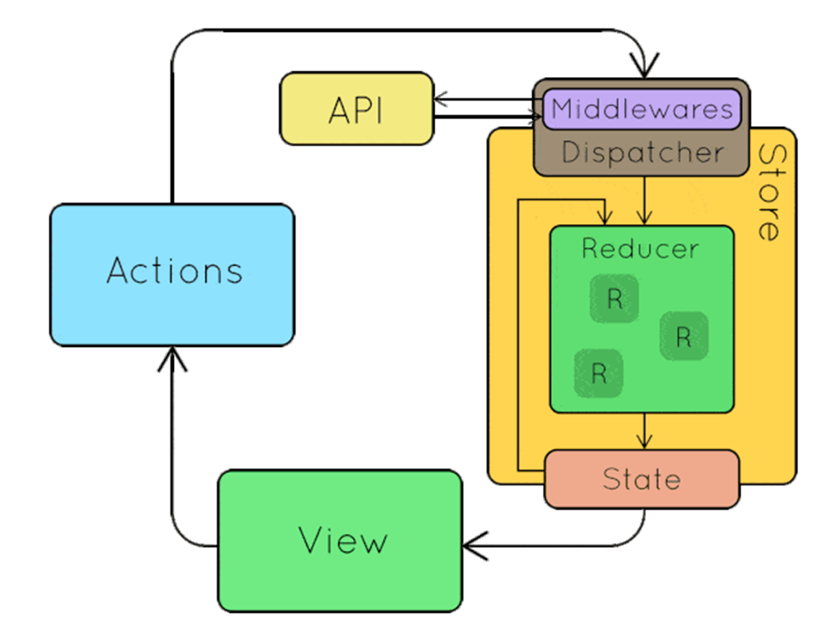
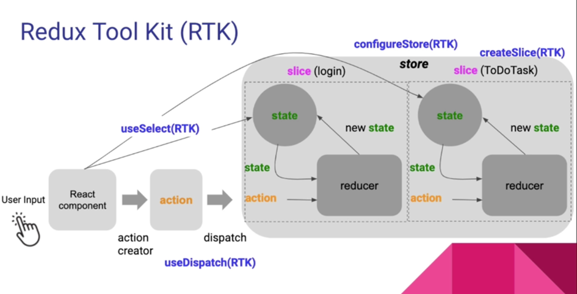

# Redux – Redux Toolkit

## 1. Redux

Redux là một thư viện quản lý state (trạng thái) cho ứng dụng javascript – phổ biến nhất vẫn là react. Giúp quản lý dữ liệu phức tạp một cách nhất quán và dễ theo dõi.

### 1.1. Các thành phần chính

**Store (kho lưu trữ):**
- Là duy nhất cho toàn ứng dụng (single source of truth).
- Lưu toàn bộ state tree và cho phép: getState(), dispatch(action), subscribe(listener).
- Nơi lưu trữ toàn bộ trạng thái của ứng dụng tại một vị trí duy nhất.

**Action (hành động):**
- Một đối tượng mô tả sự kiện đã xảy ra. Nó chứa một thuộc tính type để xác định loại hành động và có thể bao gồm thêm dữ liệu cần thiết.

**Reducer:**
- Một hàm thuần túy nhận vào trạng thái hiện tại và một action, sau đó trả về trạng thái mới. Reducer sẽ xử lý hành động và thực hiện thay đổi trạng thái dựa trên hành động đó.

Ngoài ra còn có Middleware:
- Là các lớp trung gian giúp xử lý các hành động trước khi chúng đến Reducer. Middleware thường được sử dụng để thực hiện các tác vụ như gọi API, xử lý bất đồng bộ,...

Dưới đây là hình ảnh miêu tả cách hoạt động của Redux:

### 1.2. Luồng xử lý của Redux như sau:

**Trường hợp không sử dụng Middleware:** State được khởi tạo bên trong Store -> State được đưa vào Reducer -> Reducer khởi tạo giá trị state ban đầu (initialState) -> Thực hiện action ở component (dispatch event) -> Thay đổi giá trị của state bên trong Reducer thành state mới -> Đẩy state mới ra ngoài View (component)

**Trường hợp sử dụng Middleware:** State được khởi tạo bên trong Store -> State được đưa vào Reducer -> Reducer khởi tạo giá trị state ban đầu (initialState) -> Thực hiện action ở component (dispatch event) -> Gọi API ở Middleware -> Đưa dữ liệu vừa gọi vào Reducer -> Thay đổi giá trị của state bên trong Reducer thành state mới -> Đẩy state mới ra ngoài View (component).

## Redux Toolkit

### 1.2. Redux toolkit là gì?

Redux Toolkit (RTK) là bộ cung cụ chính thức của redux, nhằm đơn giản hoá và tối ưu quy trình phát triển ứng dụng với redux. Thay vì phải viết hàng loạt action creators, reducers, và middleware một cách thủ công, RTK cung cấp các thương thức tiện lợi như createSlice, createAsyncThunk, và configureStore, giúp tự động hoá hầu hết những công việc này

Chi tiết về các tính năng của Redux Toolkit:
- configureStore: Tạo store Redux với mặc định đã được cấu hình sẵn (như devtools, middleware,...).
- createSlice: Tạo ra reducer và action cho một phần của state.
- createAsyncThunk: xử lý bất đồng bộ (ví dụ: lấy dữ liệu từ API) dễ dàng.
- Cung cấp sẵn những best practice trong cấu hình Redux.

## 2.2 Redux Saga là gì?

Redux Saga là một middleware của Redux, giúp quản lý các side effect phức tạp (như call API, tương tác với side effect) trong ứng dụng. Redux Saga sử dụng khái niệm "generator function" để quản lý logic bất đồng bộ dễ hiểu và có tổ chức.
- Quản lý những luồng logic bất đồng bộ phức tạp (gọi API, điều phối nhiều action, concurrency, retry…).
- Tách riêng logic side effect khỏi component và reducer, làm code dễ hiểu và dễ test hơn.

## 3. So sánh Redux Toolkit và Redux Saga

Mặc dù Redux Toolkit và Redux Saga đều nhằm phục vụ ứng dụng Redux, chúng có những vai trò khác nhau:

### 3.1 Redux Toolkit

Redux Toolkit giúp bạn đơn giản hóa việc thiết lập và sử dụng Redux, giảm boilerplate và tự động cung cấp các best practice.
Lợi ích:
- Tạo và quản lý store, state reducer dễ dàng.
- createAsyncThunk giúp xử lý hành động async đơn giản (như gọi API).

Khi nào bạn nên dùng:
- Khi bạn muốn thiết lập Redux nhanh chóng và chuẩn.
- Khi ứng dụng chủ yếu yêu cầu logic bất đồng bộ đơn giản.
- Khi bạn là người mới bắt đầu hoặc muốn code Redux gọn gàng, dễ bảo trì.
- Ví dụ như nếu bạn đang build ứng dụng chỉ có logic bất đồng bộ đơn giản, cần fetch data và update state, createAsyncThunk là đủ.

### 3.2 Redux Saga

Redux Saga làm middleware cho Redux để quản lý side effect phức tạp và logic bất đồng bộ.
Lợi ích: sử dụng generator function để xử lý luồng side effect phức tạp:
- nhiều API call đồng thời
- retry, cancellation
- quản lý logic phức tạp (like concurrency).

Khi nào bạn nên dùng:
- Khi ứng dụng có logic bất đồng bộ phức tạp vượt quá khả năng của createAsyncThunk.
- Khi cần kiểm soát luồng side effect chi tiết, sử dụng generator function để viết code rõ ràng hơn.
- Khi cần các tính năng như debounce, throttle, retry, cancellation logic.
- Ví dụ nếu ứng dụng có logic side effect phức tạp, cần concurrency, cancellation, retry thì bạn cần đến redux saga.

Bạn cũng có thể sử dụng kết hợp cả Redux Saga và Redux Toolkit với nhau:
- RTK giúp cấu hình store và tạo slice dễ dàng.
- Redux Saga đảm nhiệm xử lý logic bất đồng bộ phức tạp mà createAsyncThunk không đáp ứng được.