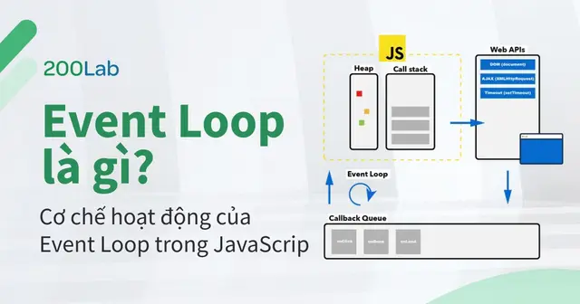

# Event Loop là gì? Cơ chế hoạt động của Event Loop trong JavaScript



## Mục lục

1. [Event Loop là gì?](#1-event-loop-là-gì)
2. [Tại sao Event Loop quan trọng?](#2-tại-sao-event-loop-quan-trọng)
3. [Cơ chế hoạt động Event Loop trong JS](#3-cơ-chế-hoạt-động-event-loop-trong-js)
   - 3.1 [Call Stack](#31-call-stack)
   - 3.2 [Web APIs](#32-web-apis)
   - 3.3 [Task Queue](#33-task-queue)
   - 3.4 [Event Loop](#34-event-loop)
   - 3.5 [Microtask Queue](#35-microtask-queue)
4. [Demo Event Loop với JavaScript](#4-demo-event-loop-với-javascript)
5. [Kết luận](#5-kết-luận)

---

## 1. Event Loop là gì?

**Event Loop** là một cơ chế cho phép xử lý các tác vụ bất đồng bộ trong JavaScript, sử dụng một vòng lặp vô tận để kiểm tra và quản lý các tác vụ. JavaScript có thể xử lý nhiều tác vụ cùng lúc mặc dù JavaScript là **single-threaded** - tại một thời điểm chỉ thực hiện một tác vụ duy nhất.

### Định nghĩa đơn giản

```
Event Loop = Vòng lặp liên tục kiểm tra + Quản lý tác vụ bất đồng bộ
```

---

## 2. Tại sao Event Loop quan trọng?

### ✅ Tránh tình trạng ứng dụng bị treo
Xử lý các tác vụ bất đồng bộ mà không làm nghẽn luồng chính.

### ✅ Xử lý bất đồng bộ
Xử lý tác vụ bất đồng bộ như call API hay thao tác với cơ sở dữ liệu mà không làm chậm chương trình.

### ✅ An toàn khi thực thi tác vụ bất đồng bộ
Event Loop quản lý và điều phối quá trình thực thi các tác vụ không bị xung đột do việc chia sẻ tài nguyên trong JavaScript.

### ✅ Hỗ trợ Promises và async/await
Thay vì phải dùng nhiều callback lồng nhau thì chỉ cần async/await để đoạn mã trở nên đơn giản, dễ quản lý hơn.

```javascript
// ❌ Callback Hell
getData(function(a) {
  getMoreData(a, function(b) {
    getMoreData(b, function(c) {
      getMoreData(c, function(d) {
        console.log(d);
      });
    });
  });
});

// ✅ Async/Await
async function fetchData() {
  const a = await getData();
  const b = await getMoreData(a);
  const c = await getMoreData(b);
  const d = await getMoreData(c);
  console.log(d);
}
```

### ✅ Kiểm soát quá trình thực thi
Hiểu sâu về Event Loop giúp các bạn dev dự đoán được luồng thực thi, debug hiệu quả và nhanh chóng.

### ✅ Giao diện người dùng mượt mà
Duy trì trải nghiệm cho người dùng khi có các tác vụ nặng.

### ✅ Nâng cao hiệu suất
JavaScript có thể xử lý nhiều tác vụ hiệu quả hơn mà không cần phải tạo nhiều luồng, tiết kiệm tài nguyên của hệ thống.

---

## 3. Cơ chế hoạt động Event Loop trong JS

### 3.1 Call Stack

**Call Stack** là một thành phần quan trọng trong JS, quản lý việc thực thi tác vụ của chương trình.

#### Đặc điểm của Call Stack

- ✅ Khi một hàm được gọi trong JavaScript, hàm đó sẽ được thêm vào call stack
- ✅ Call stack hoạt động theo cơ chế **LIFO (Last In First Out)** - Vào sau, ra trước
- ✅ Khi hàm được thực hiện xong sẽ được đẩy ra khỏi call stack
- ⚠️ JavaScript chỉ có thể xử lý **một tác vụ** tại một thời điểm

#### Ví dụ Call Stack

```javascript
function first() {
  console.log('First');
  second();
  console.log('End First');
}

function second() {
  console.log('Second');
}

first();

// Output:
// First
// Second
// End First
```

**Luồng thực thi:**

```
1. first() được push vào Call Stack
2. console.log('First') thực thi
3. second() được push vào Call Stack
4. console.log('Second') thực thi
5. second() được pop ra khỏi Call Stack
6. console.log('End First') thực thi
7. first() được pop ra khỏi Call Stack
```

#### Vấn đề với tác vụ chạy lâu

```javascript
function longRunningTask() {
  // Tác vụ mất nhiều thời gian
  for (let i = 0; i < 1000000000; i++) {
    // Do something...
  }
}

function importantTask() {
  console.log('Important task');
}

longRunningTask(); // Chặn call stack
importantTask(); // Phải đợi longRunningTask() hoàn thành
```

**Trong ví dụ trên:**
- `importantTask()` phải đợi cho đến khi `longRunningTask()` được đẩy ra khỏi Call Stack
- Việc này sẽ mất một chút thời gian và có thể làm **đóng băng chương trình**!

**❓ Câu hỏi**: Trong thực tế khi xây dựng chương trình sẽ có nhiều tác vụ chạy lâu hơn. Điều này có khiến cho toàn bộ ứng dụng treo không?

**✅ Câu trả lời**: May mắn, câu trả lời là **KHÔNG**! Chức năng này thực ra không phải là một phần của JavaScript; **Browser hỗ trợ Web APIs**.

---

### 3.2 Web APIs

**Web API** cung cấp bộ giao diện tương tác bao gồm các tính năng như:
- `fetch()`
- `setTimeout()` / `setInterval()`
- `DOM API`
- `Geolocation API`
- Và nhiều tính năng khác...

#### Vai trò của Web APIs

Web API cho phép:
- ✅ Xử lý các tác vụ **bất đồng bộ**
- ✅ Giảm tải các **longer-running tasks** cho trình duyệt
- ✅ Việc gọi một phương thức API thực chất chỉ là chuyển longer-running task sang môi trường trình duyệt

#### Luồng hoạt động

```javascript
console.log('Start');

setTimeout(() => {
  console.log('Async Task');
}, 0);

console.log('End');

// Output:
// Start
// End
// Async Task
```

**Giải thích:**

```
1. console.log('Start') → thực thi ngay
2. setTimeout() → được chuyển sang Web API
3. console.log('End') → thực thi ngay
4. Sau khi timer hết hạn → callback được đưa vào Task Queue
5. Event Loop đưa callback vào Call Stack
6. console.log('Async Task') → thực thi
```

#### Hai cách Web API hỗ trợ bất đồng bộ

1. **Callback-based**
2. **Promise-based**

#### Ví dụ Callback-based API

```javascript
// Lấy vị trí hiện tại của người dùng
navigator.geolocation.getCurrentPosition(
  // Success callback
  (position) => {
    console.log('Latitude:', position.coords.latitude);
    console.log('Longitude:', position.coords.longitude);
  },
  // Error callback
  (error) => {
    console.error('Error:', error.message);
  }
);

console.log('Request sent!');

// Output:
// Request sent!
// (Sau khi user cho phép)
// Latitude: ...
// Longitude: ...
```

**Luồng thực thi:**

```
1. getCurrentPosition() được push vào Call Stack
2. Browser bắt đầu xử lý yêu cầu vị trí
3. getCurrentPosition() được pop ra khỏi Call Stack
4. Browser hiển thị popup yêu cầu quyền truy cập
5. console.log('Request sent!') thực thi
6. User cho phép → successCallback được đưa vào Task Queue
7. Event Loop đưa callback vào Call Stack để thực thi
```

**❓ Câu hỏi**: `successCallback` sẽ được đưa vào đâu để thực thi?

**✅ Câu trả lời**: Không đơn giản là được đẩy ngược lại call stack bởi vì làm như vậy có thể gián đoạn một tác vụ nào đó đang chạy. Điều này có thể dẫn đến **conflicts**. Thay vào đó, nó được đưa vào **Task Queue**.

---

### 3.3 Task Queue

**Task Queue** (hay còn gọi là **Callback Queue**) chứa các Web API callbacks và các sự kiện đang chờ thực thi.

#### Đặc điểm

- ✅ Hoạt động theo cơ chế **FIFO (First In First Out)** - Vào trước, ra trước
- ✅ Chứa callbacks từ:
  - `setTimeout()`
  - `setInterval()`
  - `setImmediate()` (Node.js)
  - I/O operations
  - UI rendering

#### Ví dụ

```javascript
console.log('1');

setTimeout(() => {
  console.log('2');
}, 0);

setTimeout(() => {
  console.log('3');
}, 0);

console.log('4');

// Output:
// 1
// 4
// 2
// 3
```

**Giải thích:**
- `console.log('1')` và `console.log('4')` thực thi ngay từ Call Stack
- Cả hai `setTimeout()` callbacks được đưa vào Task Queue theo thứ tự
- Event Loop lấy từng callback từ Task Queue và đưa vào Call Stack

---

### 3.4 Event Loop

**Event Loop** có nhiệm vụ **liên tục kiểm tra** xem call stack có trống không.

#### Cơ chế hoạt động

```
┌───────────────────────────┐
│    Call Stack Empty?      │
└───────────┬───────────────┘
            │
            ↓
    ┌───────────────┐
    │      YES      │
    └───────┬───────┘
            │
            ↓
┌───────────────────────────┐
│ Check Microtask Queue     │
└───────────┬───────────────┘
            │
            ↓ (if not empty)
┌───────────────────────────┐
│ Execute all Microtasks    │
└───────────┬───────────────┘
            │
            ↓
┌───────────────────────────┐
│ Check Task Queue          │
└───────────┬───────────────┘
            │
            ↓ (if not empty)
┌───────────────────────────┐
│ Execute 1 Task            │
└───────────────────────────┘
```

#### Quy tắc Event Loop

1. ✅ Kiểm tra Call Stack có trống không
2. ✅ Nếu trống → Kiểm tra **Microtask Queue** trước
3. ✅ Thực thi **TẤT CẢ** microtasks
4. ✅ Sau đó kiểm tra **Task Queue**
5. ✅ Thực thi **MỘT** task từ Task Queue
6. 🔄 Lặp lại từ bước 1

#### Ví dụ setTimeout với delay 0

```javascript
console.log('Start');

setTimeout(() => {
  console.log('Timeout');
}, 0); // Delay = 0ms

console.log('End');

// Output:
// Start
// End
// Timeout (vẫn chạy sau!)
```

**Tại sao setTimeout với delay 0 vẫn chạy sau?**
- Dù delay = 0, callback vẫn phải đi qua Task Queue
- Call Stack phải trống hoàn toàn
- Event Loop mới đưa callback vào Call Stack

---

### 3.5 Microtask Queue

**Microtask Queue** là một hàng đợi khác trong runtime với **độ ưu tiên cao hơn** Task Queue.

#### Microtask Queue dành cho:

- ✅ **Promise handlers**: `then()`, `catch()`, `finally()`
- ✅ **async/await**
- ✅ **MutationObserver callbacks**
- ✅ **queueMicrotask() callbacks**

#### So sánh Microtask Queue vs Task Queue

| Đặc điểm | Microtask Queue | Task Queue |
|----------|----------------|------------|
| **Độ ưu tiên** | Cao hơn | Thấp hơn |
| **Số lượng thực thi** | Tất cả microtasks | 1 task / lần |
| **Chứa gì** | Promises, queueMicrotask | setTimeout, setInterval |
| **Thực thi khi** | Ngay khi Call Stack trống | Sau khi Microtask Queue trống |

#### Ví dụ Promise (Microtask)

```javascript
console.log('1');

setTimeout(() => {
  console.log('2');
}, 0);

Promise.resolve()
  .then(() => {
    console.log('3');
  })
  .then(() => {
    console.log('4');
  });

console.log('5');

// Output:
// 1
// 5
// 3
// 4
// 2
```

**Giải thích:**

```
1. console.log('1') → Call Stack → '1'
2. setTimeout() → Task Queue (chờ)
3. Promise.resolve().then() → Microtask Queue
4. console.log('5') → Call Stack → '5'
5. Call Stack trống
6. Event Loop: Kiểm tra Microtask Queue
7. then() thứ nhất → '3'
8. then() thứ hai → '4'
9. Microtask Queue trống
10. Event Loop: Kiểm tra Task Queue
11. setTimeout callback → '2'
```

#### Visual Diagram

```
┌─────────────────────────────────────────────────┐
│              JAVASCRIPT RUNTIME                  │
├─────────────────────────────────────────────────┤
│                                                  │
│  ┌──────────────┐                               │
│  │  Call Stack  │                               │
│  └──────┬───────┘                               │
│         │                                        │
│  ┌──────▼────────────────────────┐              │
│  │       Event Loop               │              │
│  │  (Check & Execute)             │              │
│  └──────┬────────────────┬────────┘              │
│         │                │                       │
│  ┌──────▼──────┐  ┌──────▼────────┐             │
│  │  Microtask  │  │   Task Queue  │             │
│  │   Queue     │  │  (Callbacks)  │             │
│  │ (Promises)  │  │  (setTimeout) │             │
│  └─────────────┘  └───────────────┘             │
│                                                  │
│  ┌────────────────────────────────┐             │
│  │         Web APIs               │             │
│  │  (setTimeout, fetch, DOM...)   │             │
│  └────────────────────────────────┘             │
└─────────────────────────────────────────────────┘
```

#### Lưu ý quan trọng

⚠️ **Không phải tất cả Web APIs đều bất đồng bộ!**

```javascript
// ✅ Đồng bộ (Synchronous)
localStorage.setItem('key', 'value');
document.getElementById('app');
JSON.parse('{"a": 1}');

// ✅ Bất đồng bộ (Asynchronous)
setTimeout(() => {}, 0);
fetch('https://api.example.com');
Promise.resolve();
```

---

## 4. Demo Event Loop với JavaScript

### Bài tập thực hành

Hãy dự đoán kết quả của đoạn code sau:

```javascript
Promise.resolve()
  .then(() => {
    console.log('1');
  });

setTimeout(() => {
  console.log('2');
}, 10);

queueMicrotask(() => {
  console.log('3');
  queueMicrotask(() => {
    console.log('4');
  });
});

console.log("5");
```

### 🤔 Hãy suy nghĩ trước khi xem đáp án...

<details>
<summary>Nhấn để xem đáp án và giải thích</summary>

### ✅ Kết quả

```
5
1
3
4
2
```

### Giải thích chi tiết

**Bước 1**: Synchronous code thực thi trước

```javascript
console.log("5"); // → Output: 5
```

**Bước 2**: Call Stack trống → Event Loop kiểm tra Microtask Queue

```javascript
// Microtask Queue có 2 microtasks:
// 1. Promise.then()
// 2. queueMicrotask()

Promise.resolve().then(() => {
  console.log('1'); // → Output: 1
});
```

**Bước 3**: Tiếp tục Microtask Queue

```javascript
queueMicrotask(() => {
  console.log('3'); // → Output: 3
  queueMicrotask(() => {
    console.log('4'); // Thêm microtask mới
  });
});
```

**Bước 4**: Microtask mới được thêm vào cũng phải chạy hết

```javascript
// Microtask vừa thêm:
queueMicrotask(() => {
  console.log('4'); // → Output: 4
});
```

**Bước 5**: Microtask Queue trống → Kiểm tra Task Queue

```javascript
setTimeout(() => {
  console.log('2'); // → Output: 2
}, 10);
```

### Timeline visualization

```
Time 0ms:
  ├─ Call Stack: console.log("5")
  ├─ Microtask Queue: [Promise.then, queueMicrotask]
  └─ Task Queue: []

Time 1ms (Call Stack empty):
  ├─ Execute: Promise.then → "1"
  ├─ Execute: queueMicrotask → "3"
  ├─ Microtask Queue: [queueMicrotask("4")]
  └─ Execute: queueMicrotask → "4"

Time 10ms:
  ├─ Microtask Queue: [] (empty)
  ├─ Task Queue: [setTimeout callback]
  └─ Execute: setTimeout → "2"
```

</details>

### Các ví dụ khác

#### Ví dụ 1: Promise Chain

```javascript
console.log('Start');

Promise.resolve()
  .then(() => console.log('Promise 1'))
  .then(() => console.log('Promise 2'));

console.log('End');

// Output:
// Start
// End
// Promise 1
// Promise 2
```

#### Ví dụ 2: Nested setTimeout

```javascript
console.log('A');

setTimeout(() => {
  console.log('B');
  setTimeout(() => {
    console.log('C');
  }, 0);
}, 0);

setTimeout(() => {
  console.log('D');
}, 0);

console.log('E');

// Output:
// A
// E
// B
// D
// C
```

#### Ví dụ 3: Promise + setTimeout

```javascript
setTimeout(() => console.log('1'), 0);

Promise.resolve()
  .then(() => console.log('2'))
  .then(() => console.log('3'));

setTimeout(() => console.log('4'), 0);

// Output:
// 2
// 3
// 1
// 4
```

#### Ví dụ 4: Async/Await

```javascript
async function asyncFunc() {
  console.log('1');
  
  await Promise.resolve();
  
  console.log('2');
}

console.log('3');

asyncFunc();

console.log('4');

// Output:
// 3
// 1
// 4
// 2
```

**Giải thích**: `await` tạm dừng execution và phần code sau `await` được đưa vào Microtask Queue.

---

## 5. Kết luận

### 🎯 Sau bài viết này bạn đã hiểu:

✅ **JavaScript asynchronous và non-blocking**: Biết cách Event Loop, Task Queue, và Microtask Queue làm việc cùng nhau.

✅ **Event Loop quản lý thứ tự thực hiện**: Ưu tiên Microtask Queue trước để đảm bảo các promises và các tác vụ liên quan được xử lý nhanh chóng, sau đó mới đến Task Queue.

✅ **Xử lý bất đồng bộ phức tạp**: Cách hoạt động này giúp JavaScript xử lý các thao tác không đồng bộ phức tạp trong môi trường đơn luồng.

### 📊 Tóm tắt nhanh

```
Call Stack
    ↓ (empty)
Microtask Queue (Priority: HIGH)
  - Promise.then/catch/finally
  - async/await
  - queueMicrotask
    ↓ (empty)
Task Queue (Priority: LOW)
  - setTimeout
  - setInterval
  - I/O operations
```

### 🔑 Key Takeaways

1. **JavaScript = Single-threaded** nhưng có thể xử lý bất đồng bộ nhờ Event Loop
2. **Microtask Queue > Task Queue** về độ ưu tiên
3. **Event Loop** = Vòng lặp liên tục kiểm tra và điều phối
4. **Web APIs** giúp offload các tác vụ nặng ra khỏi Call Stack
5. **Understanding Event Loop** = Debug tốt hơn + Code hiệu quả hơn

### 📚 Tài liệu tham khảo

- [MDN - Event Loop](https://developer.mozilla.org/en-US/docs/Web/JavaScript/EventLoop)
- [JavaScript.info - Event Loop](https://javascript.info/event-loop)
- [What the heck is the event loop anyway?](https://www.youtube.com/watch?v=8aGhZQkoFbQ) (Philip Roberts - JSConf EU)

### 💡 Tips để master Event Loop

1. Thực hành với nhiều ví dụ code
2. Sử dụng `console.log()` để trace execution order
3. Dùng Chrome DevTools để debug asynchronous code
4. Hiểu rõ Promise và async/await
5. Tránh blocking Call Stack với các tác vụ nặng

---

**Happy Coding! 🚀**

> **Ghi chú**: Event Loop là nền tảng quan trọng của JavaScript. Hiểu rõ nó sẽ giúp bạn viết code tốt hơn, debug nhanh hơn và tối ưu performance hiệu quả hơn!