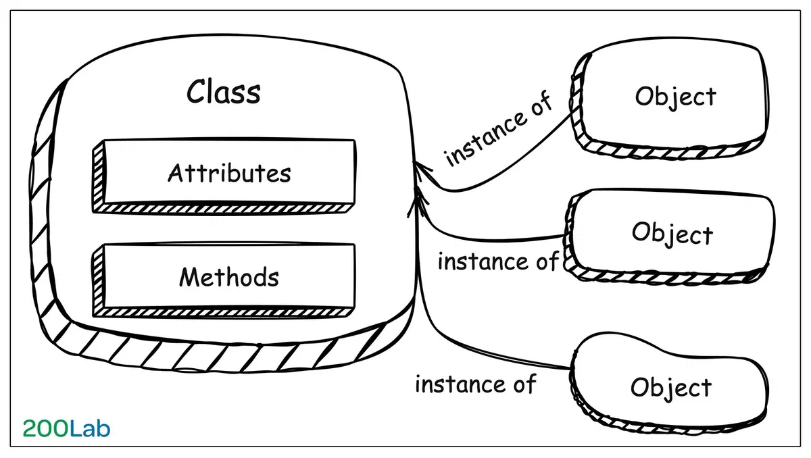
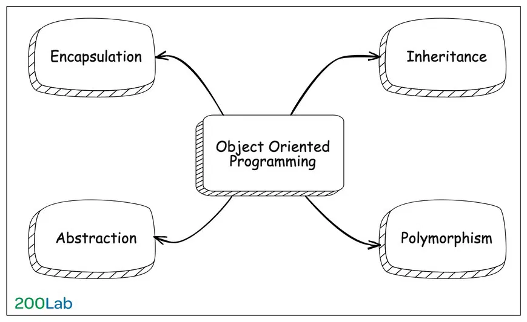

# OOP là gì? Chi tiết về lập trình hướng đối tượng

## Mục lục

1. [OOP là gì?](#1-oop-là-gì)
2. [Các thành phần chính trong OOP](#2-các-thành-phần-chính-trong-oop)
3. [4 tính chất cơ bản trong OOP](#3-4-tính-chất-cơ-bản-trong-oop)
   - 3.1 [Encapsulation (Tính đóng gói)](#31-encapsulation-tính-đóng-gói)
   - 3.2 [Abstraction (Tính trừu tượng)](#32-abstraction-tính-trừu-tượng)
   - 3.3 [Inheritance (Tính kế thừa)](#33-inheritance-tính-kế-thừa)
   - 3.4 [Polymorphism (Tính đa hình)](#34-polymorphism-tính-đa-hình)
4. [Vì sao nên học OOP](#4-vì-sao-nên-học-oop)
5. [Các hạn chế của OOP](#5-các-hạn-chế-của-lập-trình-hướng-đối-tượng-oop)
6. [Kết luận](#6-kết-luận)

---

## Giới thiệu

Chúng ta đang sử dụng các ngôn ngữ lập trình để giải quyết các vấn đề trong cuộc sống hàng ngày. Vì thế sẽ không lý gì chúng ta lại không thể mô hình các vấn đề này sang các ngôn ngữ lập trình hướng đối tượng. Đây chính là nơi mà lập trình hướng đối tượng (**Object-oriented programming**) phát huy vai trò của nó.

---

## 1. OOP là gì?

**OOP** là viết tắt của **Object-oriented programming** (lập trình hướng đối tượng). 

### Định nghĩa

OOP là viết tắt của Object-oriented programming (lập trình hướng đối tượng). OOP là một mô hình lập trình dựa trên khái niệm về **Class** và **Object**. Mô hình này tập trung vào các đối tượng tương tác với nhau 
thay vì tập trung vào logic để thao tác chúng.

### Mục tiêu chính

- ✅ Giúp việc **quản lý mã nguồn** dễ dàng hơn
- ✅ Tăng khả năng **tái sử dụng code**
- ✅ **Bảo trì** và **mở rộng** code đơn giản hơn

### Thành phần của Object

Trong OOP, một Object thường chứa 2 thành phần:

1. **Data** (Dữ liệu)
   - Dưới dạng các **fields** (trường)
   - Còn gọi là **attributes** (thuộc tính) hoặc **properties** (đặc tính)

2. **Code** (Mã)
   - Dưới dạng các **procedures** (thủ tục)
   - Còn gọi là **methods** (phương thức)

---

## 2. Các thành phần chính trong OOP




Trong OOP có 2 thành phần chính: **Class** và **Object**

### 2.1 Class (Lớp) trong OOP

**Class** là một **template** (khuôn mẫu) hay **blueprint** (bản thiết kế) để tạo ra các Object.

#### Class bao gồm:

- **Attributes**: Định nghĩa các thông tin, đặc điểm, thuộc tính của Object
- **Methods**: Định nghĩa các hành vi, phương thức, hành động của Object

#### Ví dụ Class Person

```java
class Person {
    // Attributes (Thuộc tính)
    String name;
    int age;
    String occupation;
    
    // Methods (Phương thức)
    void eat() {
        System.out.println(name + " is eating");
    }
    
    void sleep() {
        System.out.println(name + " is sleeping");
    }
    
    void work() {
        System.out.println(name + " is working");
    }
}
```

### 2.2 Object (Đối tượng) trong OOP

**Object** là một **instance** (thể hiện) của Class - một ví dụ cụ thể, hiện thực của một Class.

#### Ví dụ Objects từ Class Person


```java
// Tạo Objects từ Class Person
Person person1 = new Person();
person1.name = "Nguyễn Văn A";
person1.age = 25;
person1.occupation = "Developer";

Person person2 = new Person();
person2.name = "Trần Thị B";
person2.age = 30;
person2.occupation = "Designer";

// Sử dụng methods
person1.eat();    // Output: Nguyễn Văn A is eating
person2.work();   // Output: Trần Thị B is working
```

**So sánh Class vs Object:**

```
Class Person = Bản thiết kế con người
  ↓
Object person1 = Nguyễn Văn A (người cụ thể)
Object person2 = Trần Thị B (người cụ thể)
```

---

## 3. 4 tính chất cơ bản trong OOP



OOP có 4 tính chất cơ bản (4 trụ cột):

1. **Encapsulation** (Tính đóng gói)
2. **Abstraction** (Tính trừu tượng)
3. **Inheritance** (Tính kế thừa)
4. **Polymorphism** (Tính đa hình)

---

### 3.1 Encapsulation (Tính đóng gói)

#### Định nghĩa

**Encapsulation** là kỹ thuật **gom nhóm** các attributes và methods liên quan vào một Object, đồng thời **ẩn giấu** (hide) các chi tiết bên trong.

#### Mục đích

- ✅ **Bảo vệ dữ liệu** bên trong Object
- ✅ **Kiểm soát** việc truy cập và thay đổi dữ liệu
- ✅ Tăng tính **bảo mật** và **an toàn** cho chương trình

#### Access Modifiers

```java
public    // Truy cập từ mọi nơi
private   // Chỉ truy cập trong class
protected // Truy cập trong class và class con
```


#### Ví dụ: Class Account

```java
class Account {
    // ❌ Private - Không thể truy cập trực tiếp từ bên ngoài
    private String name;
    private double balance;
    
    // ✅ Public - Có thể truy cập từ bên ngoài
    public Account(String name, double initialBalance) {
        this.name = name;
        this.balance = initialBalance;
    }
    
    // Getter - Lấy thông tin
    public String getName() {
        return this.name;
    }
    
    public double getBalance() {
        return this.balance;
    }
    
    // Methods - Thao tác với dữ liệu
    public void deposit(double amount) {
        if (amount > 0) {
            this.balance += amount;
            System.out.println("Deposited: " + amount);
        }
    }
    
    public void withdraw(double amount) {
        if (amount > 0 && amount <= this.balance) {
            this.balance -= amount;
            System.out.println("Withdrawn: " + amount);
        } else {
            System.out.println("Insufficient balance!");
        }
    }
}
```

#### Sử dụng

```java
Account myAccount = new Account("John", 1000);

// ❌ KHÔNG thể làm điều này (vì balance là private)
// myAccount.balance = 999999;

// ✅ Phải sử dụng methods public
myAccount.deposit(500);      // Deposited: 500
System.out.println(myAccount.getBalance()); // 1500

myAccount.withdraw(200);     // Withdrawn: 200
System.out.println(myAccount.getBalance()); // 1300
```

#### Lợi ích của Encapsulation

| Lợi ích | Giải thích |
|---------|-----------|
| **Data Hiding** | Ẩn giấu dữ liệu nhạy cảm |
| **Validation** | Kiểm tra dữ liệu trước khi thay đổi |
| **Flexibility** | Thay đổi implementation mà không ảnh hưởng code bên ngoài |
| **Maintainability** | Dễ bảo trì và debug |

#### Ví dụ thực tế

```java
class BankAccount {
    private String accountNumber;
    private String pin;
    private double balance;
    
    // Validate PIN trước khi withdraw
    public boolean withdraw(String inputPin, double amount) {
        // Bảo mật: Kiểm tra PIN
        if (!this.pin.equals(inputPin)) {
            System.out.println("Incorrect PIN!");
            return false;
        }
        
        // Validation: Kiểm tra số dư
        if (amount > this.balance) {
            System.out.println("Insufficient balance!");
            return false;
        }
        
        // Thực hiện giao dịch
        this.balance -= amount;
        // Log transaction (có thể thêm logic phức tạp)
        logTransaction("WITHDRAW", amount);
        return true;
    }
    
    private void logTransaction(String type, double amount) {
        // Logic ghi log phức tạp ở đây
        System.out.println(type + ": " + amount);
    }
}
```

**Tại sao cần Encapsulation?**

Nếu không có Encapsulation:

```java
// ❌ Không có Encapsulation
class BadAccount {
    public double balance; // Ai cũng có thể thay đổi
}

BadAccount acc = new BadAccount();
acc.balance = 1000;
// Ai đó có thể làm điều này:
acc.balance = -999999; // Số dư âm?! Không hợp lý!
```

Với Encapsulation:

```java
// ✅ Có Encapsulation
class GoodAccount {
    private double balance;
    
    public void setBalance(double balance) {
        if (balance >= 0) { // Validation
            this.balance = balance;
        } else {
            System.out.println("Balance cannot be negative!");
        }
    }
}
```

---

### 3.2 Abstraction (Tính trừu tượng)

#### Định nghĩa

**Abstraction** là kỹ thuật **đơn giản hóa** bằng cách chỉ hiển thị những thông tin **cần thiết** và **ẩn giấu** các chi tiết phức tạp.

#### Mục đích

- ✅ Tập trung vào **"cái gì"** thay vì **"như thế nào"**
- ✅ Giảm độ phức tạp
- ✅ Tăng khả năng tái sử dụng

#### Cách thực hiện Abstraction

1. **Abstract Class** - Class trừu tượng
2. **Interface** - Giao diện

#### Ví dụ 1: Remote Control (Điều khiển từ xa)

```java
// Abstract class
abstract class RemoteControl {
    // Abstract method - Không có implementation
    abstract void powerOn();
    abstract void powerOff();
    abstract void volumeUp();
    abstract void volumeDown();
    
    // Concrete method - Có implementation
    public void showInfo() {
        System.out.println("This is a remote control");
    }
}

// TV Remote
class TVRemote extends RemoteControl {
    void powerOn() {
        System.out.println("TV is turning ON");
        // Logic phức tạp để bật TV (user không cần biết)
    }
    
    void powerOff() {
        System.out.println("TV is turning OFF");
    }
    
    void volumeUp() {
        System.out.println("TV volume UP");
    }
    
    void volumeDown() {
        System.out.println("TV volume DOWN");
    }
}

// AC Remote
class ACRemote extends RemoteControl {
    void powerOn() {
        System.out.println("AC is turning ON");
        // Logic khác để bật điều hòa
    }
    
    void powerOff() {
        System.out.println("AC is turning OFF");
    }
    
    void volumeUp() {
        System.out.println("AC temperature UP");
    }
    
    void volumeDown() {
        System.out.println("AC temperature DOWN");
    }
}
```

**Sử dụng:**

```java
RemoteControl tvRemote = new TVRemote();
tvRemote.powerOn();  // TV is turning ON
tvRemote.volumeUp(); // TV volume UP

RemoteControl acRemote = new ACRemote();
acRemote.powerOn();  // AC is turning ON
acRemote.volumeUp(); // AC temperature UP
```

**User chỉ cần biết**:
- Nhấn nút ON → Thiết bị bật
- Nhấn nút Volume UP → Tăng âm lượng/nhiệt độ

**User không cần biết**:
- Tín hiệu hồng ngoại hoạt động thế nào
- Mã hóa tín hiệu như thế nào
- Hardware xử lý tín hiệu ra sao

#### Ví dụ 2: UIElement

```java
// Abstract class cho UI Elements
abstract class UIElement {
    protected int x, y;
    protected int width, height;
    
    // Abstract method - Mỗi element render khác nhau
    abstract void render();
    
    // Concrete method - Chung cho tất cả elements
    public void move(int newX, int newY) {
        this.x = newX;
        this.y = newY;
    }
}

// Button element
class Button extends UIElement {
    private String label;
    
    void render() {
        System.out.println("Rendering Button: " + label);
        // Logic vẽ button phức tạp
        // - Vẽ hình chữ nhật
        // - Thêm shadow
        // - Vẽ text
        // - Thêm hover effect
    }
}

// Image element
class Image extends UIElement {
    private String imageUrl;
    
    void render() {
        System.out.println("Rendering Image: " + imageUrl);
        // Logic load và hiển thị ảnh phức tạp
        // - Tải ảnh từ URL
        // - Resize ảnh
        // - Apply filters
        // - Render lên canvas
    }
}

// TextInput element
class TextInput extends UIElement {
    private String placeholder;
    
    void render() {
        System.out.println("Rendering TextInput: " + placeholder);
        // Logic vẽ input phức tạp
        // - Vẽ border
        // - Vẽ placeholder text
        // - Handle focus state
        // - Cursor animation
    }
}
```

**Sử dụng:**

```java
List<UIElement> elements = new ArrayList<>();
elements.add(new Button());
elements.add(new Image());
elements.add(new TextInput());

// Render tất cả elements
for (UIElement element : elements) {
    element.render(); // Gọi method chung, nhưng mỗi element tự xử lý
}
```

#### Interface - Một dạng Abstraction khác

```java
interface Vehicle {
    void start();
    void stop();
    void accelerate();
}

class Car implements Vehicle {
    public void start() {
        System.out.println("Car: Turn key, engine starts");
    }
    
    public void stop() {
        System.out.println("Car: Press brake, engine stops");
    }
    
    public void accelerate() {
        System.out.println("Car: Press gas pedal");
    }
}

class Bicycle implements Vehicle {
    public void start() {
        System.out.println("Bicycle: Start pedaling");
    }
    
    public void stop() {
        System.out.println("Bicycle: Use hand brake");
    }
    
    public void accelerate() {
        System.out.println("Bicycle: Pedal faster");
    }
}
```

#### Abstraction vs Encapsulation

| Khía cạnh | Abstraction | Encapsulation |
|-----------|-------------|---------------|
| **Mục đích** | Ẩn giấu **complexity** | Ẩn giấu **data** |
| **Focus** | **What** it does | **How** it does |
| **Implementation** | Abstract class, Interface | Access modifiers (private, public) |
| **Level** | Design level | Implementation level |

#### Ví dụ thực tế: ATM Machine

```java
abstract class ATM {
    // User chỉ biết các operations này
    abstract void checkBalance();
    abstract void withdraw(double amount);
    abstract void deposit(double amount);
    
    // User KHÔNG cần biết:
    // - Kết nối database như thế nào
    // - Mã hóa dữ liệu ra sao
    // - Xác thực thẻ như thế nào
    // - In biên lai thế nào
}
```

---

### 3.3 Inheritance (Tính kế thừa)

#### Định nghĩa

**Inheritance** là cơ chế cho phép một class **kế thừa** (inherit) các attributes và methods từ class khác.

#### Thuật ngữ

- **Parent Class** / **Base Class** / **Super Class**: Class cha
- **Child Class** / **Derived Class** / **Sub Class**: Class con

#### Mục đích

- ✅ **Tái sử dụng code** (Code reusability)
- ✅ Giảm **duplication** (trùng lặp)
- ✅ Tạo **hierarchy** (phân cấp) rõ ràng

#### Ví dụ 1: Animal Hierarchy

```java
// Parent class
class Animal {
    String name;
    int age;
    
    void eat() {
        System.out.println(name + " is eating");
    }
    
    void sleep() {
        System.out.println(name + " is sleeping");
    }
    
    void makeSound() {
        System.out.println(name + " makes a sound");
    }
}

// Child class 1
class Dog extends Animal {
    String breed;
    
    // Override method từ parent
    @Override
    void makeSound() {
        System.out.println(name + " barks: Woof! Woof!");
    }
    
    // Method riêng của Dog
    void fetch() {
        System.out.println(name + " is fetching the ball");
    }
}

// Child class 2
class Cat extends Animal {
    boolean isIndoor;
    
    @Override
    void makeSound() {
        System.out.println(name + " meows: Meow! Meow!");
    }
    
    // Method riêng của Cat
    void scratch() {
        System.out.println(name + " is scratching");
    }
}

// Child class 3
class Bird extends Animal {
    boolean canFly;
    
    @Override
    void makeSound() {
        System.out.println(name + " chirps: Tweet! Tweet!");
    }
    
    void fly() {
        if (canFly) {
            System.out.println(name + " is flying");
        }
    }
}
```

**Sử dụng:**

```java
Dog dog = new Dog();
dog.name = "Buddy";
dog.age = 3;
dog.breed = "Golden Retriever";

// Methods từ Animal (kế thừa)
dog.eat();       // Buddy is eating
dog.sleep();     // Buddy is sleeping

// Method override
dog.makeSound(); // Buddy barks: Woof! Woof!

// Method riêng của Dog
dog.fetch();     // Buddy is fetching the ball

Cat cat = new Cat();
cat.name = "Whiskers";
cat.age = 2;
cat.makeSound(); // Whiskers meows: Meow! Meow!
cat.scratch();   // Whiskers is scratching
```

#### Visualization

```
        Animal (Parent)
        ├─ name
        ├─ age
        ├─ eat()
        ├─ sleep()
        └─ makeSound()
           ↓ (kế thừa)
    ┌──────┼──────┐
    │      │      │
   Dog    Cat   Bird
(+ breed) (+ isIndoor) (+ canFly)
(+ fetch()) (+ scratch()) (+ fly())
```

#### Loại Inheritance

##### 1. Single Inheritance (Đơn kế thừa)

Một class chỉ kế thừa từ **một** parent class duy nhất.

```java
class Vehicle {
    void start() { }
}

class Car extends Vehicle {
    // Car chỉ kế thừa từ Vehicle
}
```

##### 2. Multiple Inheritance (Đa kế thừa)

Một class kế thừa từ **nhiều** parent classes.

> ⚠️ **Lưu ý**: Java **KHÔNG** hỗ trợ multiple inheritance với classes (để tránh Diamond Problem)

```java
// ❌ KHÔNG thể làm điều này trong Java
class FlyingCar extends Car, Aircraft {
    // ERROR: Multiple inheritance not supported
}
```

**Giải pháp**: Sử dụng **Interface**

```java
interface Flyable {
    void fly();
}

interface Drivable {
    void drive();
}

// ✅ Có thể implement nhiều interfaces
class FlyingCar implements Flyable, Drivable {
    public void fly() {
        System.out.println("Flying in the sky");
    }
    
    public void drive() {
        System.out.println("Driving on the road");
    }
}
```

#### "Is-a" Relationship

"Is-a" giúp xác định khi nào nên dùng kế thừa.

```
Dog IS-A Animal          ✅ Đúng → Dog extends Animal
Car IS-A Vehicle         ✅ Đúng → Car extends Vehicle
Button IS-A UIElement    ✅ Đúng → Button extends UIElement

Dog IS-A Car             ❌ Sai → Không nên kế thừa
```

**Ví dụ thực tế:**

```java
// Shape hierarchy
class Shape {
    String color;
    void draw() { }
}

class Circle extends Shape {
    // Circle IS-A Shape ✅
    double radius;
}

class Rectangle extends Shape {
    // Rectangle IS-A Shape ✅
    double width;
    double height;
}

class Triangle extends Shape {
    // Triangle IS-A Shape ✅
    double base;
    double height;
}
```

#### "Has-a" Relationship (Composition)

"Has-a" là **thay thế** cho kế thừa, sử dụng **composition** (phối hợp).

```java
// ❌ Không nên: Car extends Engine (Car IS-A Engine? Sai!)

// ✅ Nên: Car HAS-A Engine
class Engine {
    int horsepower;
    void start() {
        System.out.println("Engine started");
    }
}

class Car {
    Engine engine; // Car HAS-A Engine
    
    Car() {
        this.engine = new Engine();
    }
    
    void start() {
        engine.start();
        System.out.println("Car started");
    }
}
```

**Thêm ví dụ Has-a:**

```java
class Customer {
    String name;
    String email;
}

class Product {
    String name;
    double price;
}

class Order {
    Customer customer;    // Order HAS-A Customer
    List<Product> products; // Order HAS-A List of Products
    double totalAmount;
}
```

#### Khi nào dùng Inheritance vs Composition?

```
Inheritance (Is-a):
✅ Có mối quan hệ rõ ràng "is-a"
✅ Child class là một dạng đặc biệt của Parent class
✅ Cần override methods từ parent

Composition (Has-a):
✅ Cần tính linh hoạt cao
✅ Muốn tránh tight coupling
✅ Cần kết hợp nhiều functionalities
```

---

### 3.4 Polymorphism (Tính đa hình)

#### Định nghĩa

**Polymorphism** = "Poly" (nhiều) + "Morph" (hình dạng)

Polymorphism cho phép một Object có thể có **nhiều hình dạng** và **hành vi** khác nhau.

#### Phân loại


1. **Static Polymorphism** (Compile-time)
   - Method Overloading
2. **Dynamic Polymorphism** (Runtime)
   - Method Overriding

---

#### Static Polymorphism (Method Overloading)

**Định nghĩa**: Nhiều methods **cùng tên** nhưng **khác tham số** trong cùng một class.

**Điều kiện để Overloading:**

- Cùng tên method
- Khác số lượng tham số, HOẶC
- Khác kiểu dữ liệu tham số

```java
class Calculator {
    // Method 1: Cộng 2 số int
    int add(int a, int b) {
        return a + b;
    }
    
    // Method 2: Cộng 3 số int (khác số lượng tham số)
    int add(int a, int b, int c) {
        return a + b + c;
    }
    
    // Method 3: Cộng 2 số double (khác kiểu tham số)
    double add(double a, double b) {
        return a + b;
    }
    
    // Method 4: Cộng array
    int add(int[] numbers) {
        int sum = 0;
        for (int num : numbers) {
            sum += num;
        }
        return sum;
    }
}
```

**Sử dụng:**

```java
Calculator calc = new Calculator();

System.out.println(calc.add(5, 3));           // 8 (Method 1)
System.out.println(calc.add(5, 3, 2));        // 10 (Method 2)
System.out.println(calc.add(5.5, 3.2));       // 8.7 (Method 3)
System.out.println(calc.add(new int[]{1,2,3})); // 6 (Method 4)
```

**Ví dụ thực tế: Print method**

```java
class Printer {
    void print(String text) {
        System.out.println("Text: " + text);
    }
    
    void print(int number) {
        System.out.println("Number: " + number);
    }
    
    void print(String text, int copies) {
        for (int i = 0; i < copies; i++) {
            System.out.println("Text: " + text);
        }
    }
    
    void print(String[] texts) {
        for (String text : texts) {
            System.out.println("Text: " + text);
        }
    }
}
```

**Lợi ích của Method Overloading:**

- ✅ Code dễ đọc, dễ nhớ (cùng tên method)
- ✅ Tăng tính linh hoạt
- ✅ Giảm sự phức tạp

---

#### Dynamic Polymorphism (Method Overriding)

**Định nghĩa**: Child class **định nghĩa lại** (ghi đè) method từ Parent class với **cùng signature** (tên, tham số, return type).

```java
class Animal {
    void makeSound() {
        System.out.println("Animal makes a sound");
    }
    
    void move() {
        System.out.println("Animal moves");
    }
}

class Dog extends Animal {
    // Override method makeSound()
    @Override
    void makeSound() {
        System.out.println("Dog barks: Woof! Woof!");
    }
    
    @Override