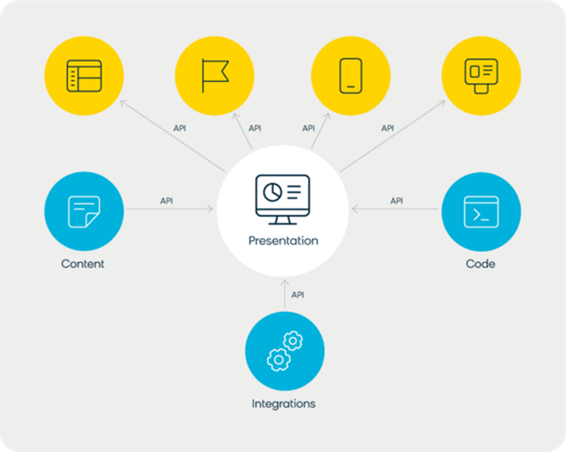
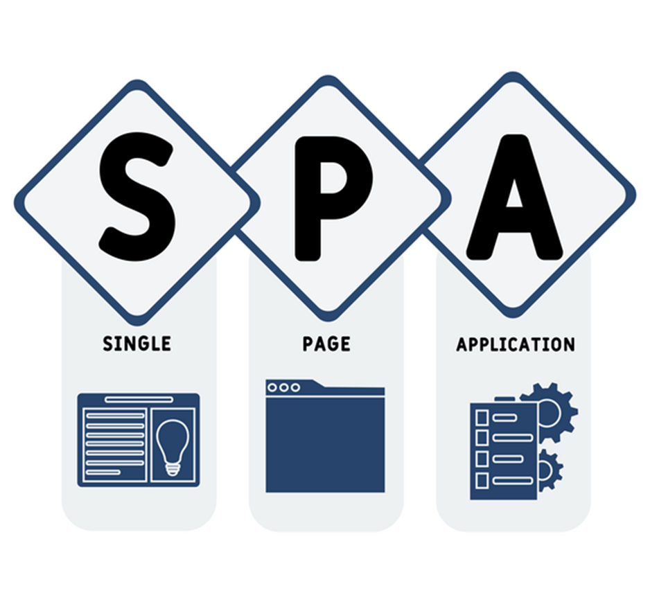
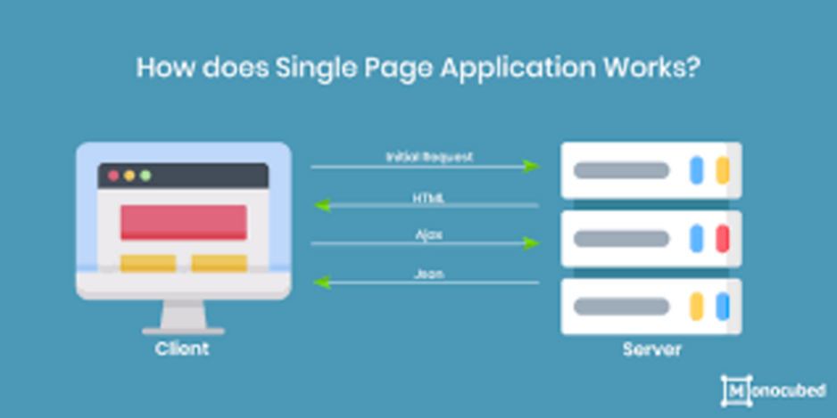
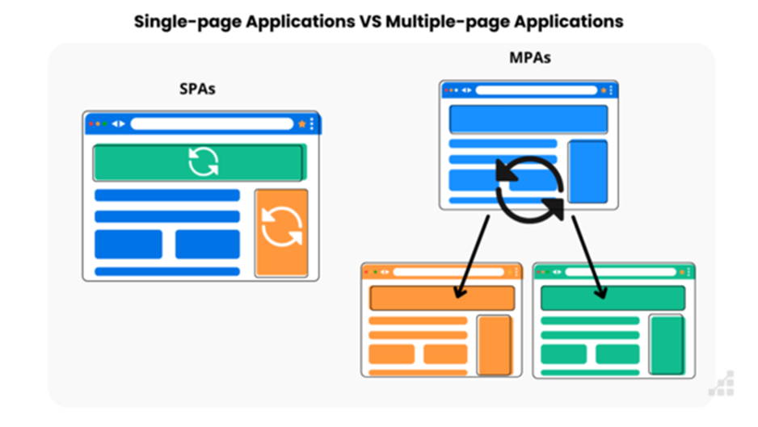

# SPA (Single Page Application)

SPA, hay còn gọi là ứng dụng web một trang, là một loại ứng dụng web hoạt động bên trong trình duyệt và không yêu cầu tải lại toàn bộ trang mỗi khi người dùng tương tác. Thay vì tải một trang HTML mới từ máy chủ cho mỗi hành động, SPA chỉ cập nhật các thành phần cụ thể của trang hiện tại. Điều này tạo ra trải nghiệm người dùng mượt mà và nhanh chóng hơn, tương tự như khi sử dụng các ứng dụng desktop. Hãy tưởng tượng bạn đang sử dụng một ứng dụng email. Khi bạn nhấp vào một email, nội dung email sẽ xuất hiện ngay lập tức mà không cần tải lại toàn bộ trang. Đó chính là cách SPA hoạt động. SPA sử dụng Javascript Framework để xử lý hầu hết các tác vụ ở phía client. Vậy, điều gì khiến SPA trở nên khác biệt so với các ứng dụng web truyền thống?

## SPA (Single Page Application) là gì?

## 2. SPA hoạt động như thế nào?

Để hiểu rõ hơn về SPA, chúng ta cần đi sâu vào cách thức hoạt động của nó. Khi người dùng truy cập một SPA, trình duyệt sẽ tải xuống một trang HTML ban đầu cùng với tất cả các tệp JavaScript, CSS và các tài sản khác cần thiết. Sau đó, JavaScript sẽ tiếp quản việc điều khiển giao diện người dùng. Khi người dùng tương tác với trang web, ví dụ như nhấp vào một liên kết hoặc gửi một biểu mẫu, JavaScript sẽ gửi yêu cầu đến máy chủ để lấy dữ liệu cần thiết. Dữ liệu này thường được trả về dưới dạng JSON (JavaScript Object Notation). Sau khi nhận được dữ liệu, JavaScript sẽ cập nhật các thành phần tương ứng trên trang mà không cần tải lại toàn bộ trang. Điều này được thực hiện thông qua việc thao tác với DOM (Document Object Model), cấu trúc đại diện cho trang web trong trình duyệt. Quy trình này diễn ra nhanh chóng và liền mạch, tạo ra trải nghiệm người dùng mượt mà hơn so với các ứng dụng web truyền thống. Bạn có thể hình dung SPA như một ngôi nhà được xây sẵn. Khi bạn muốn thay đổi nội thất, bạn chỉ cần di chuyển đồ đạc chứ không cần phải xây lại toàn bộ ngôi nhà.

## 3. Ưu điểm của SPA

SPA mang lại nhiều lợi ích đáng kể so với các ứng dụng web truyền thống. Dưới đây là một số ưu điểm của SPA:

- Tốc độ: SPA tải trang nhanh hơn vì chỉ cần tải dữ liệu cần thiết thay vì toàn bộ trang. Điều này cải thiện đáng kể trải nghiệm người dùng, đặc biệt là trên các thiết bị di động hoặc kết nối internet chậm.
- Trải nghiệm người dùng mượt mà: SPA tạo ra trải nghiệm người dùng liền mạch và tương tác cao. Các thao tác như chuyển trang, gửi biểu mẫu, hoặc cập nhật dữ liệu diễn ra nhanh chóng và không gây gián đoạn.
- Khả năng tái sử dụng mã: SPA cho phép tái sử dụng mã giữa frontend và backend, giúp giảm thiểu thời gian và chi phí phát triển.
- Dễ dàng phát triển API: SPA tách biệt rõ ràng giữa frontend và backend, giúp dễ dàng phát triển các API (Application Programming Interface) để phục vụ cho nhiều ứng dụng khác nhau.
- Khả năng làm việc offline: Với việc sử dụng Service Workers, SPA có thể lưu trữ dữ liệu và tài sản tĩnh trong bộ nhớ cache, cho phép người dùng truy cập ứng dụng ngay cả khi không có kết nối internet.

Ví dụ, các ứng dụng như Gmail hay Google Maps đều là SPA. Bạn có thể sử dụng chúng ngay cả khi không có kết nối internet, mặc dù một số tính năng sẽ bị hạn chế.

## Ưu điểm của SPA

## 4. Nhược điểm của SPA

Mặc dù SPA có nhiều ưu điểm, nhưng cũng tồn tại một số nhược điểm cần xem xét trước khi quyết định sử dụng.

- SEO (Search Engine Optimization): SPA có thể gặp khó khăn trong việc SEO vì các công cụ tìm kiếm thường khó thu thập dữ liệu từ các trang web JavaScript. Tuy nhiên, có nhiều kỹ thuật SEO hiện đại có thể giúp cải thiện khả năng hiển thị của SPA trên các công cụ tìm kiếm.
- Thời gian tải ban đầu lâu hơn: Do SPA cần tải xuống tất cả các tệp JavaScript và CSS ban đầu, thời gian tải ban đầu có thể lâu hơn so với các ứng dụng web truyền thống. Tuy nhiên, sau khi tải xong, ứng dụng sẽ hoạt động rất nhanh.
- Yêu cầu kiến thức JavaScript chuyên sâu: Để xây dựng SPA, bạn cần có kiến thức vững chắc về JavaScript và các JavaScript Framework.
- Vấn đề bảo mật: SPA có thể dễ bị tấn công XSS (Cross-Site Scripting) hơn nếu không được bảo mật đúng cách.
- Khó debug: Việc gỡ lỗi SPA có thể phức tạp hơn so với các ứng dụng web truyền thống do logic phức tạp và việc sử dụng nhiều thư viện và framework.

Trước khi quyết định sử dụng SPA, hãy cân nhắc kỹ các ưu và nhược điểm để đảm bảo rằng nó phù hợp với yêu cầu của dự án.

## Nhược điểm của SPA

## 5. So sánh SPA và MPA (Multi-Page Application)

Để hiểu rõ hơn về SPA, chúng ta hãy so sánh nó với MPA (Multi-Page Application), hay còn gọi là ứng dụng web nhiều trang, là loại ứng dụng web truyền thống yêu cầu tải lại toàn bộ trang mỗi khi người dùng tương tác.

Dưới đây là bảng so sánh chi tiết giữa SPA và MPA:

| Tính năng | SPA (Single Page Application) | MPA (Multi-Page Application) |
|-----------|-------------------------------|------------------------------|
| Tốc độ | Nhanh hơn, chỉ tải dữ liệu cần thiết. | Chậm hơn, tải lại toàn bộ trang mỗi khi tương tác. |
| Trải nghiệm người dùng | Mượt mà, tương tác cao. | Gián đoạn, cần thời gian tải lại trang. |
| SEO | Khó khăn hơn, cần các kỹ thuật SEO đặc biệt. | Dễ dàng hơn, các công cụ tìm kiếm dễ thu thập dữ liệu. |
| Thời gian tải ban đầu | Lâu hơn, cần tải tất cả các tệp JavaScript và CSS. | Nhanh hơn, chỉ tải các tệp cần thiết cho trang hiện tại. |
| Bảo trì | Khó khăn hơn, code phức tạp hơn. | Dễ dàng hơn, code đơn giản hơn. |
| Khả năng offline | Có thể, với việc sử dụng Service Workers. | Không, cần kết nối internet để tải trang mới. |
| Kiến thức cần thiết | Yêu cầu kiến thức JavaScript chuyên sâu. | Yêu cầu kiến thức về backend và frontend. |

MPA phù hợp với các trang web lớn và phức tạp, nơi SEO là yếu tố quan trọng hàng đầu. Ngược lại, SPA phù hợp với các ứng dụng web tương tác cao, nơi trải nghiệm người dùng là ưu tiên hàng đầu.

## So sánh SPA và MPA (Multi-Page Application)

## 6. Các Framework phổ biến để xây dựng SPA

Để xây dựng SPA hiệu quả, bạn cần sử dụng các JavaScript Framework mạnh mẽ. Dưới đây là một số framework phổ biến nhất:

- ReactJS: Được phát triển bởi Facebook, ReactJS là một thư viện JavaScript phổ biến để xây dựng giao diện người dùng. ReactJS sử dụng JSX (JavaScript XML) để tạo ra các thành phần giao diện có thể tái sử dụng và Virtual DOM để tối ưu hóa hiệu suất.
- Angular: Được phát triển bởi Google, Angular là một framework JavaScript mạnh mẽ để xây dựng các ứng dụng web phức tạp. Angular sử dụng TypeScript, một superset của JavaScript, và cung cấp nhiều tính năng như Dependency Injection, Routing và Data Binding.
- VueJS: Là một framework JavaScript nhẹ và dễ học, VueJS được sử dụng để xây dựng các ứng dụng web nhỏ và vừa. VueJS tập trung vào việc tạo ra giao diện người dùng tương tác và có hiệu suất cao.

Ngoài ra, còn có nhiều framework và thư viện JavaScript khác có thể được sử dụng để xây dựng SPA, như Svelte, EmberJS, và Preact. Lựa chọn framework phù hợp phụ thuộc vào yêu cầu cụ thể của dự án, kinh nghiệm của đội ngũ phát triển, và sở thích cá nhân. Nếu bạn mới bắt đầu, VueJS có thể là một lựa chọn tốt do tính dễ học và cộng đồng hỗ trợ lớn. Nếu bạn cần xây dựng một ứng dụng phức tạp và có yêu cầu cao về hiệu suất, ReactJS hoặc Angular có thể là lựa chọn tốt hơn.

## Các Framework phổ biến để xây dựng SPA

## 7. Ví dụ thực tế về SPA

SPA đang được sử dụng rộng rãi trong nhiều ứng dụng web hiện đại. Dưới đây là một số ví dụ thực tế về SPA:

- Gmail: Ứng dụng email của Google là một ví dụ điển hình về SPA. Khi bạn nhấp vào một email, nội dung email sẽ xuất hiện ngay lập tức mà không cần tải lại toàn bộ trang.
- Google Maps: Ứng dụng bản đồ của Google cũng là một SPA. Khi bạn di chuyển bản đồ hoặc tìm kiếm địa điểm, ứng dụng sẽ cập nhật giao diện một cách mượt mà và nhanh chóng.
- Facebook: Trang mạng xã hội lớn nhất thế giới cũng sử dụng SPA để cung cấp trải nghiệm người dùng mượt mà và tương tác cao.
- Twitter: Ứng dụng mạng xã hội Twitter cũng là một SPA. Khi bạn cuộn trang hoặc đăng một tweet, ứng dụng sẽ cập nhật giao diện một cách nhanh chóng và liền mạch.
- Netflix: Ứng dụng xem phim trực tuyến Netflix cũng sử dụng SPA để cung cấp trải nghiệm xem phim mượt mà và không gián đoạn.

Các ứng dụng này đều có chung một đặc điểm là tốc độ tải nhanh, trải nghiệm người dùng mượt mà và khả năng tương tác cao. Đây là những lợi ích mà SPA mang lại cho người dùng. Bạn có thể thấy SPA được sử dụng trong nhiều lĩnh vực khác nhau, từ email, bản đồ, mạng xã hội đến xem phim trực tuyến.

## Ví dụ thực tế về SPA

## 8. Khi nào nên sử dụng SPA?

SPA là một lựa chọn tuyệt vời cho nhiều loại ứng dụng web, nhưng không phải lúc nào cũng là lựa chọn tốt nhất. Dưới đây là một số trường hợp nên sử dụng SPA:

- Ứng dụng web tương tác cao: Nếu bạn đang xây dựng một ứng dụng web yêu cầu nhiều tương tác từ người dùng, như ứng dụng quản lý dự án, ứng dụng CRM, hoặc ứng dụng chỉnh sửa ảnh, SPA có thể là lựa chọn tốt nhất.
- Ứng dụng web cần tốc độ tải nhanh: Nếu tốc độ tải trang là một yếu tố quan trọng, SPA có thể giúp cải thiện đáng kể trải nghiệm người dùng.
- Ứng dụng web yêu cầu trải nghiệm người dùng mượt mà: Nếu bạn muốn tạo ra một trải nghiệm người dùng liền mạch và không gián đoạn, SPA có thể giúp bạn đạt được mục tiêu này.
- Ứng dụng web có API backend: Nếu bạn đã có một API backend hoặc có kế hoạch xây dựng một API backend, SPA có thể dễ dàng tích hợp với API này.
- Ứng dụng web cần khả năng làm việc offline: Nếu bạn muốn ứng dụng web của mình có thể hoạt động ngay cả khi không có kết nối internet, SPA có thể giúp bạn đạt được điều này với việc sử dụng Service Workers.

Trước khi quyết định sử dụng SPA, hãy cân nhắc kỹ các yêu cầu của dự án và đảm bảo rằng nó phù hợp với các tiêu chí trên.

## Khi nào nên sử dụng SPA?

## 9. Khi nào không nên sử dụng SPA?

Mặc dù SPA có nhiều ưu điểm, nhưng cũng có những trường hợp không nên sử dụng SPA. Dưới đây là một số ví dụ:

- Trang web tĩnh: Nếu bạn chỉ cần xây dựng một trang web tĩnh, như trang giới thiệu công ty hoặc trang blog đơn giản, SPA có thể là quá phức tạp và không cần thiết.
- Trang web có yêu cầu SEO cao: Nếu SEO là yếu tố quan trọng hàng đầu, MPA có thể là lựa chọn tốt hơn. Mặc dù có thể tối ưu hóa SEO cho SPA, nhưng nó đòi hỏi nhiều công sức và kỹ thuật hơn.
- Ứng dụng web nhỏ và đơn giản: Nếu bạn chỉ cần xây dựng một ứng dụng web nhỏ và đơn giản, MPA có thể là lựa chọn đơn giản và nhanh chóng hơn.
- Đội ngũ phát triển thiếu kinh nghiệm về JavaScript: Để xây dựng SPA hiệu quả, bạn cần có kiến thức vững chắc về JavaScript và các JavaScript Framework. Nếu đội ngũ phát triển của bạn thiếu kinh nghiệm về JavaScript, MPA có thể là lựa chọn phù hợp hơn.
- Ngân sách hạn hẹp: Xây dựng SPA có thể tốn nhiều thời gian và chi phí hơn so với xây dựng MPA, đặc biệt là nếu bạn cần thuê các chuyên gia về JavaScript.

Hãy đánh giá kỹ các yếu tố trên trước khi quyết định sử dụng SPA cho dự án của bạn.

## Khi nào không nên sử dụng SPA?