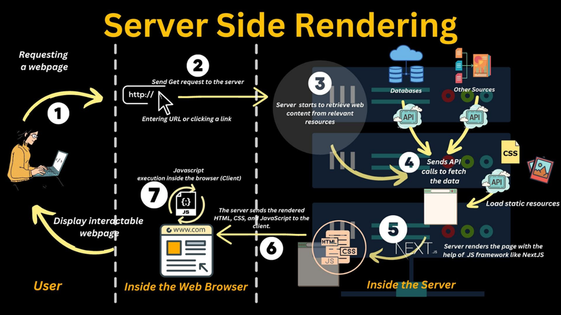
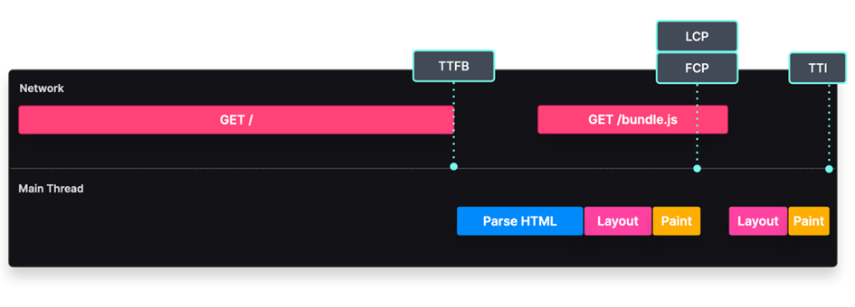

# So sánh CSR (Client-Side Rendering) và SSR (Server-Side Rendering)

## 1. Tổng quan về Rendering

Rendering là quá trình mà một website được biến từ code HTML, CSS, JS (hoặc các định dạng khác) thành giao diện mà người dùng nhìn thấy và tương tác được
•	Khi mở một website, ta nhận về một số dữ liệu (dạng text, JSON, HTML,...) từ server.
•	Browser sẽ diễn giải và biến các code này thành hình ảnh, chữ, màu, hiệu ứng,… để người dùng có thể xem và thao tác.
Tuy nhiên, quá trình này có thể diễn ra ở nhiều "bước" khác nhau, và đây chính là lúc khái niệm CSR (Client-Side Rendering) và SSR (Server-Side Rendering) xuất hiện.

## 2. Tổng quan về khái niệm của CSR

Nếu bạn từng tự hỏi tại sao các website hiện nay lại có tốc độ phản hồi nhanh, giao diện mượt mà và trải nghiệm tương tác tuyệt vời, thì Client-Side Rendering (CSR) chính là chìa khóa giúp bạn tạo nên điều đó. Các website hiện nay không chỉ dừng lại ở việc hiển thị nội dung tĩnh.
Hãy tưởng tượng: bạn đang sử dụng website quản lý công việc, mỗi cú click chuột thêm task mới sẽ lập tức hiển thị kết quả trên màn hình mà không có bất kỳ độ trễ nào. Hay khi bạn lướt store online, các thông tin sản phẩm, giỏ hàng, hay danh mục được load và update ngay lập tức. Nó bắt nguồn từ việc render giao diện trực tiếp trong browser của bạn.
Trong thực tế, CSR thường được áp dụng đặc biệt cho SPA (Single Page Application) hay các website tương tác cao như công cụ quản lý công việc, quản trị, dashboard. Tại sao lại như vậy? Hãy cùng mình đi qua bài viết này từ khái niệm cơ bản: "Client-Side Rendering là gì?", đến cách thức hoạt động của CSR.

### 2.1. Giới thiệu về CSR (Client-Side Rendering)

Trước đó, khi người dùng truy cập một website, browser sẽ gửi reques đến server. Server xử lý yêu cầu, render toàn bộ trang HTML trên server và trả về cho browser một trang HTML đã hoàn thiện.
Tuy nhiên, với sự phát triển của JavaScript và nhu cầu người dùng tương tác cao trên website, CSR ra đời và đặc biệt trở nên phổ biến. CSR chuyển phần lớn quá trình render giao diện từ server sang browser, tận dụng tài nguyên máy của người dùng, đồng thời tạo ra trải nghiệm mượt mà, tương tác nhanh chóng hơn.


 
Hầu hết các Single Page Application (SPA) - các ứng dụng web chỉ load trang HTML ban đầu, sau đó tương tác và cập nhật nội dung động mà không làm load lại trang - đều áp dụng CSR. Các thư viện và framework hiện đại như: React, Vue, Angular đều mặc định hoạt động theo hướng CSR hoặc hybrid (kết hợp SSR và CSR).

### 2.2. CSR (Client-Side Rendering) là gì?

Client-Side Rendering (CSR) là phương thức mà browser (client) đảm nhiệm việc render các nội dung HTML, CSS, JavaScript từ khung ban đầu. Thông thường, khi sử dụng CSR, server sẽ gửi cho cho client các thành phần HTML rất cơ bản, kèm theo liên kết đến các file JS (JavaScript) lớn. Khi browser nhận HTML rỗng (hoặc gần như rỗng) này, nó sẽ tải và thực thi JavaScript để render toàn bộ giao diện.
Nói dễ hiểu hơn thì bạn hãy tưởng tượng, bạn sử dụng React để build website. Khi người dùng thực hiện tìm kiếm website của bạn (ví dụ: https://ttv-fe.com) và nhấn Enter, browser sẽ yêu cầu server gửi về file HTML (thường là file index.html) cùng với các file JavaScript đã được build sẵn (thường là các file .js trong thư mục build như: main.js, bundle.js,…).
•	File index.html ban đầu có thể trống rỗng, chỉ chứa <div id="root"></div>.
•	Sau khi load xong main.js, browser sẽ chạy React, "mount" ứng dụng vào thẻ <div id="root"> và bắt đầu tạo ra giao diện đầu tiên.
•	Ứng dụng React sẽ gửi thêm các yêu cầu fetch đến API để lấy dữ liệu, rồi hiển thị dữ liệu này lên màn hình.


 
Khi người dùng truy cập vào URL, server hầu như chỉ trả về khung HTML cơ bản, thường là file HTML trống hoặc chỉ có một vài thẻ <div> làm "vỏ". Browser sau đó mới load JavaScript. Chính các file JavaScript này, sau khi được load và thực thi, sẽ xây dựng cấu trúc DOM, chèn nội dung và cập nhật giao diện theo logic được định nghĩa trong source code frontend.
Nói cách khác, thay vì server phải tạo ra HTML hoàn chỉnh cho từng request, thì trong CSR, phần lớn việc tạo nội dung trang, diễn ra trong browser sau khi người dùng đã tải về source code JavaScript của ứng dụng.
Điều này mở ra nhiều khả năng:
•	Ứng dụng có thể điều hướng giữa các "trang" nội bộ mà không cần load lại toàn bộ từ server.
•	Giao diện có thể cập nhật ngay lập tức khi có sự kiện người dùng (như click chuột, nhập liệu), tạo cảm giác tương tác mượt mà.
•	Toàn bộ logic dựng giao diện, định tuyến, quản lý trạng thái được chuyển hẳn về phía client, giúp server giảm việc phải render.

### 2.3. Cơ chế hoạt động của Client-Side Rendering


 
Quy trình chung của CSR thường diễn ra như thế này:
•	Khi người dùng gõ vào browser URL (ví dụ: https://200lab.io/), browser gửi request đến server. Server trả về file HTML rất đơn giản, thường chỉ chứa một <div id="root"></div> hoặc tương tự, kèm theo một thẻ <script src="/bundle.js"></script>.
•	Browser sẽ nhận HTML, bắt đầu phân tích cấu trúc. Thời điểm này, nội dung thực tế trên trang gần như chưa có. Màn hình có thể chỉ hiển thị trang trắng hoặc một layout đơn giản.
•	Khi browser gặp thẻ <script src="/bundle.js"></script>, nó gửi request tải file JavaScript từ server. File này thường chứa toàn bộ logic ứng dụng, từ định tuyến, quản lý trạng thái đến các component giao diện.
•	Sau khi load JavaScript, browser sẽ thực thi code. JavaScript sẽ tìm các phần tử DOM gốc (document.getElementById("root")), sau đó sử dụng các thư viện hoặc logic thuần JavaScript để build giao diện.
Ví dụ, nếu dùng React, ReactDOM.render(…) sẽ tạo ra cây component và gắn nó vào #root. Trong quá trình này, JavaScript có thể gọi API, lấy dữ liệu từ server (thông qua AJAX, Fetch API), sau đó cập nhật giao diện tương ứng.
•	Khi DOM đã được cập nhật bởi JavaScript, người dùng bắt đầu thấy nội dung xuất hiện trên trang. Tất cả tương tác tiếp theo, như click chuột, nhập vào form, chuyển sang trang "khác" trong SPA, đều được xử lý phía client.
Nếu cần thêm dữ liệu, JavaScript sẽ gọi API từ phía client và cập nhật DOM mà không cần load lại trang.

### 2.4. Tại sao nên chọn Client-Side Rendering?

•	CSR cho phép web phản hồi gần như ngay lập tức với tương tác người dùng. Khi click vào button, bạn không cần load lại toàn bộ trang, chỉ phần giao diện liên quan được cập nhật. Điều này mang lại trải nghiệm thoải mái và dễ chịu.
•	SPA là kiến trúc mà toàn bộ ứng dụng được gói gọn trong trang HTML duy nhất. Điều hướng giữa các "trang" thực chất là thay đổi trạng thái bên trong ứng dụng, cập nhật DOM mà không load lại toàn bộ.
Ví dụ, khi bạn click vào link "Tìm hiểu ngay" trên một SPA, JavaScript sẽ chặn hành vi load lại trang, thay vào đó, nó cập nhật giao diện bằng nội dung "Tìm hiểu ngay" mới tải từ API hoặc được lưu trữ trong memory. Người dùng cảm thấy như đang chuyển trang, nhưng thật ra không hề có request HTML mới đến server.
•	Trong CSR, server chỉ cần phục vụ file HTML tĩnh, bundle JavaScript, CSS, và có thể một số file media. Sau đó, hầu hết logic kết xuất được đẩy sang client. Điều này có thể giảm tải cho server về mặt render giao diện, nâng cao khả năng mở rộng.

### 2.5. Những điều cần lưu ý khi triển khai Client-Side Rendering

•	Kích thước bundle JavaScript: vì toàn bộ logic ứng dụng chạy phía client, kích thước file JavaScript (bundle) có thể rất lớn. Điều này dẫn đến thời gian load lâu, ảnh hưởng đến trải nghiệm người dùng. Cần có các biện pháp tối ưu như: code splitting, tree shaking, lazy-loading.
•	State Management: khi ứng dụng lớn, việc quản lý dữ liệu (state) và chia sẻ nó giữa các component rất phức tạp. Các thư viện như: Redux, Zustand, Pinia, hoặc cơ chế nội bộ (React Context API, Vuex) giúp quản lý trạng thái hiệu quả và dễ dàng cập nhật DOM.
•	Client-Side Routing: thay vì để server quyết định trang nào được trả về, việc điều hướng URL sang "trang" khác trong SPA được xử lý bởi JavaScript. CÁc thư viện định tuyến như: React Router, Vue Router, Angular Router đảm bảo URL thay đổi nhưng không tải lại trang, chỉ cập nhật giao diện.
•	Tối ưu SEO: CSR mặc định không thân thiện với SEO vì bot tìm kiếm có thể không chờ JavaScript chạy hoàn chỉnh. Các giải pháp:
- Sử dụng prerendering: tạo bản tĩnh HTML của trang để bot thu thập
- Kết hợp SSR + CSR (hydratation): render ban đầu trên server để nội dung sẵn có cho SEO, sau đó client tiếp tục xử lý tương tác.
- Sử dụng dịch vụ prerendering, hoặc áp dụng Progressive Enhancement (cung cấp ít nhất nội dung cốt lõi ở dạng HTML tĩnh).
•	Progressive Enhancement: đảm bảo rằng trang sẽ vẫn có phần nội dung cơ bản ở mức HTML tĩnh, sau đó JavaScript mới thêm tương tác, trang sẽ ít bị phụ thuộc hoàn toàn vào CSR.

### 2.6. Tổng kết

Với CSR, thay vì server tạo sẵn HTML hoàn chỉnh, ta đẩy công đoạn kết xuất giao diện sang trình duyệt. Mặc dù điều này có thể gây chậm trễ ban đầu, nhưng sau khi trang được tải, trải nghiệm tương tác trên CSR rất mượt và linh hoạt.
CSR đặc biệt phù hợp với các web phức tạp, SPA, dashboard, nơi mà sự linh hoạt và phản hồi nhanh. Tuy nhiên, CSR cũng mang theo nhiều thách thức như: SEO kém hơn, kích thước bundle lớn, và yêu cầu tối ưu hiệu năng phức tạp.

## 3. Tổng quan về khái niệm của SSR

Khi bạn truy cập website, bạn mong muốn sẽ nhìn thấy nội dung xuất hiện càng nhanh càng tốt. Bạn cũng muốn rằng website này có thể được tìm kiếm dễ dàng trên Google. Đây chính là lúc kỹ thuật Server-Side Rendering (SSR) trở nên hữu ích.
Trước khi SSR phổ biến, nhiều website sử dụng Client-Side Rendering (CSR): nghĩa là khi người dùng truy cập, browser sẽ nhận được file HTML trống, sau đó load xuống file JavaScript rất lớn, rồi chạy JavaScript đó để tạo ra giao diện. Vấn đề ở đây là: phải chờ JavaScript load và chạy xong, người dùng mới thấy được nội dung. Điều này có thể khiến trang load chậm. Công cụ tìm kiếm cũng gặp khó khăn vì lúc crawler (bot của công cụ tìm kiếm) đến, nó thấy HTML gần như trống, có thể bị hiểu nhầm là nội dung sơ sài.
SSR ra đời để khắc phục: thay vì để browser tự build giao diện, sẽ dựng sẵn HTML ngay trên server và gửi nó về. Như vậy, khi người dùng truy cập, họ thấy nội dung ngay (vì HTML đã có sẵn). Sau đó, browser mới tải JavaScript để thêm tính tương tác. Cách làm này cải thiện trải nghiệm người dùng, hỗ trợ SEO tốt hơn, và vẫn giữ được sự linh hoạt khi cần nội dung động.

### 3.1. Server-Side Rendering là gì?

Server-Side Rendering (SSR) là cách tiếp cận ngược lại. Thay vì browser phải "render" mọi thứ, server sẽ handle và trả về HTML hoàn thiện của page. Từ đó, browser gần như: chỉ cần load HTML (và CSS, JS tĩnh nếu cần) để hiển thị ngay lập tức.
Để bạn dễ hiểu thì mình lấy ví dụ framework Nextjs nha
•	Khi bạn truy cập https://200lab.io/blog, server sẽ "chạy" React trên server, áp dụng router, gọi data (từ API hoặc database) để "render" ra nội dung HTML hoàn chỉnh (hoặc gần như hoàn chỉnh).
•	Server trả về page HTML này cho browser.
•	Browser nhận được page HTML đã có sẵn nội dung, hiển thị gần như ngay lập tức.
•	Sau đó, JavaScript phía client (cũng được đóng gói sẵn) sẽ "tiếp quản" trang, để hỗ trợ tương tác client-side.


 
Ví dụ: nếu không có SSR, khi bạn vào website, bạn có thể nhận file HTML gần như rỗng: chỉ có <div id="root"></div>. Browser phải chạy JavaScript để tạo giao diện. Nếu như với SSR, khi bạn vào website, bạn nhận ngay đoạn HTML đã chứa đầy đủ <h1>Tiêu đề</h1><p>Nội dung trang...</p>. Browser hiển thị ngay nội dung mà bạn không phải chờ đợi.

### 3.2. Tại sao SSR quan trọng?

Người dùng thấy nội dung sớm hơn
Khi trang web của bạn được render từ phía server (SSR), server sẽ xử lý ứng dụng và trả về đoạn HTML hoàn chỉnh ngay khi có yêu cầu. Khác với Client-Side Rendering (CSR), browser của bạn ban đầu nhận được một file HTML gần như trống (chỉ chứa vài thẻ cơ bản và một div trống), sau đó phải tải file JavaScript, phân tích và thực thi JavaScript để dựng giao diện hoàn thiện. Quá trình này ở CSR có thể mất thời gian, đặc biệt đối với kết nối internet chậm hoặc thiết bị yếu.


 
Với SSR, ngay khi người dùng truy cập trang, bạn nhận được một khối HTML đã đầy đủ nội dung. Browser chỉ cần parse và hiển thị nó ngay lập tức, thay vì phải chờ đợi JavaScript load xong và hoàn thiện giao diện. Kết quả là người dùng sẽ thấy nội dung hiển thị trên màn hình nhanh chóng hơn rất nhiều. Thời gian hiển thị thông tin ban đầu (First Contentful Paint - FCP) được rút ngắn, tạo cảm giác "nhanh" hơn, giảm khả năng người dùng rời khỏi trang do chờ đợi lâu.
Tốt cho SEO (Tối ưu hóa công cụ tìm kiếm)
Trong mô hình CSR, khi bot tìm kiếm truy cập vào website, ban đầu nó có thể thấy HTML rất ít nội dung, phải chờ để "chạy" JavaScript mới thấy nội dung thật sự. Việc này có thể làm công cụ tìm kiếm gặp khó khăn hoặc chậm trễ trong việc lập chỉ mục nội dung, hoặc tệ hơn, một số công cụ tìm kiếm yếu hơn không thấy được nội dung đầy đủ nếu không xử lý được JavaScript - giảm performance rất nhiều.
Ngược lại, với SSR, khi bot của công cụ tìm kiếm vào trang, HTML đã sẵn sàng với đầy đủ nội dung. Bot không cần phải chờ JavaScript chạy để có giao diện hoàn chính; nội dung đã hiển thị ngay trong HTML ban đầu. Điều này giúp công cụ tìm kiếm dễ dàng đọc, hiểu, và lập chỉ mục nội dung của trang. Kết quả là trang của bạn có cơ hội xếp hạng cao hơn trong kết quả tìm kiếm, thu hút nhiều lượt truy cập hơn.
Phù hợp cho nội dung tùy biến theo người dùng
Nhiều website ngày nay cần hiển thị nội dung khác nhau cho từng người dùng dựa trên thông tin đăng nhập, cookies, session, hoặc token gửi kèm request. Ví dụ:
•	Website thương mại điện tử muốn hiển thị giá khuyến mãi riêng cho khách hàng VIP.
•	Social Website hiển thị nguồn tin (feed) cá nhân dựa trên bạn bè của người dùng.
•	Dashboard doanh nghiệp chỉ hiển thị dữ liệu dựa trên quyền của tài khoản đã đăng nhập.
Với SSR, bạn có thể thực hiện logic xác thực và xử lý dữ liệu người dùng ngay trên server. Server sẽ dựa vào cookie, token, hoặc thông tin phiên đăng nhập, sau đó render giao diện đã được "cá nhân hóa" trước khi gửi về browser. Nhờ vậy, người dùng khi truy cập sẽ thấy ngay nội dung phù hợp với họ mà không cần phải đợi tự browser fetch dữ liệu và cập nhật lại giao diện.

### 3.3. Cơ chế hoạt động của SSR

Hãy tưởng tượng bạn có website được viết bằng React. Thông thường nó sẽ hoạt động như thế này:
•	Browser yêu cầu trang.
•	Server trả về HTML rỗng + file JavaScript lớn.
•	Browser load và chạy JavaScript, cuối cùng mới thấy nội dung.
Đối với cơ chế hoạt động của SSR bạn hãy xem qua hình phía dưới, kết hợp phần giải thích của mình bên dưới để hiểu rõ hơn nhé.


 
•	Người dùng thực hiện hành động, ví dụ như nhập URL vào thanh địa chỉ trên browser hoặc click vào một liên kết dẫn đến website. Browser lúc này sẽ gửi request HTTP (GET request) đến server để yêu cầu nội dung của trang.
•	Khi hành động request được thực hiện, browser sẽ gửi request HTTP tới server của ứng dụng. Request này chứa: URL của trang, các thông tin liên quan khác như: cookies, headers để server có thể xử lý.
•	Server nhận request từ browser và bắt đầu thực hiện các công việc sau:
•	Truy xuất dữ liệu từ databases.
•	Kết nối đến các API.
•	Lấy các file tĩnh cần thiết như là: hình ảnh, CSS,... 
•	Server gửi các yêu cầu API để lấy dữ liệu: quá trình này, server sẽ gửi API calls đến backend hoặc bên thứ ba để lấy dữ liệu.
Ví dụ: nếu người dùng truy cập trang sản phẩm, server có thể gửi request đến một API để lấy thông tin chi tiết của sản phẩm (tên, giá, hình ảnh, mô tả,...).
Ngoài ra, server có thể tải các file CSS hoặc hình ảnh cần thiết để đưa vào giao diện HTML.
•	Server render website
•	Sau khi có tất cả dữ liệu (Database, API,...), server sẽ sử dụng framework hoặc công cụ JavaScript.
•	Server sẽ:
•	Render các thành phần giao diện thành code HTML tĩnh.
•	Chèn dữ liệu động vào các phần thích hợp của HTML.
•	Kết quả là trang HTML đã hoàn chỉnh, chứa đầy đủ thông tin và cấu trúc giao diện.
•	Server gửi HTML, CSS và JavaScript tới browser
•	HTML hoàn chỉnh (đã render), CSS (định dạng giao diện), và các file JavaScript (logic động) sẽ được gửi từ server về browser của người dùng.
•	Khi browser nhận được các file này:
•	HTML: được parse và hiển thị ngay lập tức. Người dùng có thể thấy nội dung tĩnh gần như ngay lập tức mà không cần chờ load JavaScript.
•	CSS: được tải để áp dụng định dạng cho HTML, giúp giao diện trang trở nên đẹp và đầy đủ.
•	JavaScript: được tải xuống nhưng chưa chạy.
Lúc này là người dùng đã có thể nhìn thấy nội dung tĩnh của trang.
•	Browser chạy JavaScript (hydrate)
Khi JavaScript được tải xong, browser sẽ:
•	Chạy các logic động được định nghĩa trong ứng dụng (thông qua JavaScript).
•	Gắn các event handlers (trình xử lý sự kiện, ví dụ: click, hover) vào các thành phần HTML.
Quá trình này được gọi là Hydration, trong đó JavaScript "kích hoạt" các thành phần giao diện đã render trên server, biến chúng từ HTML tĩnh thành các thành phần tương tác động.
•	Website hiển thị và tương tác được
Sau khi hoàn tất các bước trên, trang web trở nên đầy đủ và tương tác được. Người dùng có thể:
•	Xem nội dung mà không cần chờ lâu vì HTML được render sẵn.
•	Tương tác với trang như: onClick vào button, submit form,...

### 3.4. SSR cải thiện hiệu suất


 
Trên là hình ảnh tóm tắt cách SSR hoạt động và các chỉ số quan trọng liên quan đến hiệu suất:
•	TTFB (Time to First Byte): thời gian từ khi browser gửi request đến khi nhận được byte đầu tiên từ server.
•	FCP (First Contentful Paint): thời gian để nội dung đầu tiên xuất hiện trên màn hình.
•	LCP (Largest Contentful Paint): thời gian để phần nội dung lớn nhất (tiêu đề hoặc hình ảnh chính) hiển thị hoàn chỉnh.
•	TTI (Time to Interactive): thời gian để website có thể tương tác.

### 3.5. Hạn chế của SSR?

Chi phí server tăng cao
•	Nguyên nhân:
•	Với mỗi request từ người dùng, server phải thực hiện công việc: xử lý request, Fetch dữ liệu từ API hoặc cơ sở dữ liệu, render giao diện thành HTML.
•	Nếu có nhiều người dùng truy cập đồng thời, tải trọng trên server tăng lên rất nhanh.
•	Hậu quả:
•	Server cần tài nguyên mạnh hơn (CPU, RAM) để xử lý nhiều request trong cùng lúc.
•	Chi phí vận hành server (hosting) có thể tăng cao, đặc biệt với các website có lưu lượng truy cập lớn.
•	Một số giải pháp:
•	Caching HTML đã render để tái sử dụng, giảm tải cho server.
•	Streaming SSR: gửi HTML từng phần để giảm thời gian xử lý.
Ví dụ như trang tin tức với hàng triệu lượt truy cập mỗi ngày. Nếu sử dụng SSR mà không caching, server phải render hàng triệu lần/ngày, chi phí phát sinh sẽ rất lớn.
Phức tạp hơn trong triển khai và bảo trì
•	Nguyên nhân:
•	SSR đòi hỏi bạn phải chạy JavaScript trên server (thường là môi trường Node.js).
•	Cần đồng bộ logic giữa server (SSR) và client (hydrate). Ví dụ:
•	Dữ liệu nào nên render trên server, dữ liệu nào nên fetch trên client?
•	Làm sao để tránh render lặp lại nội dung đã có?
•	Khó khăn trong việc bảo trì:
•	Codebase phức tạp hơn vì cần xử lý cả logic server và client.
•	Phải quản lý hiệu năng server, caching, và đồng thời tối ưu SEO.
Ví dụ như bạn có một ứng dụng React bình thường có thể chạy trên client chỉ với một file HTML. Nhưng khi thêm SSR, bạn cần:
•	Thiết lập server Node.js.
•	Kết hợp thêm framework như Next.js hoặc tự xây dựng SSR.
•	Quản lý quá trình hydrate sau khi server render xong.
TTFB (Time To First Byte) tăng so với SSG
TTFB là thời gian từ khi người dùng gửi request đến khi họ nhận được byte đầu tiên của phản hồi từ server. Với SSR:
•	Server phải render HTML mỗi khi có request.
•	Điều này làm TTFB cao hơn so với Static Site Generation (SSG), nơi server chỉ cần trả về một file HTML tĩnh đã được tạo sẵn.
Trang có thể mất thêm vài mili giây đến vài giây trước khi người dùng nhận được byte đầu tiên. Nếu server chậm hoặc phải xử lý quá nhiều request, thời gian phản hồi có thể kéo dài, làm giảm trải nghiệm người dùng.
Cá nhân mình gặp trường hợp này, thường sẽ sử dụng caching để lưu trữ HTML render sẵn và sử dụng Edge Rendering (SSR tại các máy chủ CDN) để giảm độ trễ.
Ví dụ: trang e-commerce dùng SSG có thể trả về HTML tĩnh trong 50ms. Nhưng với SSR, nếu server phải fetch dữ liệu từ API, render HTML, rồi mới trả về, TTFB có thể lên đến 200ms.

### 3.6. Khi nào nên sử dụng SSR?

Server-Side Rendering (SSR) không phải lúc nào cũng là lựa chọn tốt nhất, vì nó đi kèm với chi phí và sự phức tạp cao hơn. Theo cá nhân mình thấy thì những trường hợp cụ thể khi SSR thực sự mang lại lợi ích lớn và phù hợp với nhu cầu của bạn:
•	Bạn mong muốn website của bạn xếp hạng cao trên các công cụ tìm kiếm như Google. Nội dung của bạn phải được hiển thị đầy đủ ngay trong HTML, để các bot của công cụ tìm kiếm có thể lập chỉ mục (indexing) chính xác.
•	Vậy thì tại sao lại phù hợp?
•	Crawler không cần chạy JavaScript để "hiểu" nội dung, vì tất cả đã có sẵn trong HTML.
•	Các trang CSR có thể bị crawler bỏ qua nếu JavaScript bị lỗi hoặc browser của bot không hỗ trợ.
•	Web của bạn không thể sử dụng các file HTML tĩnh vì nội dung thay đổi liên tục hoặc phụ thuộc vào người dùng cụ thể như: dashboard, profile,...
•	SSR cho phép server xử lý logic tùy chỉnh trước khi gửi HTML cho client.
•	Người dùng nhận được trang cá nhân hóa ngay từ đầu, không phải chờ client fetch dữ liệu và cập nhật giao diện.
•	Bạn cần website hiển thị nội dung nhanh nhất có thể để giữ chân người dùng, thời gian hiển thị nội dung đầu tiên (FCP) đóng vai trò quan trọng trong việc giảm tỷ lệ thoát (bounce rate) như landing page marketing, homepage.
•	HTML được render sẵn và gửi về ngay, giúp browser hiển thị nội dung gần như ngay lập tức.
•	Cải thiện trải nghiệm người dùng, đặc biệt với những người dùng có kết nối mạng chậm hoặc thiết bị yếu.
Nếu trang của bạn là SPA nội bộ, không cần SEO, SSR có thể không cần thiết. Nếu trang ít thay đổi, SSG (tạo tĩnh) có thể nhanh hơn. SSR phù hợp khi bạn cần linh hoạt và thân thiện SEO, nhưng chấp nhận phức tạp hơn.

### 3.7. SSR với framework NextJS

Việc tự code SSR sẽ giúp bạn hiểu rõ cơ chế, nhưng thường khá vất vả. Framework Next.js sẽ lo phần nặng nhọc. Với Next.js bạn không phải tự cấu hình SSR, mọi thứ đều tự động. Bạn chỉ cần tập trung vào logic ứng dụng.
```JSX
export async function getServerSideProps() {
  const res = await fetch('https://jsonplaceholder.typicode.com/posts/1');
  const post = await res.json();
  return { props: { post } };
}

export default function Home({ post }) {
  return (
    <main>
      <h1>SSR with Next.js</h1>
      <h2>{post.title}</h2>
      <p>{post.body}</p>
    </main>
  );
}
```
Truy cập http://localhost:3000, bạn thấy nội dung ngay vì Next.js đã SSR sẵn, không cần bạn viết renderToString như bên React.
Không phải là SSR lúc nào cũng nhanh, đây là một vài cách mình hay sử dụng
•	Caching: Lưu kết quả SSR vào bộ nhớ hoặc CDN. Nếu dữ liệu ít thay đổi, thay vì render mỗi request, bạn cache vài chục giây.
```JS
let cachedData = null;
let lastFetch = 0;
server.get('*', async (req, res) => {
  const now = Date.now();
  if (!cachedData || (now - lastFetch) > 10000) {
    const response = await fetch('https://jsonplaceholder.typicode.com/posts/4');
    cachedData = await response.json();
    lastFetch = now;
  }

});
```
•	Streaming SSR (React 18): Thay vì chờ render xong toàn bộ trang, bạn gửi HTML từng phần. Trình duyệt hiển thị sớm phần có sẵn.

```JS
import { renderToPipeableStream } from 'react-dom/server';

server.get('/', (req, res) => {
  const { pipe } = renderToPipeableStream(<App message="Streaming" />, {
    onShellReady() {
      res.setHeader('Content-type', 'text/html');
      pipe(res);
    }
  });
});
```
•	Giảm kích thước bundle JS: Next.js hỗ trợ code splitting, dynamic import.
•	Tối ưu database và API: giảm thiểu số lần truy vấn, tăng tốc server.
Với SSR, nội dung có sẵn trong HTML. Công cụ tìm kiếm (Google) thấy nội dung mà không cần chạy JS, từ đó dễ lập chỉ mục hơn. Bạn cũng có thể đặt thẻ <title>, <meta> trên server, giúp SEO tốt.

```JS
import Head from 'next/head';

export default function Page({ post }) {
  return (
    <>
      <Head>
        <title>{post.title}</title>
        <meta name="description" content={post.body.slice(0,100)} />
      </Head>
      <main>
        <h1>{post.title}</h1>
        <p>{post.body}</p>
      </main>
    </>
  );
}
```
Nhờ SSR, <title> và <meta> xuất hiện ngay trong HTML trả về.
Lưu ý: SSR chạy trên server, bạn có thể kiểm tra token, cookie để quyết định nội dung hiển thị. Ví dụ, chỉ người dùng đã đăng nhập mới thấy thông tin nhạy cảm. Tuy nhiên, chú ý không đẩy thông tin nhạy cảm vào HTML. Tất cả dữ liệu trong HTML gửi xuống client là công khai. Chỉ gửi thông tin cần thiết. Thông tin nhạy cảm cần được bảo vệ (ví dụ gửi token nhạy cảm ở HTTP-only cookie chứ không nhúng vào HTML).

### 3.8. Kết luận

Server-Side Rendering mang lại sự cân bằng tuyệt vời: nội dung xuất hiện sớm, hỗ trợ SEO, và vẫn giữ được khả năng tương tác như một SPA sau khi hydrate. Mặc dù phức tạp hơn so với CSR thuần túy, nhưng với sự hỗ trợ từ các framework như Next.js, Remix việc triển khai SSR đã trở nên dễ dàng hơn nhiều.

## 4. Sự khác nhau chi tiết giữa CSR và SSR

Bây giờ, cùng mình đặt CSR và SSR lên "bàn cân", so sánh một cách chi tiết hơn thông qua một vài khía cạnh quan trọng: hiệu năng (performance), SEO, trải nghiệm người dùng (UX), bảo mật, khả năng mở rộng (scalability), độ phức tạp khi phát triển, và chi phí.

### 4.1 Hiệu năng (performance)

•	CSR:
•	Lần load page đầu tiên (initial load) có thể chậm do phải tải về JS khá lớn.
•	Sau khi đã tải xong, điều hướng giữa các trang (các route) thường mượt mà, không cần reload toàn bộ page.
•	Thích hợp cho các ứng dụng web nặng về mặt tương tác của người dùng, sau bước tải đầu tiên, mọi thứ sẽ mượt hơn.
•	SSR:
•	Thời gian hiển thị page đầu tiên sẽ nhanh hơn, vì người dùng nhận được HTML tĩnh ngay lập tức.
•	Tuy nhiên, nếu server xử lý chậm, thì tốc độ phản hồi cũng bị ảnh hưởng.
•	Với SSR, mỗi lần điều hướng sang trang mới có thể kích hoạt vòng render trên server (trừ khi ta sử dụng tính năng "client-side navigation" trong Next.js hoặc Nuxt.js, nên vẫn có chi phí phía server.

### 4.2 SEO

•	CSR:
•	SEO bị hạn chế hơn, vì nội dung trang nằm trong JS, gây khó khăn cho bot tìm kiếm (mặc dù Google đã hỗ trợ render JS ở mức độ tốt).
•	Các mạng xã hội hoặc bot khác (không phải Google) có thể không hỗ trợ JavaScript, dẫn đến việc không đọc được nội dung.
•	Nếu bạn cần SEO cao, CSR truyền thống thật sự thì đây không phải phương án lý tưởng.
•	SSR:
•	Rất phù hợp cho SEO, vì HTML đầy đủ được gửi về ngay ban đầu, các công cụ tìm kiếm dễ index nội dung.
•	Chia sẻ link lên mạng xã hội sẽ hiển thị được meta tags, hình ảnh,…

### 4.3 Trải nghiệm người dùng (UX)

•	CSR:
•	Trải nghiệm khá giống với ứng dụng di động: nhanh, mượt, không cần reload trang.
•	Người dùng có thể thấy một màn hình trắng xoá ban đầu nếu tốc độ mạng chậm (thường thì sẽ sử dụng skeleton nếu page đang load dữ liệu).
•	Sau khi đã "load" xong, mọi thao tác chuyển trang, hiển thị danh mục,… diễn ra trên client, nên tạo cảm giác rất nhanh.
•	SSR:
•	Hiển thị nội dung ngay lập tức, không bị màn hình trắng ban đầu.
•	Mỗi lần request trang mới (nếu không dùng "client-side navigation" bổ trợ) sẽ tải lại HTML từ server, có thể gây chớp trang.
•	Với Next.js, Nuxt.js, SvelteKit,… ta có thể kết hợp SSR với tính năng SPA để giảm cảm giác chớp.

### 4.4 Bảo mật

•	CSR:
•	Dữ liệu nhạy cảm không nên để lộ trong JavaScript (client).
•	Cần xác thực và phân quyền ở back-end, vì front-end hay CSR chỉ nên hiển thị dữ liệu sau khi đã xác thực xong.
•	Nếu API bảo mật kém, hacker có thể "tóm" được API endpoints dễ dàng (thực tế, SSR cũng cần API nhưng mức độ lộ thông tin cấu trúc API có thể khác nhau).
•	SSR:
•	Nhiều logic chạy trên server, bạn có thể "giấu" được một phần logic.
•	Tuy nhiên, nếu code SSR bị lộ hoặc server config không chuẩn, hacker có thể tấn công server, đánh cắp dữ liệu.
•	Bảo mật vẫn là câu chuyện tổng thể từ server đến client, không chỉ riêng bất cứ một mảng nào.
Ở phần bảo mật thì mình thấy nhiều bạn luôn nghĩ rằng SSR an toàn hơn CSR vì logic chạy ở phía server. Thực tế, về mặt bảo mật, quan trọng là cách bạn quản lý session, token, phân quyền,… Dù SSR hay CSR, bạn vẫn phải bảo vệ API và các dữ liệu nhạy cảm. SSR có thể "che giấu" một số logic hay endpoints, nhưng hacker vẫn có thể tấn công server nếu có lỗ hổng.

### 4.5 Khả năng mở rộng (Scalability)

•	CSR:
•	Gánh nặng được đẩy sang phía client (browser). Server chỉ cần cung cấp file HTML cơ bản và các file JS tĩnh.
•	Việc scale phục vụ nhiều người dùng chủ yếu nằm ở hạ tầng CDN, caching,...
•	Thích hợp cho ứng dụng nhiều người dùng khi ta muốn giảm tải cho server.
•	SSR:
•	Server phải "render" (tạo HTML) cho mỗi request (hoặc ít nhất là với page nào đó). Điều này khiến server tiêu tốn tài nguyên CPU, RAM.
•	Có thể áp dụng caching, load balancing,… nhưng vẫn cần triển khai hạ tầng phức tạp hơn.
•	Nếu website có lượt truy cập cực cao, đôi khi chi phí server cho SSR sẽ rất đắt đỏ.

### 4.6 Độ phức tạp trong việc phát triển

•	CSR:
•	Chắc bạn cũng khá quen thuộc với mô hình SPA: tách biệt front-end (React, Vue, Angular) và back-end (REST API, GraphQL).
•	Triển khai hosting thường đơn giản, chỉ cần server tĩnh (hoặc dịch vụ CDN) cho front-end, server API cho back-end.
•	SSR:
•	Cần một runtime môi trường server (Node.js, Deno, hay framework PHP, Ruby on Rails,… tùy dự án).
•	Phức tạp hơn vì phải đồng bộ logic giữa server-side và client-side.
•	Vấn đề "state hydration" khiến việc dev SSR phức tạp hơn. Chẳng hạn Next.js cần biết khi nào render ở server, khi nào render ở client.

### 4.7 Chi phí (Cost)

•	CSR:
•	Rẻ hơn về chi phí server, vì ta có thể dùng hosting tĩnh (VD: Netlify, Vercel free plan) để triển khai front-end, đồng thời triển khai API ở một server "nhỏ" hơn.
•	Chi phí dev có thể cao trong giai đoạn đầu (chạy marketing cho SEO), nhưng nếu SEO không phải ưu tiên, thì với mình CSR vẫn rất kinh tế.
•	SSR:
•	Chi phí server cao hơn, vì phải chạy một quá trình "render" trên server. Cần server đủ mạnh để handle request.
•	Dịch vụ hosting SSR (như Vercel, Heroku, AWS) có thể tốn phí khi nhu cầu sử dụng tăng cao.
•	Chi phí cho đội ngũ phát triển cũng tăng, do đòi hỏi kỹ năng dev chuyên sâu hơn.

### 4.8. Ví dụ minh hoạ thực tế

Phần này, mình sẽ đưa ra 3 ví dụ thực tế mà mình đã trải qua, giúp bạn hiểu rõ hơn tất cả các kiến thức mình nói từ đầu đến giờ.

Ví dụ 1: Website tin tức/blog đòi hỏi SEO tốt
•	Mình từng tham gia dự án làm page tin tức về công nghệ. Nội dung website thay đổi hàng ngày, có nhiều bài viết, và mục tiêu lớn là tối ưu SEO để thu hút người đọc khi tìm kiếm thông qua Google.
•	Giải pháp ban đầu (CSR): ban đầu mình sử dụng React (CRA – Create React App), toàn bộ nội dung được "render" client-side. Kết quả là Google vẫn index được (sau một thời gian), nhưng mình gặp khó khăn với một số chú bot của mạng xã hội (khi share link, không lên được thumbnail, meta). Các công cụ tìm kiếm nhỏ hơn gần như không đọc được nội dung.
•	Chuyển hướng sang SSR: cuối cùng, mình đã quyết định chuyển sang Next.js (vẫn là React, nhưng hỗ trợ SSR). Nhờ đó, mỗi bài viết khi người dùng truy cập đều được "render" server-side, hiển thị đầy đủ <title>, <meta name="description">,… Từ đó, SEO cải thiện rõ rệt. Lượng truy cập tăng đáng kể, còn việc trải nghiệm người dùng cũng ổn định vì Next.js hỗ trợ Link component (client-side transition), nên không bị chớp trang nhiều.
•	Bên cạnh đó, có một giải pháp siêu lý tưởng đối với page tin tức/blog không thay đổi quá thường xuyên, đó là Static Site Generation (SSG) là dạng "build HTML tĩnh sẵn" cho mỗi page, nên khi người dùng request, server chỉ việc trả HTML tĩnh. Next.js, Gatsby (cho React), Nuxt.js (cho Vue) đều hỗ trợ SSG.

Ví dụ 2: Quản lý công việc nội bộ (Internal Dashboard)
•	Một dự án khác của mình là build là dashboard quản lý công việc, chỉ dùng nội bộ công ty, không đòi hỏi SEO, và trải nghiệm tương tác liên tục với người dùng.
•	Giải pháp: hoàn toàn sử dụng CSR với React + Redux. Vì SEO không phải ưu tiên, đặc biệt là tương tác liên tục với người dùng nên dùng CSR giúp tốc độ phát triển nhanh, mô hình gọn nhẹ (chỉ cần 1 server API, 1 hosting tĩnh cho front-end). Dashboard này cho phép người dùng thao tác, kéo thả, chuyển trang nhiều lần, nên CSR đem lại cảm giác "nhanh nhẹn" hơn.
•	Kết quả: ứng dụng chạy mượt, thời gian load ban đầu có hơi lâu vì nhiều component phức tạp, nhưng người dùng nội bộ đa số ở mạng LAN nhanh, nên không phải là vấn đề lớn. Việc bảo trì cũng đơn giản vì chỉ deploy "build bundle" front-end duy nhất.

Ví dụ 3: Ecommerce - kết hợp CSR + SSR
•	Trong một số dự án e-commerce (bán hàng), mình cần SEO tốt cho trang danh mục, trang chi tiết sản phẩm, nhưng vẫn muốn giao diện "nhanh" cho người dùng sau khi đã vào trang.
•	Giải pháp: sử dụng Next.js để SSR cho các trang quan trọng như: home page, trang sản phẩm, trang danh mục. Sau khi đã hiển thị ban đầu, người dùng chuyển trang sang phần khác thì có thể dùng CSR.
•	Kết quả: người dùng truy cập qua Google sẽ thấy trang đã được "render" đầy đủ, SEO tốt, trong khi quá trình tương tác sau đó vẫn khá mượt do framework hỗ trợ tính năng "hydration" (chuyển từ SSR sang CSR liền mạch).

### 4.9. Khi nào nên chọn CSR hay SSR?

Sẽ không có câu trả lời nào hoàn hảo cho tất cả các trường hợp. Việc lựa chọn giữa CSR và SSR phụ thuộc vào mục tiêu bạn build website đó là gì? Đây là một vài gợi ý của mình, bạn có thể tham khảo qua nha:
•	Nếu SEO là yếu tố hàng đầu (ví dụ blog, trang tin tức, e-commerce cần nhiều lượt truy cập người dùng từ tìm kiếm google): bạn nên dùng SSR hoặc ít nhất là "kết hợp" SSR cho những page cần SEO. Một vài frameword có thể hỗ trợ bạn tốt như: Next.js, Nuxt.js, SvelteKit, Astro,...
•	Nếu ứng dụng phức tạp, mang tính sử dụng trong nội bộ, không cần SEO, tối ưu trải nghiệm tương tác với người dùng nhiều: CSR có thể là lựa chọn đơn giản và hiệu quả, chẳng hạn như: dashboard quản lý, web nội bộ, SPA.
•	Nếu bạn quan tâm đến chi phí server: CSR tiết kiệm chi phí server vì chỉ cần cung cấp file tĩnh, SSR đòi hỏi server "nặng" hơn, chi phí có thể cao. Nhưng nếu bạn bán hàng online và SEO ảnh hưởng trực tiếp doanh số, đầu tư SSR có thể sinh lợi nhuận trong dài hạn.
•	Nếu bạn mong muốn cả hai (SEO tốt và UX mượt): kết hợp SSR cho các page quan trọng + CSR cho phần còn lại (các route ít quan trọng về SEO).

## 5. Kết luận

CSR (Client-Side Rendering) và SSR (Server-Side Rendering) về bản chất chỉ là hai cách tiếp cận cho quá trình khi hiển thị website. Mỗi phương án đều có ưu - nhược riêng biệt.
