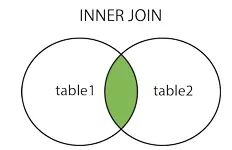

# JOIN trong SQL

## Giới thiệu

JOIN trong SQL là một mệnh đề dùng để kết hợp dữ liệu từ hai hoặc nhiều bảng trong một cơ sở dữ liệu dựa trên một cột chung có mối quan hệ. Nó cho phép bạn truy vấn các cột từ các bảng khác nhau và trả về kết quả trong cùng một tập dữ liệu, thay vì phải tạo nhiều truy vấn riêng lẻ. Các loại JOIN phổ biến bao gồm INNER JOIN, LEFT JOIN, RIGHT JOIN và FULL OUTER JOIN, mỗi loại có cách thức kết hợp các bản ghi khác nhau.

## Các loại JOIN phổ biến

| Loại JOIN | Mô tả |
|-----------|-------|
| **INNER JOIN** | Trả về các bản ghi khi có sự khớp ở cả hai bảng. Nếu không có sự trùng khớp, bản ghi sẽ bị loại bỏ. Đây là loại JOIN được sử dụng phổ biến nhất. |
| **LEFT (OUTER) JOIN** | Trả về tất cả các bản ghi từ bảng bên trái và các bản ghi khớp từ bảng bên phải. Nếu không có bản ghi khớp, giá trị ở cột của bảng bên phải sẽ là NULL. |
| **RIGHT (OUTER) JOIN** | Trả về tất cả các bản ghi từ bảng bên phải và các bản ghi khớp từ bảng bên trái. Nếu không có bản ghi khớp, giá trị ở cột của bảng bên trái sẽ là NULL. |
| **FULL OUTER JOIN** | Trả về tất cả các bản ghi khi có sự khớp ở một trong hai bảng. Nếu không có bản ghi khớp, giá trị ở bảng không khớp sẽ là NULL. |
| **SELF JOIN** | Là một loại JOIN đặc biệt nơi một bảng được join với chính nó. Thường được sử dụng khi bảng có mối quan hệ phân cấp hoặc cần so sánh các hàng trong cùng một bảng. |


## 1. Các loại Join trong SQL

Ở bài trước mình đã chia sẻ về các câu lệnh thường dùng trong truy vấn CSDL như: SQL DISTINCT, SQL Where, SQL And Or, SQL Count, SQL ORDER BY, SQL GROUP BY, SQL HAVING các bạn có thể tham khảo trong bài viết trước của mình trong link: https://viblo.asia/p/co-so-du-lieu-la-gimysql-mot-so-cau-lenh-truy-van-co-so-du-lieu-thuong-dung-gDVK26AAKLj

Hôm nay mình chia sẻ thêm về các câu lệnh SQL Join, các loại Join trong SQL.

JOIN là phép kết nối dữ liệu từ nhiều bảng lại với nhau, nối 2 bảng, 3 bảng.. với nhau. Khi bạn cần truy vấn các cột dữ liệu từ nhiều bảng khác nhau để trả về trong cùng một tập kết quả, bạn cần dùng JOIN. 2 bảng kết nối được với nhau khi có 1 trường chung giữa 2 bảng này.

### 1.1 INNER JOIN (Hoặc JOIN)

INNER JOIN (Hoặc JOIN): Trả về tất cả các hàng khi có ít nhất một giá trị ở cả hai bảng.



### 1.2 LEFT OUTER JOIN (Hoặc LEFT JOIN)

LEFT OUTER JOIN (Hoặc LEFT JOIN): Trả lại tất cả các dòng từ bảng bên trái, và các dòng đúng với điều kiện từ bảng bên phải.


### 1.3 RIGHT OUTER JOIN (Hoặc RIGHT JOIN)

RIGHT OUTER JOIN (Hoặc RIGHT JOIN): Trả lại tất cả các hàng từ bảng bên phải, và các dòng thỏa mãn điều kiện từ bảng bên trái.


### 1.4 FULL OUTER JOIN (Hoặc OUTER JOIN)

FULL OUTER JOIN (Hoặc OUTER JOIN): Trả về tất cả các dòng đúng với 1 trong các bảng.


### 1.5 SELF JOIN

SELF JOIN là một loại JOIN đặc biệt nơi một bảng được join với chính nó. Điều này hữu ích khi bạn cần so sánh các hàng trong cùng một bảng hoặc khi bảng có mối quan hệ phân cấp (như nhân viên và quản lý).


## 2. Câu lệnh SQL Join

### 2.1 Câu lệnh INNER JOIN

INNER JOIN trả về kết quả là các bản ghi mà trường được join hai bảng khớp nhau, các bản ghi chỉ xuất hiện một trong hai bảng sẽ bị loại.

Có thể thay INNER JOIN bởi JOIN. Ý nghĩa và kết quả là như nhau.

**Cú pháp:**

```sql
SELECT column_name(s)
FROM table1
INNER JOIN table2
ON table1.column_name = table2.column_name;
```

**INNER JOIN nhiều table:**

```sql
SELECT column_list
FROM table1
INNER JOIN table2 ON join_condition1
INNER JOIN table3 ON join_condition2
```

**Ví dụ:**

Có bảng `khach_hang` với thông tin như sau:

| MaKH | TenKH    | DiaChi  |
|------|----------|---------|
| 1    | Nguyen A | Ha Noi  |
| 2    | Tran B   | Sai Gon |
| 3    | Le C     | Da Nang |

Có bảng `order_kh` với thông tin như sau:

| MaDH | MaKH | NgayDat   | TongTien |
|------|------|-----------|----------|
| 101  | 1    | 2023-01-01| 100000   |
| 102  | 2    | 2023-01-02| 200000   |
| 103  | 4    | 2023-01-03| 150000   |

=> Ở 2 bảng trên thì thấy MaKH được phản ánh là mã khách hàng ở bảng khach_hang, mối quan hệ 2 bảng là cột MaKH.

Chúng ta chạy câu lệnh SQL join sau đây, và xem kết quả trả ra, sẽ lấy ra như sau:

```sql
SELECT * FROM lanptp.khach_hang AS KH
JOIN lanptp.order_kh AS OD ON KH.MaKH = OD.MaKH;
```

**Kết quả:**

| MaKH | TenKH    | DiaChi  | MaDH | MaKH | NgayDat   | TongTien |
|------|----------|---------|------|------|-----------|----------|
| 1    | Nguyen A | Ha Noi  | 101  | 1    | 2023-01-01| 100000   |
| 2    | Tran B   | Sai Gon | 102  | 2    | 2023-01-02| 200000   |

### 2.2 Câu lệnh LEFT OUTER JOIN

LEFT OUTER JOIN là từ khóa trả về tất cả các hàng (rows) từ bảng bên trái (table1), với các hàng tương ứng trong bảng bên phải (table2). Chấp nhận cả dữ liệu NULL ở bảng 2.

LEFT OUTER JOIN hay còn được gọi là LEFT JOIN.

**Cú pháp:**

```sql
SELECT column_name(s)
FROM table1
LEFT JOIN table2
ON table1.column_name = table2.column_name;
```

**LEFT JOIN cũng có thể join nhiều table:**

```sql
SELECT column_list
FROM table1
LEFT JOIN table2 ON join_condition1
LEFT JOIN table3 ON join_condition2
```

**Ví dụ:** Vẫn với data như 2 bảng ở trên khach_hang, order_kh khi sử dụng câu lệnh Left Join kết quả sẽ trả ra như sau:

```sql
SELECT * FROM lanptp.khach_hang AS KH
LEFT JOIN lanptp.order_kh AS OD ON KH.MaKH = OD.MaKH;
```

**Kết quả:**

| MaKH | TenKH    | DiaChi  | MaDH | MaKH | NgayDat   | TongTien |
|------|----------|---------|------|------|-----------|----------|
| 1    | Nguyen A | Ha Noi  | 101  | 1    | 2023-01-01| 100000   |
| 2    | Tran B   | Sai Gon | 102  | 2    | 2023-01-02| 200000   |
| 3    | Le C     | Da Nang | NULL | NULL | NULL      | NULL     |

### 2.3 Câu lệnh RIGHT OUTER JOIN

RIGHT OUTER JOIN là từ khóa trả về tất cả các hàng (rows) từ bảng bên phải (table2), với các hàng tương ứng trong bảng bên trái (table1). Chấp nhận cả dữ liệu NULL ở bảng 1. Ngược lại với LEFT JOIN.

RIGHT OUTER JOIN hay còn được gọi là RIGHT JOIN.

**Cú pháp:**

```sql
SELECT column_name(s)
FROM table1
RIGHT JOIN table2
ON table1.column_name = table2.column_name;
```

Vẫn với data 2 bảng trên các bạn hãy thử chạy câu lệnh RIGHT JOIN nhé!

**RIGHT JOIN cũng có thể join nhiều table:**

```sql
SELECT column_list
FROM table1
RIGHT JOIN table2 ON join_condition1
RIGHT JOIN table3 ON join_condition2
```

**Ví dụ:**

```sql
SELECT * FROM lanptp.khach_hang AS KH
RIGHT JOIN lanptp.order_kh AS OD ON KH.MaKH = OD.MaKH;
```

**Kết quả:**

| MaKH | TenKH    | DiaChi  | MaDH | MaKH | NgayDat   | TongTien |
|------|----------|---------|------|------|-----------|----------|
| 1    | Nguyen A | Ha Noi  | 101  | 1    | 2023-01-01| 100000   |
| 2    | Tran B   | Sai Gon | 102  | 2    | 2023-01-02| 200000   |
| NULL | NULL     | NULL    | 103  | 4    | 2023-01-03| 150000   |

### 2.4 Câu lệnh FULL OUTER JOIN

FULL OUTER JOIN là sự kết hợp của LEFT JOIN và RIGHT JOIN.

**Cú pháp:**

```sql
SELECT column_name(s)
FROM table1
FULL OUTER JOIN table2
ON table1.column_name = table2.column_name
WHERE condition;
```

**Ví dụ:**

```sql
SELECT * FROM lanptp.khach_hang AS KH
FULL OUTER JOIN lanptp.order_kh AS OD ON KH.MaKH = OD.MaKH;
```

**Kết quả:**

| MaKH | TenKH    | DiaChi  | MaDH | MaKH | NgayDat   | TongTien |
|------|----------|---------|------|------|-----------|----------|
| 1    | Nguyen A | Ha Noi  | 101  | 1    | 2023-01-01| 100000   |
| 2    | Tran B   | Sai Gon | 102  | 2    | 2023-01-02| 200000   |
| 3    | Le C     | Da Nang | NULL | NULL | NULL      | NULL     |
| NULL | NULL     | NULL    | 103  | 4    | 2023-01-03| 150000   |

### 2.5 Câu lệnh SELF JOIN

SELF JOIN được sử dụng khi bạn muốn join một bảng với chính nó. Điều này thường xảy ra khi bảng có mối quan hệ phân cấp, như nhân viên và quản lý, hoặc khi bạn cần so sánh các hàng trong cùng một bảng.

**Cú pháp:**

```sql
SELECT a.column_name, b.column_name
FROM table_name a, table_name b
WHERE condition;
```

Hoặc sử dụng alias rõ ràng:

```sql
SELECT a.column_name, b.column_name
FROM table_name AS a
INNER JOIN table_name AS b ON a.column_name = b.column_name;
```

**Ví dụ:**

Giả sử có bảng `nhan_vien` với thông tin nhân viên và quản lý:

| MaNV | TenNV     | MaQL |
|------|-----------|------|
| 1    | Nguyen A  | NULL |
| 2    | Tran B    | 1    |
| 3    | Le C      | 1    |
| 4    | Pham D    | 2    |

Để tìm tên nhân viên và tên quản lý của họ:

```sql
SELECT nv.TenNV AS NhanVien, ql.TenNV AS QuanLy
FROM nhan_vien nv
LEFT JOIN nhan_vien ql ON nv.MaQL = ql.MaNV;
```

**Kết quả:**

| NhanVien | QuanLy   |
|----------|----------|
| Nguyen A | NULL     |
| Tran B   | Nguyen A |
| Le C     | Nguyen A |
| Pham D   | Tran B   |

## 3. Kết luận

Ở trên mình đã giới thiệu với các bạn về Các loại Join trong SQL và câu lệnh đi kèm, trong quá trình thực hành các bạn có thể kết hợp thêm các câu SQL DISTINCT, SQL Where, SQL And Or, SQL Count, SQL ORDER BY, SQL GROUP BY, SQL HAVING,... để truy vấn theo yêu cầu lấy ra data nhé!. Các bạn cần tìm hiểu thêm để có thể hiểu sâu hơn, kết hợp giữa các câu lệnh với nhau để thực hành tốt các câu lệnh trong MySQL và áp dụng hiệu quả nó vào công việc của bạn. Bạn có thể tham khảo Website ở link tài liệu tham khảo bên dưới để có thể học và thực hành một cách tốt nhất!

## Tài liệu tham khảo

- [SQL Joins - W3Schools](https://www.w3schools.com/sql/sql_join.asp)
- [MySQL Joins - MySQL Documentation](https://dev.mysql.com/doc/refman/8.0/en/join.html)
- [Bài viết gốc trên Viblo](https://viblo.asia/p/co-so-du-lieu-la-gimysql-mot-so-cau-lenh-truy-van-co-so-du-lieu-thuong-dung-gDVK26AAKLj)

---

**Lưu ý**: Các ví dụ trên sử dụng MySQL syntax. Cú pháp có thể khác nhau tùy theo hệ quản trị cơ sở dữ liệu (SQL Server, PostgreSQL, v.v.).